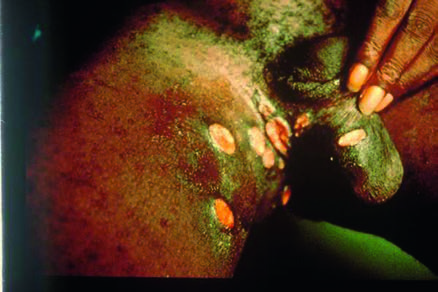
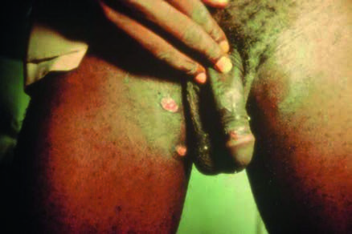

# Page 112 A 29-Year-Old Man from The Gambia With Genital Ulceration DAVID C.W. MABEY Clinical Presentation History A 29-year-old man comes to your clinic in The Gambia com-plaining of painful sores involving his private parts for 7 days. He has been previously well. He admits to having had sex with a commercial sex worker 2 weeks ago, when he had not used a condom. Clinical Findings He is in considerable pain and is only able to walk with dif-ficulty because of these sores. He is afebrile and well nour-ished. General examination is unremarkable. The only abnormality is the presence of numerous painful ulcers on his penis, scrotum and inner thigh (Fig. 12.1). The ulcers are tender, soft and bleed on contact. There is no inguinal lymphadenopathy. Questions 1. What are the most important differential diagnoses? 2. How would you manage this patient? Discussion A 29-year-old Gambian man presents with genital ulcers which he has developed over the past week. He admits to having had unprotected sex with a commercial sex worker 2 weeks previously. Answer to Question 1 What Are the Most Important Differential Diagnoses? The three major causes of genital ulceration are Herpes sim-plex, syphilis and chancroid. Ulcers caused by H. simplex are self-limiting in immunocompetent individuals, and do not usually last longer than a few days. They can be severe and persistent in the immunocompromised. Ulcers caused by primary syphilis are usually painless, and it is unusual for there to be more than a single ulcer. Inguinal adenopathy is sometimes seen but is usually painless. Ulcers caused by chancroid are often multiple, and usually painful. In some 50% of cases painful inguinal lymphadenopathy is found. Inguinal buboes may be fluctuant and sometimes rupture, releasing large amounts of pus. However, the clinical diagnosis of genital ulcer disease is unreliable. For this reason, the patient should be treated syn-dromically for both syphilis and chancroid. If he is HIV-positive, additional treatment for herpes should also be considered. Answer to Question 2 How Would You Manage This Patient? Treat him for syphilis with a single dose of IM benzathine pen-icillin 2.4 million units. Treat him for chancroid with a single dose of azithromycin 1g PO or ciprofloxacin 500mg bid for 3 days or erythromycin 500mg qds for 7 days. If he is HIV-positive, consider adding aciclovir 400mg tds for 7 days. He is at high risk of HIV because he has acquired a genital ulcer from a commercial sex worker, so you should test him for HIV and start antiretroviral treatment if positive. Serol-ogy for syphilis will be helpful in guiding treatment for his • Fig. 12.1 Numerous painful ulcers on the penis, scrotum and inner thigh. The ulcers are soft, tender and bleed on contact. 30 # Page 2 sexual partners, but he should be treated for syphilis even if it is negative, because serology can be negative in early primary syphilis. He should be strongly encouraged to bring his sex-ual partners to the clinic for assessment and treatment. The Case Continued… The patient was treated with 2.4 million units of benzathine penicillin IM stat and given erythromycin 500mg to take qds for 7 days. He was HIV-negative, his syphilis serology was positive (RPR and TPHA). A swab was taken for culture of Haemophilus ducreyi, and H. ducreyi was grown after three days’ incubation at 33°C. Mixed infection are common in patients with sexually transmitted diseases (STIs), since for behavioural reasons patients with one STI are at increased risk of others. The patient returned for follow-up after 7 days. The pain had resolved and the ulcers were all healing (Fig. 12.2). SUMMARY BOX Chancroid Chancroid is a disease of core groups, principally sex workers and their clients. Unlike other STIs, asymptomatic infection is rare; most infected individuals have painful genital ulcers. Laboratory diagnosis of chancroid is difficult. It depends on the identification of the causative agent, H. ducreyi, in material from lesions. Gram stain is neither sensitive nor specific. Nucleic acid amplification tests such as PCR have been used in research settings, but are not commercially available. Isolation is the gold standard. H. ducreyi is a fastidious organism, requiring an enriched culture medium that needs to be made selective by the addition of antibiotics to inhibit the growth of other organisms present in the ulcer. Unlike most bacteria, it grows best at 33°C. Virtually all strains of H. ducreyi are resistant to penicillin, because of plasmids encoding various penicillin resistance genes. Most strains are also resistant to tetracyclines and sulphona-mides. Treatment for chancroid is with azithromycin 1g PO or ciprofloxacin 500mg bid for 3 days or erythromycin 500mg qds for 7 days. It is important to treat all patients with genital ulcers for chancroid in regions where it is endemic (believed to be most parts of Africa, Asia and perhaps South America). Because it is difficult to diagnose, the incidence, prevalence and geographical distribution of chancroid are not well known; but it is thought to have become less common since the onset of the HIV/AIDS epidemic. Further Reading 1. Richens J, Mayaud P, Mabey DCW. Sexually transmitted infec-tions (excluding HIV). In: Farrar J, editor. Manson’s Tropical Dis-eases. 23rd ed London: Elsevier; 2014 [chapter 23]. 2. Mayaud P, Ndowa FJ, Richens J, et al. Sexually transmitted infec-tions. In: Mabey D, et al, editors. Principles of Medicine in Africa. 4th ed Cambridge University Press, 2014 [Chapter 21]. 3. Lewis DA, Ison CA. Chancroid. Sex Transm Infect 2006;82 (Suppl. 4): iv19-20. 4. Kemp M, Christensen JJ, Lautenschlager S, et al. European guide-line for the management of chancroid, 2011. Int J STD AIDS 2011;22(5):241-4. 5. Kularatne RS, Muller EE, Maseko DV, et al. Trends in the relative prevalence of genital ulcer disease pathogens and association with HIV infection in Johannesburg, South Africa, 2007-2015. PLoS One 2018;13:e0194125. https://doi.org/10.1371/journal. pone.0194125. • Fig. 12.2 Follow-up after 1 week of antibiotic therapy. The ulcers are healing and the pain has resolved. 31 CHAPTER 12 A 29-Year-Old Man from The Gambia With Genital Ulceration

## Images

