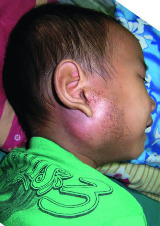

# Page 115 A 3-Year-Old Boy from Laos With Right Suppurative Parotitis SAYAPHET RATTANAVONG, VIRAVONG DOUANGNOULAK, BUACHAN NORINDR, PAUL N. NEWTON AND CAOIMHE NIC FHOGARTAIGH Clinical Presentation History A 3-year-old rural Lao boy presents to the ENT clinic with a 10-day history of gradual, painful swelling of the right cheek with associated fever and poor appetite. Three days previously his mother noticed a purulent discharge from the ear. He has no cough, vomiting or diarrhoea. There is no history of pre-vious ear infection or dental problems and no known history of trauma. The child is developing normally and is up to date with vaccinations. His parents are rice farmers. Clinical Findings The child looks unwell, with a fever of 39.5°C (103.1°F). There is a localized, fluctuant, hot, tender swelling below and anterior to the right ear, 6 to 8cm in diameter, extending from the lower cheek to the submandibular region and con-sistent with a parotid mass (Fig. 15.1). Ear examination reveals a purulent discharge in the auditory canal and suspicion of a small fistula from which the pus is arising, with a right lower motor neuron facial nerve palsy. The oral cavity and throat are unremarkable. There is no lymphadenopathy and no hepatos-plenomegaly. Heart sounds are normal and the chest is clear. Laboratory Results WBC 16.5109/L (4-10 x109/L), 90% neutrophils. Hb 9.4g/dL (13-15g/dL), all other blood tests are normal. Questions 1. What are your differential diagnoses? 2. What investigations would you perform? Discussion A 3-year-old boy from rural Laos presents to a local hospital because of high fever, unilateral parotid swelling and purulent discharge from his ear. The little boy has previously been well. Answer to Question 1 What Are Your Differential Diagnoses? Acute, suppurative, unilateral parotitis in children is usually bacterial. The most common pathogens are Staphylococcus aureus, Streptococcus pyogenes and Haemophilus influenzae, although the latter has declined because of widespread vac-cination. Neonates are at risk of parotitis caused by Gram-negative bacteria, and Streptococcus pneumoniae parotitis may occur in HIV-infected children. In an endemic area like Laos, Burkholderia pseudomallei, the causative agent of melioidosis, must also be considered. Studies in neighbouring countries have shown melioidosis to be the commonest cause of suppurative parotitis in children. Actinomycosis and cat-scratch disease (Bartonella henselae) are more unusual bacterial causes. • Fig. 15.1 A Lao boy with a unilateral parotid mass showing signs of local inflammation. 37 # Page 2 Mumps was the commonest cause of parotid swelling in children until the introduction of vaccination, which is still not commonly available in some countries, including Laos. Swelling is painful, but is non-suppurative and becomes bilateral in the majority of cases. Other less common viral agents causing parotitis include parainfluenza viruses, influ-enza A, cytomegalovirus, Epstein-Barr virus and enterovi-ruses, but these do not cause the degree of inflammation and suppuration seen here. Granulomatous parotitis, caused by Mycobacterium tuber-culosis, Mycobacterium avium-intracellulare and other myco-bacteria, is rare and presents with a more chronic, painless, enlarging mass without surrounding inflammation. Salivary stones and malignancies are very rare in children. Answer to Question 2 What Investigations Would You Perform? Samples for bacterial culture before commencing antimicro-bial therapy are crucial. Gram stain and bacterial culture of pus from the ear are quick and non-invasive. Blood cultures should be taken because the results have therapeutic and prognostic implications. A throat swab may detect causative bacterial pathogens and has been used to diagnose melioidosis in children. Deep pus from incision and drainage of the parotid abscess is the most useful diagnostic material, and drainage may be neces-sary for management of the abscess. This may be performed under ultrasound guidance. Full blood count may help differentiate between bacte-rial and viral causes. When melioidosis is suspected, chest radiograph and abdominal ultrasound should be requested to look for other foci of infection. In this patient a radiograph of the skull would be useful to detect any osteomyelitis. The laboratory must be informed if melioidosis is sus-pected, because selective media are used to isolate B. pseudo-mallei from non-sterile sites, and suspected growth must be handled under containment level 3 conditions when available. If melioidosis is confirmed, investigations should look for underlying predisposing conditions such as diabetes mellitus, although these are found less commonly in chil-dren with B. pseudomallei parotitis than in adults with melioidosis. The Case Continued… Pus culture from the right ear and parotid abscess isolated B. pseudomallei. Blood culture was negative. Chest radiography and abdominal ultrasound were normal. The patient had incision and drainage of the parotid with removal of copious pus. Intravenous ceftazidime was admin-istered for 10 days followed by oral co-amoxiclav for 16 weeks with good clinical response. No complications occurred, and no underlying disease was identified. Being from a rice farm-ing family, the boy was likely to have been frequently exposed to soil and water containing B. pseudomallei in the paddy fields. SUMMARY BOX Melioidosis Melioidosis is an infectious disease caused by B. pseudomallei, a saprophytic Gram-negative environmental bacterium endemic in South and South-east Asia, as well as in northern Australia. It is the third most common cause of death in north-east Thailand after HIV and tuberculosis. There is growing evidence that melioidosis is also of relevance in other parts of the tropics where its importance has long been underestimated. In endemic areas B. pseudomallei is readily isolated from soil and surface water. The disease is highly seasonal and most cases present during the rainy season. The clinical presentation ranges from mild localized infection to severe septicaemia. In endemic areas, 60-80% of children have evidence of seroconversion to B. pseudomallei by the age of 4 years and most paediatric infections are mild or asymptomatic. Septicaemic melioidosis occurs in more than one-third of paediatric cases, with a similar clinical presentation as in adults. The lung is the most common organ involved, and septic shock is associated with a high mortality. Multiple organ involvement and disseminated infections are well described. Localized disease, however, accounts for the majority of paediatric melioidosis, with the parotid gland being the most common site involved. Skin and soft tissue abscesses are also common. Parotitis is uncommon in adults and has not been seen in children in Australia. It is believed that ingestion of water contaminated with B. pseudomallei may cause colonization of the oropharynx and ascending infection to the parotid gland, particularly where drinking water is obtained from boreholes. Less than 10% of children have a predisposing condition. The prognosis is usually favourable, although complications include spontaneous rupture into the auditory canal, facial nerve palsy, septicaemia and osteomyelitis. The aims of treatment are to reduce mortality and morbidity, prevent recurrence and drain abscesses. Referral to a surgeon for consideration for drainage should be arranged; however, such surgery risks damage to the facial nerve. There is little evidence to inform the choice and duration of antimicrobial treatment for localized melioidosis in children. The authors recommend pre-cautionary intravenous ceftazidime, meropenem or imipenem for the acute phase (10-14 days); however, parenteral therapy is very expensive. This is followed by co-trimoxazole monotherapy for the eradication phase (12-20 weeks), which has been shown to be non-inferior to dual therapy with co-trimoxazole and doxycy-cline and avoids adverse effects of doxycycline in children. Amoxicillin-clavulanate is an alternative for patients with sulfa allergy or resistance and in pregnancy. Further Reading 1. Dance DAB. Melioidosis. In: Farrar J, editor. Manson’s Tropical Diseases. 23rd ed. London: Elsevier; 2013 [chapter 34]. 2. Lumbiganon P, Viengnondha S. Clinical manifestations of melioi-dosis in children. Pediatr Infect Dis J 1995;14(2):136-40. 38 CHAPTER 15 A 3-Year-Old Boy from Laos With Right Suppurative Parotitis # Page 33. Stoesser N, Pocock J, Moore CE, et al. Paediatric suppurative par-otitis in Cambodia between 2007 and 2011. Paediatr Infect Dis J 2012;31(8):865-8. 4. Phetsouvanh R, Phongmany S, Newton P, et al. Melioidosis and Pandora’s box in the Lao People’s Democratic Republic. Clin Infect Dis 2001;32(4):653-4. 5. Chetchotisakd P, Chierakul W, Chaowagul W, et al. Trimetho-prim-sulphamethoxazole versus trimethoprim-sulphamethoxazole plus doxycycline as oral eradicative treatment for melioidosis (MERTH): A multicentre, double-blind, non-inferiority, rando-mised controlled trial. Lancet 2014;383:807-14. https://doi.org/ 10.1016/S0140-6736(13)61951-0. 39 CHAPTER 15 A 3-Year-Old Boy from Laos With Right Suppurative Parotitis

## Images

