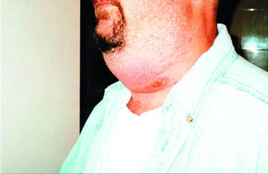

# Page 121 A 35-Year-Old American Man With Fatigue and a Neck Lesion MARY E. WRIGHT AND ARTHUR M. FRIEDLANDER Clinical Presentation History A 35-year-old Caucasian male presents to a clinic in the United States with fatigue and a rash on his neck that started as a papule 2 days earlier. The lesion is non-pruritic, but it is associated with significant non-painful swelling and a pres-sure sensation in the neck. There is no history of fever, but the patient reports at least one episode of diaphoresis with mild confusion and headache. The patient recalls a break in the skin at the site of the lesion 3 days before while shaving and is sure that he has not been bitten by an insect. He has had no contact with animals and no foreign travel within the previous year. He had come to the clinic 24 hours earlier with similar symptoms. After blood cultures were obtained, he was given one dose of a first-generation cephalosporin and discharged on a ten-day oral course. He returns because of worsening malaise and neck swelling associated with mild difficulty breathing. The past medical history is unremarkable. The patient is a postal worker by profession. Clinical Findings Examination reveals a 2cm irregularly shaped, indurated non-tender patch on the left anterior neck with mild overly-ing erythema and several 2 to 3mm vesicles. The main lesion has a 6mm shallow ulceration. There is massive neck oedema making lymph nodes difficult to assess (see Fig. 21.1). His neck circumference had increased from 57cm at baseline to a peak of 81cm. Temperature is 36.9°C (98.4°F), pulse 118 bpm, blood pressure 138/90mmHg and respiratory rate 20 breath cycles per minute. The remainder of the initial physical examination is normal. Investigations Full blood count, Na+, K+, Cl HCO3, BUN, creatinine and random glucose are normal except for a mildly elevated hae-moglobin at 18.7g/dL (reference range: 13.0-18.0g/dL). Questions 1. What are the distinguishing features of this lesion that help narrow down your differential diagnosis? 2. What investigations need to be performed to establish early diagnosis and appropriate treatment? Discussion A 35-year-old male postal worker presents to a clinic in the United States with a papulovesicular lesion on his neck asso-ciated with massive neck swelling. There is no fever but dia-phoresis is present. The patient’s condition is worsening despite antibiotic therapy with an oral cephalosporin. • Fig. 21.1 Papulovesicular lesion with extensive neck oedema 2 days after the onset of a small papule. 55 # Page 2 Answer to Question 1 What Are the Distinguishing Features of This Lesion that Help Narrow Down Your Differential Diagnosis? The differential diagnosis of an ulcerative skin lesion with concomitant massive soft tissue swelling and systemic symp-toms depends on the epidemiological setting and the individ-ual exposure; it includes bacterial ecthyma (Streptococcus pyogenes, Staphylococcus aureus), rickettsial diseases, necrotic arachnidism (bite by brown recluse spider), rat-bite fevers Streptococcus moniliformis and (Spirillum minus), ulcero-glandular tularaemia and bubonic plague. At the time of the patient’s presentation, the United States was in the process of investigating a possible event of bioter-rorism. Therefore the most important, though overall rare, diagnosis to consider was cutaneous anthrax. There may be few distinguishing features at the time of presentation, depending on the age of the lesion. Although it is commonly known that cutaneous anthrax is manifested by a central black eschar, this is not seen until approximately a week after inoculation. The anthrax lesion begins as a pain-less papule that lasts 1 to 2 days before becoming a vesicle that later ruptures. It then develops the classic necrotic cen-tral ulcer and may be surrounded by smaller peripheral ves-icles. Therefore a patient may present with a non-specific localized papulovesicular eruption. Key associated findings include a preceding history of a break in the skin at the affected site, the presence of systemic symptoms such as mal-aise and headache and extensive, non-tender oedema. Fever and leukocytosis may not be present. In parts of the world where anthrax is endemic, zoonotic exposure to infected ani-mals or contaminated animal products is important to estab-lish, whereas exposure from a bioterrorism act may not be immediately apparent. Answer to Question 2 What Investigations Need to be Performed to Establish Early Diagnosis and Appropriate Treatment? Aspirate of fluid from the skin lesion should be sent for Gram stain, culture and susceptibilities along with blood cultures in patients with systemic symptoms regardless of fever status. In the absence of preceding antimicrobial therapy, numerous Gram-positive rods in high concentration will grow within 24 hours. Empirical antibacterial treatment with a quinolone or doxycycline should be instituted while awaiting microbi-ological results. Because negative cultures do not exclude anthrax, full-thickness punch biopsy from the vesicle and the eschar should be obtained, fixed in 10% buffered forma-lin and sent to a specialized laboratory for nucleic acid ampli-fication and immunohistochemical (IHC) staining to detect Bacillus anthracis antigens. Serum should also be tested for antibodies to the protective antigen at baseline and 4 weeks later. The Case Continued… Blood cultures taken at the first clinic visit grew gram-positive rods. Gram stain and culture of the skin lesion obtained at the second visit were negative for B. anthracis. The patient was admitted and received intravenous levoflox-acin and ampicillin-sulbactam and recovered. Stains for bacteria and IHC of the skin biopsy performed at a reference laboratory showed abundant bacilli in the dermis and the presence of B. anthracis antigens, respectively. Serology revealed that antibody to protective antigen was present in convalescent serum. The patient was exposed during his occupation as a postal worker, handling contaminated mail. Overall, 22 cases were identified, of which 11 presented with cutaneous anthrax, and a further 11 fell ill with the inhalational form. Five peo-ple died; all deaths occurred secondary to inhalational anthrax. SUMMARY BOX Anthrax Anthrax is caused by B. anthracis, a Gram-positive rod that forms spores under certain environmental conditions. It is primarily a zoonotic disease affecting domestic and wild herbivores. Anthrax remains endemic in animals worldwide, most importantly in Asia, Africa and South-eastern Australia, as well as parts of the southern and western United States. Humans usually acquire the infection when they are exposed to infected animals or animal products, but anthrax has also been used as an agent of bioterrorism. In the developed world, cases usually tend to be sporadic. In resource-limited countries anthrax remains a relevant public health problem and large outbreaks can occasionally occur. Depending on the route of entry, B. anthracis can cause cutaneous, gastrointestinal or inhalational disease. Cutaneous anthrax is the most common form worldwide, accounting for 95% of all human cases. Although only a small percentage develop systemic disease, it can be lethal if not treated quickly. The clinical marker lesion is a painless central ulcer with ves-icles and extensive surrounding oedema, but the initial lesion will appear as a non-specific papulovesicular eruption. History includes recent exposure to infected animals or con-taminated animal products, unless the setting is a bioterrorism event, a previous break in the skin at the affected site and the presence of systemic symptoms in disseminated disease. A high index of suspicion is critical to the diagnosis. Differential diagnosis of cutaneous anthrax depends on the setting and the individual exposures; it includes bacterial ecthyma, rickettsial diseases, rat-bite fevers, necrotic arachnidism, ulceroglandular tularaemia and bubonic plague. Gram stain and culture of affected fluids (blood, skin lesion aspirate, pleural fluid) and paired serological testing for antibodies to protective antigen remain the cornerstone of diagnosis. However, negative cultures do not exclude anthrax. In cutaneous anthrax, full-thickness punch biopsy from the vesicle and eschar should be fixed and sent to a specialized laboratory for PCR and immunohistochemical staining. Empirical antibacterial treatment with a quinolone or doxycycline should be instituted while awaiting results for limited cutaneous infection. When dissemi-nated infection or other forms of anthrax are suspected, multi-drug therapy that includes those with CNS penetration should be used. 56 CHAPTER 21 A 35-Year-Old American Man With Fatigue and a Neck Lesion # Page 3 Although 7 to 10 days of antibiotic treatment are usually suf-ficient in cutaneous anthrax, up to 60 days of antibiotics are needed in inhalational disease because of the possibility of retained ungerminated spores in the lungs. Prevention of anthrax involves either prevention of exposure in occupational settings or immunization. In the setting of a suspected bioterrorism event, those at risk of exposure should receive a 60-day course of postexposure prophylaxis with oral antibiotics. Further Reading 1. Eitzen E. Anthrax. In: Farrar J, editor. Manson’s Tropical Diseases. 23rd ed. London: Elsevier; 2013 [chapter 31]. 2. Carlson CJ, Kracalik IT, Ross N, et al. The global distribution of Bacillus anthracis and associated anthrax risk to humans, livestock and wildlife. Nat Microbiol 2019;4:1337-43. 3. Gold H. Anthrax: a report of one hundred seventeen cases. AMA Arch Intern Med 1955;96(3):387-96. 4. Shieh WJ, Guarner J, Paddock C, et al. The critical role of pathology in the investigation of bioterrorism-related cutaneous anthrax. Am J Pathol 2003;163(5):1901-10. 5. Hendricks KA, Wright ME, Shadomy SV, et al. Centers for Disease Control and Prevention expert panel meetings on prevention and treatment of anthrax in adults. Emerg Infect Dis 2014;20(2). https://doi.org/10.3201/eid2002.130687. 57 CHAPTER 21 A 35-Year-Old American Man With Fatigue and a Neck Lesion

## Images

