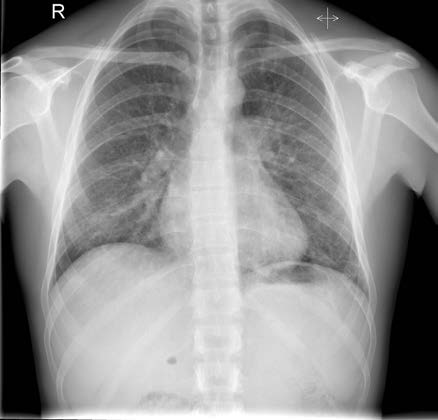
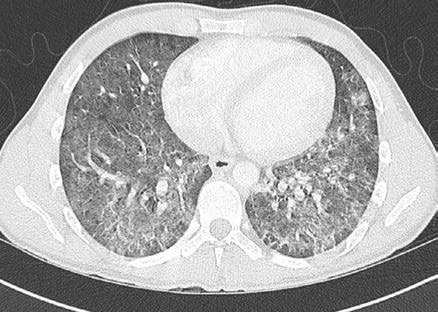

# Page 123 A 31-Year-Old HIV-Positive Business Traveller With Cough, Shortness of Breath and Night Sweats ROBERT F. MILLER Clinical Presentation History A 31-year-old HIV-positive man presents to the Emer-gency Department of a London hospital. He has a 6-week history of increasing shortness of breath on exertion, dry cough, and drenching night sweats. He also reports general fatigue and a weight loss of about 10kg over the past 5 months. He travels extensively for business and in the past 6 months has had work trips to Europe, China, Korea, Japan, Singapore and the United States. He lives with his male part-ner, denies any recreational drug use and has never smoked tobacco. He was diagnosed with HIV 6 years ago. He says that 1 month ago his CD4 was 280/μL. He is not yet on anti-retroviral therapy (ART), nor on co-trimoxazole prophylaxis or any other regular medications. There is no other signifi-cant past medical history. Clinical Findings He is alert, short of breath at rest but able to complete full sentences. Temperature 39.2°C (102.6°F), blood pressure 120/70mmHg, pulse 100bpm, respiratory rate 26 breaths per minute, sO287% on air, and 97% on 15L O2. Chest is clear on auscultation. The rest of the physical examination is unremarkable. Laboratory results His arterial blood gases on air are shown in Table 23.1. His FBC is normal. CRP is 6.7 mg/dL (<5). Creatinine, urea, bilirubin, ALT, AP and albumin are normal. CD4150/ μL, HIV viral load 1500000 copies/mL (fully sensitive on resistance testing). Chest Radiography His chest radiograph is shown in Figure 23.1. TABLE 23.1 Arterial Blood Gases on Ambient Air Parameter Patient Reference Range pH 7.447.35-7.45 PaO2 (kPa) 7.610.67-13.33 PaCO2 (kPa) 34.67-6.00 HCO3 (mmol/L) 1922-26 Base excess (mmol/L)-3.82 Lactate (mmol/L) 1.60.5-1.6 • Fig. 23.1 Chest radiograph on admission, showing bilateral perihilar infiltrates. 61 # Page 2 Questions 1. What further investigations would you perform in order to confirm the diagnosis? 2. What is your immediate management of the patient? Discussion An HIV-positive man who is not yet on ART presents with progressive shortness of breath, dry cough and drenching night sweats, with associated significant weight loss. He has a history of extensive work-related travel. He is febrile with type 1 respiratory failure and bilateral perihilar infil-trates seen on chest radiography. Routine laboratory tests are normal, except for a very slightly elevated CRP, his CD4-count is low. Answer to Question 1 What Further Investigations Would You Perform to Confirm the Diagnosis? Pneumocystis pneumonia (PCP) should be high up in the dif-ferential of any ART-naïve, HIV-positive patient with a low CD4 count, who presents with progressive shortness of breath on exertion and dry cough, with patchy perihilar infil-trates on the chest radiograph. Tuberculosis, atypical bacte-rial pneumonia, cryptococcosis or histoplasmosis should also be considered. Serum 1,3 β-D-glucan (β-glucan) is fre-quently elevated in patients with PCP. Although the β-glucan assay has a high sensitivity for PCP, the specificity of an elevated β-glucan for PCP diagnosis is low because other fungal infections, such as histoplasmosis, some drugs including amoxicillin-clavulanate or piperacillin-tazobactam, and cellulose membranes used for haemodialysis can elevate β-glucan levels. Bronchoscopy and immunofluorescence or Grocott methenamine silver staining of bronchoalveolar lavage (BAL) specimens are the diagnostic tests of choice. Ziehl-Neelsen staining of the BAL fluid for acid-fast bacilli (AFB) should also be requested. Similar staining of induced sputum is a less sensitive alternative. Polymerase chain reaction (PCR) is highly sensitive and specific for detecting Pneumocystis in BAL fluid or induced sputum. However, PCR cannot reliably distinguish colonization from active dis-ease, although higher organism loads, as determined by quantitative PCR, likely represent clinically significant dis-ease. CD4 count should be requested as well. Answer to Question 2 What is Your Immediate Management of the Patient? Correction of hypoxia aiming for oxygen saturation greater than 95% is top priority. Some patients will require CPAP or ventilatory support in addition to oxygen therapy. High-dose co-trimoxazole is first-line treatment for PCP; this may be given IV in severe respiratory failure or if the patient is unable to tolerate oral therapy. In moderate to severe PCP (Table 23.2) corticosteroids should be added. Standard starting dose is prednisolone 40mg bid or methyl-prednisolone 30mg bid, IV if unable to tolerate PO. The Case continued… The patient was treated with high-flow oxygen and started on high-dose co-trimoxazole plus prednisolone combined with a proton-pump inhibitor. His tachycardia settled with reversal of his hypoxia and he remainedotherwise stable.In view of his multiple recent long-haul flights a computed tomography (CT)-pulmonary angiogram was performed to rule out pul-monary embolism (Fig. 23.2). This showed extensive “ground-glass” infiltrates in bothlungs, especially in thelower lobes, but no evidence of pulmonary emboli or cavitations. Serum β-glucan was >500 pg/mL (<80pg/mL). Bronchoscopy was macroscopically normal. Grocott staining of BAL fluid revealed Pneumocystis jirovecii cystic forms, and PCR was strongly positive for P. jirovecii DNA. Oxygen was gradually weaned and the patient was dis-charged on oral co-trimoxazole to complete a 21-day total course. Ten days into PCP treatment, the patient commenced antiretroviral therapy with tenofovir, emtricitabine and TABLE 23.2 Grading of Severity of Pneumocystis Pneumonia Mild Moderate Severe Clinical features Increasing exertional dyspnoea cough and sweats Dyspnoea on minimal exertion, occasional dyspnoea at rest, fever sweats Dyspnoea at rest, tachypnoea at rest, persistent fever, cough Arterial blood gas (room air) PaO2 normal, SaO2 falling on exercise PaO2 ¼ 8.1-11kPa PaO2 < 8.0kPa Chest radiography Normal or minor perihilar infiltrates Diffuse interstitial shadowing Extensive interstitial shadowing diffuse alveolar shadowing (‘white out’), sparing costophrenic angles and apices Source: Farrar, J. et al., 2013. Pneumocystis jirovecii infection, In: Farrar, J., ed. Manson’s Tropical Diseases, 23rd ed. Elsevier, London. Ch. 39. 62 CHAPTER 23 A 31-Year-Old HIV-Positive Business Traveller With Cough, Shortness of Breath and Night Sweats # Page 3 efavirenz.TwoweeksintoPCPtreatment,hedevelopedawide-spread pruritic maculopapular rash most likely attributable to either co-trimoxazole or efavirenz. As a result, co-trimoxazole was changed to clindamycin and primaquine for the final week of treatment and efavirenz was replaced by a boosted protease inhibitor. After completing PCP treatment, he was started on dapsone and pyrimethamine for secondary prophylaxis. SUMMARY BOX Pneumocystis Pneumonia (PCP) P. jirovecii, a fungus found worldwide, causes Pneumocystis pneumonia (PCP) in immunocompromised individuals. Classic symptoms are sub-acute onset of malaise, non-productive cough and progressive exertional dyspnoea; fever may also be present. On examination, desaturation on exertion is the classic sign; this is a useful clinical test in resource-limited settings because it is easy to perform using a simple pulse oximeter. The chest is often clear on auscultation. Complications include respiratory failure and pneumothorax. Without treatment, PCP is progressive and usually fatal. Grading of severity at presentation guides management decisions (Table 23.2). Diagnosis is by visualizing P. jirovecii on BAL fluid (>90% sensitivity, and sensitivity maintained up to 10 days into treatment). Induced sputum has lower sensitivity (50-90%). PCR of respiratory secretions cannot reliably distin-guish infection from colonization. Chest imaging can support the diagnosis, but changes are non-specific and the chest radiograph may be normal. The classic finding is of diffuse perihilar interstitial infiltrates. High-resolution CT scan may show diffuse or patchy “ground-glass” infiltrates. A normal CT scan has a high negative predictive value for PCP. First-line treatment is with co-trimoxazole, which in severe cases should initially be intravenous. The addition of high-dose corticosteroids in moderate to severe PCP improves outcomes if started within 72 hours of starting specific PCP treatment. In HIV-positive patients co-trimoxazole should be continued for a total of 21 days; in other types of immunosuppression 14 days may be sufficient. Steroids are weaned over 20 days. ART should be started within the first 14 days of PCP treatment in ART-naïve, HIV-positive patients. In resource-limited settings, the diagnosis of PCP is most commonly made on clinical grounds. Differentiating PCP from pulmonary TB is often challenging, and dual infections with both TB and PCP also need to be considered. In the absence of intensive care options severely ill patients may have to be empirically treated for both infections. Co-trimoxazole is often available as an oral formulation only. Adverse effects with co-trimoxazole are common and usually occur at 6 to 14 days of treatment, e.g. cytopaenias (40%), rash (25%), fever (20%) and abnormal liver profile (10%). Second-line treatment is with primaquine and clindamycin or IV pentamidine. For mild-to-moderate cases, dapsone-trimethoprim or atova-quone may be given. In resource-limited settings alternative treatments are mostly unavailable. In case of a mild rash, the only option may be desensitization with cautious re-exposure to co-trimoxazole. Secondary prophylaxis with co-trimoxazole (480mg or 960mg od) should be given until a CD4 count over 200/μL has been maintained for at least 3 months after commencing ART. In some resource-limited tropical countries, co-trimoxazole is continued life-long. Further Reading 1. Miller RF, Doffman S. Pneumocystis jirovecii infection. In: Farrar J, editor. Manson’s Tropical Disease. 23rd ed. London: Elsevier; 2013 [chapter 39]. 2. Miller RF, Huang L, Walzer PD. Pneumocystis pneumonia associ-ated with human immunodeficiency virus. Clin Chest Med 2013;34(2):229-41. 3. Chiliza N, Du Toit M, Wasserman S. Outcomes of HIV-associated pneumocystis pheumonia at a South African referral hospital. PLoS ONE 2018;13(8):e0201733. 4. Stover DE, Greeno RA, Gagliardi AJ. The Use of a simple exercise test for the diagnosis of Pneumocystis carinii pneumonia in patients with AIDS. Am Rev Respir Dis 1989;139:1343-6. 5. Church JA, Fitzgerald F, Walker AS, et al. The expanding role of co-trimoxazole in developing countries. Lancet Infect Dis 2015;15:327-39. • Fig. 23.2 CT scan of the chest showing bilateral ground-glass infil-trates, but no pulmonary emboli. 63 CHAPTER 23 A 31-Year-Old HIV-Positive Business Traveller With Cough, Shortness of Breath and Night Sweats

## Images

