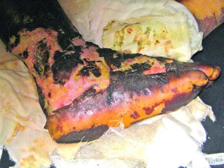
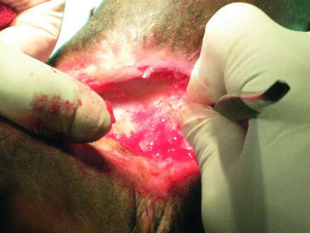

# Page 126 A 14-Year-Old Boy from Malawi Who Has Been Bitten by a Snake GREGOR POLLACH Clinical Presentation History A 14-year-old Malawian boy presents to a local hospital because of an extensive necrotic wound on his right foot. Three weeks earlier he was playing with his friends on a path leading through rocky grassland to the maize field of his family when he stepped on a snake. The snake was brown with V-shaped black bands on its back, and it was approxi-mately one metre long. His friends told his mother later that the snake had hissed loudly but did not move away before biting him-which the boy did not even realize, being busy chasing a football. Shortly after the bite, haemorrhagic bullae formed on the right leg. His gums started to bleed and he vomited extensively. He was taken to a local traditional healer for treatment. His bleeding and vomiting settled; however, he developed intense pain and swelling at the site of the bite. Clinical Findings 14-year old boy, who appears weak and is in respiratory dis-tress. Temperature 39.4°C, pulse 126bpm, blood pressure 85/60mmHg, respiratory rate 30 breath cycles per minute. There is an extensive, foul-smelling necrosis affecting his right foot and ankle where the tendons are exposed (Fig. 26.1). The right lower leg is swollen and he is unable to bend the ankle of his right foot. The inguinal lymph nodes are enlarged on the right side. The urine is clear, rectal exam does not show any signs of bleeding and upon provoked coughing there is no haemop-tysis. Fundoscopy is normal. Investigations The 20-minute whole blood clotting test (WBCT20) is nor-mal. The results of the other blood tests are shown in Table 26.1. Questions 1. Which snake most probably caused this bite? 2. What first-aid measures should have been taken? Discussion A 14-year-old boy from rural Malawi who was bitten by a snake 3 weeks earlier presents to a local hospital. He is septic with an extensive foul-smelling necrotic wound on the right ankle, exposed tendons and oedema of the right leg. • Fig. 26.1 The right foot and ankle with extensive tissue necrosis 3 weeks after a snake bite. TABLE 26.1 Laboratory Results on Admission Parameter Patient Reference Range WBC ( 109/L) 194-10 Haemoglobin (mg/dL) 9.512-14 Platelets ( 109/L) 60150-400 K+ (mmol/L) 4.23.5-5.270 # Page 2 Answer to Question 1 Which Snake Was Most Probably Responsible for the Bite? The African puff-adder (Bitis arietans) is the most likely snake to have caused his bite. Puff-adders are about one metre long and stout. They show a distinctive ‘V’ or ‘U’ pat-tern on their back. When disturbed, they behave aggres-sively, hissing loudly and inflating their body. The puff-adder is a highly dangerous snake, with large quantities of a potent venom and long fangs. It commonly lives in densely populated areas. Throughout the African savannah, this spe-cies is responsible for a large number of serious bites. The main problem is massive local swelling, which may spread to involve the whole limb and cause hypovolaemic shock. Bullae filled with haemorrhagic fluid may develop at the site of the bite. Extensive necrosis may occur. Cardiotoxic effects of the venom may lead to arrhythmias, and the venom may cause systemic haemorrhage. The puff-adder, along with the saw-scaled or carpet viper (Echis species), which produces similar symptoms, are responsible for most fatalities after snake bites in Africa. In contrast, bites by mambas, the most feared snakes in Africa, are relatively uncommon. Answer to Question 2 What First-Aid Measures Should Have Been Taken? First-aid should include reassurance of the victim. Paraceta-mol should be used for pain relief because aspirin might aggravate haemorrhage and morphine can enhance respira-tory depression caused by the venom. Any tight jewellery should be removed. The affected limb should be immobi-lized along with the whole patient, because any muscular contractions will increase the absorption of the venom. If a neurotoxic venom cannot be excluded, a pressure immobilization technique should be used; e.g. a long elas-tic bandage can be wrapped around the affected limb incorporating a splint. However, in cytotoxic venoms the local effects may be worsened through such pressure techniques. The wound itself should be left alone to avoid infection and absorption of the venom. The patient should gently but quickly be taken to the nearest appropriate health facility. Patients should be placed in a recovery position if vomiting or if their level of con-sciousness is reduced. All patients bitten by snakes should ideally be observed in hospital for at least 24 hours. Finally, helpers should not try to kill the snake, risking further bites. However, if the snake has already been killed it should be taken to the healthcare facility for identification. Even a dead snake needs to be handled with great caution as it still may bite by reflex. Smart-phone photography of the culprit snake is another alternative. Some widely popular first-aid measures have never been proven to be of any help in the management of snake bites; these include local cuts with a knife or razor blade, attempts to suck the venom out of the wound, the often disastrous application of an arterial tourniquet, cauteriza-tion, chemicals, ice, electric shocks and the use of ‘magic stones’. The Case Continued… The snake bite had occurred 3 weeks earlier, therefore appli-cation of antivenom was not deemed useful. Because the boy was septic upon admission, he was managed according to the international sepsis treatment guidelines, crucially including early start of broad-spectrum antibiotics, ‘ventilatory sup-port’ and fluid resuscitation. He also received tetanus prophylaxis. The wound was managed surgically: After several debride-ments (Fig. 26.2) it stayed clean and mesh-grafting was suc-cessfully performed. Further reconstructive surgery was not necessary and severe local complications (e.g. compartment syndrome, deep tissue infection and ischaemia) did not develop. The boy was discharged several weeks later. Some functional impairment of his right foot remained and he was booked for outpatient physiotherapy. • Fig. 26.2 After several debridements the wound looks clean. 71 CHAPTER 26 A 14-Year-Old Boy from Malawi Who Has Been Bitten by a Snake # Page 3 SUMMARY BOX Snake Bite Snake bite is a common problem in rural areas of many tropical countries. The true numbers are unknown because many patients may never reach a health facility or seek the help of a traditional practitioner. Snake bites are most common among farm workers, herdsmen, plantation workers and their children. Most bites occur at the beginning of the rainy season. Even though there is a large variety of venomous snakes, the toxic effects of snake bites can be classified into one or more of seven groups (Table 26.2). The therapeutic approach in hospital has to consider local and systemic effects of the bite and the complications that might arise. Tetanus prophylaxis, antibiotic coverage, wound cleansing and sterile dressing are mandatory. Antivenom should be given in case of systemic envenoming, indicated by clinical signs and symptoms or deranged laboratory parameters. Of note, loosening of tourniquets or improvement of circulation may lead to an increased systemic load of venom. In severe local envenoming, antivenom should be given if the swelling involves more than half of the bitten limb and in patients bitten by snakes known to cause local necrosis. Antivenom is most effective when administered by slow IV injection or infusion. Children need the same dose of antivenom as adults because the same amount of venom has been injected. Antivenom mostly consists of non-human hyperimmunoglobulin; it therefore may lead to severe side effects including fever, ana-phylaxis or late serum sickness-like reactions. Necrotic wounds require careful debridement. Wound infec-tion, compartment syndrome or osteomyelitis must be suspected and treated early. Skin grafts, reconstructive surgery, fasciotomy or amputation may be necessary. Massive local oedema carries the risk of hypovolaemic shock. In severe haemorrhagic complications with hypotension, patients should be transfused; if blood is unavailable, sufficient IV fluids should be administered. For neurotoxic complications mechanical ventilation is often required and anticholinesterase drugs should be attempted. Further Reading 1. Warrell DA. Venomous and poisonous animals. In: Farrar J, editor. Manson’s Tropical Diseases. 23rd ed. London: Elsevier; 2013 [chapter 75]. 2. Warrell DA. Treatment of bites by adders and exotic venomous snakes. BMJ 2005;331(7527):1244-7. 3. Warrell DA. Venomous and other dangerous animals. In: Mabey D, Gill G, Parry E, et al., editors. Principles of Medicine in Africa. 4th ed. Cambridge: Cambridge University Press; 2013. p. 849-74. 4. Dellinger RP, Levy MM, Rhodes A, et al. Surviving sepsis cam-paign: international guidelines for management of severe sepsis and septic shock: 2012. Crit Care Med 2013;41(2):580-637. TABLE 26.2 Principal Effects of African Snake Venoms in Humans Venom Activity Clinical Manifestations African Snake Responsible Cytotoxic Massive local swelling, blistering, necrosis; plasma extravasation with consecutive fluid loss, hypotension. Eye: keratoconjunctivitis, corneal ulcer, blindness (spitting cobra) Puff-adder and other large Bitis species, saw-scaled vipers (Echis), burrowing asps (Atractaspis species); spitting cobra Auto-pharmacological Release of vasoactive compounds (e.g. NO, histamine, serotonin, bradykinin); anaphylaxis, acute profound hypotension, urticaria, vomiting, diarrhoea Burrowing asps (Atractaspis spp.), Bitis species, boomslang Haematotoxic Spontaneous systemic bleeding (gums, brain, gastrointestinal, uterine), bleeding from trauma and recent wounds Puff-adder and other large Bitis spp., saw-scaled vipers, boomslang, vine snake Cardiotoxic Hypotension, shock, arrhythmias, conduction abnormalities Puff-adder and other large Bitis species, burrowing asps Neurotoxic Cranial nerve palsies, bulbar and respiratory paralysis Elapids (mamba, cobra, rinkhals) berg adder, Peringuey’s adder Myotoxic Trismus; rhabdomyolysis with myalgias, myoglobinuria, renal failure, hyperkalaemia, respiratory failure Sea snake Nephrotoxic Acute kidney injury, renal necrosis Boomslang, vine snake, saw-scaled vipers Source: After Warrell, 2013372 CHAPTER 26 A 14-Year-Old Boy from Malawi Who Has Been Bitten by a Snake

## Images

