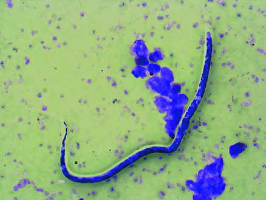

# Page 128 A 67-Year-Old Female Expatriate Living in Cameroon With Eosinophilia and Pericarditis SEBASTIAN DIECKMANN AND RALF IGNATIUS Clinical Presentation History A 67-year-old German woman who has lived as an expatriate in Cameroon for the past 4 years presents with palpitations at a tropical medicine clinic in Germany. She also reports tran-sient subcutaneous swellings for the past year. There is no history of fever or constitutional symptoms and the past medical history is otherwise unremarkable. 24-hour ECG recording was done elsewhere, which showed paroxysmal supraventricular extrasystoles. Echocar-diography revealed a minimal pericardial effusion. Clinical Findings Vital signs are normal and the patient is afebrile. There are no visible subcutaneous swellings. Heart sounds are clear and regular, and there are no murmurs. No pathological findings are noted on physical examination. Laboratory Results Full blood count results are shown in Table 28.1. Further Investigations The chest radiograph does not show any abnormalities. Questions 1. What are the key findings? 2. What are your differential diagnoses? Discussion A 67-year-old expatriate living in Cameroon for 4 years pre-sents with eosinophilia and reports transient subcutaneous swellings. Additionally, the patient suffers from cardiac arrhythmia. Answer to Question 1 What Are the Key Findings? The pattern of transient subcutaneous swellings, eosinophilia and the history of living in Cameroon for several years are the key pieces of clinical information suggestive of a filarial infection. TABLE 28.1 Full Blood Count Results at Presentation Parameter Patient Reference WBC ( 109/L) 6.204-10 Haemoglobin (g/dL) 13.812-15 Platelets ( 109/L) 155150-450 Neutrophils (%) 4520-50 Eosinophils (%) 140-6 Absolute eosinophil count ( 109/L) 0.868 <0.45 Band neutrophils (%) 10-5 Lymphocytes (%) 3620-40 Monocytes (%) 40-10 Basophils (%) 00-276 # Page 2 Some filarial infections may affect the heart, and chronic eosinophilia is known to be cardiotoxic and may cause endo-myocardial fibrosis. The cardiac findings in this patient, however, may warrant further work-up. Answer to Question 2 What Are the Differential Diagnoses? The differentials of skin swellings and eosinophilia include non-specific urticaria, Calabar swellings in loiasis, cysticerco-sis, larva currens in Strongyloides stercoralis infection and infection with Mansonella perstans. Acute schistosomiasis (Katayama syndrome) may present with eosinophilia, fever and an urticarial rash; however, this patient is afebrile and the migratory swellings she describes do not fit the clinical picture of schistosomiasis. Gnathostomiasis and sparganosis may also cause eosino-philia and migratory swellings; however, these infections are more common in East Asia than in Africa. Sparganosis has been reported from Kenya and Tanzania and gnathosto-miasis occurs in the Okavango Delta, Botswana. The Case Continued… Serology for filarial infections was positive. Day-blood sam-ples were collected, filtered and stained with Giemsa, which revealed sheathed microfilariae with a tapered tail character-istic for Loa loa (Fig. 28.1). In contrast, microfilariae of M. perstans, another filarial nematode endemic in West and Central Africa, which may cause similar symptoms, would have been smaller and unsheathed with a blunt tail. The microfilarial count was 1400/mL. Despite the low microfilarial count the patient was treated with caution, first with albendazole followed by ivermectin. Therapy was tolerated well. The absolute eosinophil count (AEC) returned to normal and the microfilarial count declined (Fig. 28.2). No sequelae were observed and the pal-pitations settled. Follow-up echocardiography 3 months later was normal, the pericardial effusion had resolved and 24-hour ECG was also normal. Loiasis and other conditions causing high eosinophil counts have been implicated in the development of endo-myocardial fibrosis; however, it remains unclear in this case whether there was any association between the infection and the patient’s transient cardiac problems. • Fig. 28.1 Sheathed microfilaria of Loa loa. The tail is tapered and nuclei are extending into the tip of the tail. (Giemsa staining; magnifica-tion 200 ) 3000200020000400060008000 Therapy AEC/µL AEC/µL microfilariae/mL microfilariae/mL 1000008.11. 14.11. 21.11. 26.11. 03.12. 10.12. 14.12. 25.03. 13.08. • Fig. 28.2 Development of microfilaraemia and absolute eosinophil count (AEC) in the patient after treatment. TABLE 28.2 Treatment of Loiasis Matched to Levels of Microfilaraemia (After Boussinesq 2012) Level of Microfilaraemia Recommended Drug Regimen High (>8000mfa/mL) Albendazole 200mg bd for 21 days, followed by ivermectin 150μg/kg stat, then DEC at slowly increasing doses. Moderate (2000-8000mf/mL) Ivermectin 150 μg/kg stat, repeat after 1-3 months until microfilaraemia is <2000 mf/mL, this is followed by treatment with DEC. Low (<2000mf/mL) DEC: start with low doses of 3-6mg/d if there are parasites in the blood, 50 mg/ d if amicrofilaraemic, divided into 2-3 doses. The dose is doubled every day up to 400mg/d, still divided into 2-3 doses. Start treatment in hospital. Oral antihistamines or corticosteroids may be useful during the first days of treatment to reduce side effects (arthralgias, pruritus, headache, fever). Several 3-to 4-week courses of DEC administered at intervals of 2-3 weeks may be required to achieve a complete cure. mfa ¼ microfilariae. 77 CHAPTER 28 A 67-Year-Old Female Expatriate Living in Cameroon With Eosinophilia and Pericarditis # Page 3 SUMMARY BOX Loiasis Loiasis is the symptomatic infection with the filarial nematode L. loa. It is common in West and Central Africa. The infective larvae of L. loa are transmitted by female Chrysops species horseflies. Inside the human host larvae develop into adult worms, which takes several months. Adult L. loa migrate through the subcutaneous and connective tissues of the human body. Migration may cause urticaria and transient painless subcutane-ous swellings (‘Calabar swellings’), a localized angioedema which may last from several hours to a few days. Adult worms may be spotted when migrating through the bulbar conjunctiva, which is noticed by the patient as intense itching of the eye, pain and photophobia. Passage of the palpebral conjunctiva is associated with swelling of the eyelid and the periorbital region. Loiasis may cause renal complications (glomerulonephritis, nephrotic syndrome, etc.) and a wide range of neurological symptoms. The female worms release sheathed microfilariae that are detectable in the peripheral blood during daytime with a peak around noon, but are usually absent at night. This diurnal periodicity corresponds to the day-biting habits of the Chrysops vectors. Microfilaraemia in L. loa infection tends to be higher than in lymphatic filariasis, where microfilariaemia is usually betweeen 1 and 1000 mf/ml. However, there is also a high percentage of amicrofilaraemic individuals (‘occult loiasis’) in endemic areas, which poses a diagnostic challenge. Clinical diagnosis in loiasis relies on the typical passage of the adults through the bulbar conjunctiva (‘eye worm’). Microfilariae of L. loa may be detected in a thick blood film or filtered blood using day-blood samples. PCR (polymerase chain reaction) is currently the best diagnostic method for amicrofilar-aemic patients with occult loiasis. Serology has to be interpreted with caution. Serological tests for L. loa are usually based on antigens derived from another filarial species, e.g. Dirofilaria immitis. Therefore serology is unable to distinguish between the different filarial diseases. Furthermore, cross-reactions with antibodies against other nematodes are common. For treatment of loiasis, diethylcarbamazine (DEC), ivermectin and albendazole are used. DEC is effective against microfilariae of L. loa and also kills a proportion of the adult worms. It has long been considered the drug of choice for the treatment of loiasis; however, it may cause severe side effects in patients with high levels of microfilariae. Furthermore, DEC is difficult to access in non-endemic countries and repeated courses of treatment may be required for final cure. Ivermectin is only microfilaricidal, and albendazole may have embryostatic activity; however, the precise mechanism of action and the nature and degree of its effect on adult L. loa remain to be elucidated. In contrast to other filarial nematodes (e.g. O. volvulus, W. bancrofti), L. loa does not harbour any endosymbiotic Wolbachia bacteria. Therefore there is no role for doxycycline in the treatment of loiasis. When patients with high microfilarial counts are treated with DEC or ivermectin, the rapid death of microfilariae can lead to severe side effects, including glomerulonephritis, encephalopa-thy, coma or death. Sequential treatment has therefore been suggested, depending on the degree of microfilaraemia (Table 28.2). To safely administer ivermectin in the context of mass drug treatment campaigns for onchocerciasis or lymphatic filariasis in regions co-endemic with L. loa, a mobile phone-based video-microscope has proven useful as a point-of-care device to identify people with high levels of L. loa microfilariae under field conditions and postpone their ivermectin treatment. Further Reading 1. Simonsen P, Fischer PU, Hoerauf A, et al. The filariases. Manson’s Tropical Diseases. 23rd ed. London: Elsevier; 2013 [chapter 54]. 2. Boussinesq M. Loiasis. Ann Trop Med Parasitol 2006;100:715-31. 3. Boussinesq M. Loiasis: new epidemiologic insights and proposed treatment strategy. J Trav Med 2012;19(3):140-3. 4. D’Ambrosio MV, Bakalar M, Bennuru S, et al. Point-of-care quan-tification of blood-borne filarial parasites with a mobile phone microscope. Sci Tranl Med 2015;286:1-10. 5. Metzger WG, Mordmueller B. Loa loa-does it deserve to be neglected? Lancet Infect Dis 2014;14:353-7. 78 CHAPTER 28 A 67-Year-Old Female Expatriate Living in Cameroon With Eosinophilia and Pericarditis

## Images

