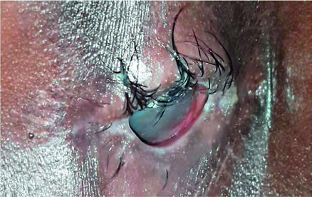
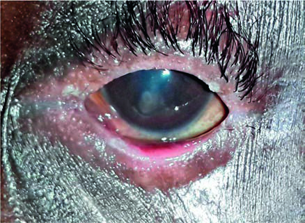

# Page 130 A 12-Year-Old Boy from Rural Kenya With Painful Eyes HILLARY K. RONO, ANDREW BASTAWROUS AND NICHOLAS A.V. BEARE Clinical Presentation History A 12-year-old boy is brought to a health centre in rural north-west Kenya. He reports 2 months of painful, watery, red eyes. The watering of his eyes is worse in the sun and he is struggling to keep his eyes open. Six months previously he was treated at a dispensary for less severe symptoms. He was given tetracycline eye oint-ment but his symptoms did not improve. After this, he went to a traditional healer who applied some juice extracts from the ecucuka plant (Aloe vera species). After instillation he experienced severe eye pain and discharge, both eyes became very red and he could hardly see. The boy lives with his parents in Loima, Turkana County, a hot, dusty and dry area of Kenya. They fetch water from a dried riverbed about 6 kilometres from home. They keep herds of cows and sheep, and the boy helps with herding and watering. Clinical Findings A 12-year-old boy who appears systemically well. Very poor vision in both eyes: His visual acuity is 6/60 with the left eye, but he can only perceive hand movements with the right eye. The findings on examination are shown in Table 30.1 and Figures 30.1 and 30.2. TABLE 30.1 Findings on Inspection of Both Eyes Right Eye Left Eye Lid Fibrotic lids with loss of lid architecture and tightening of palpebral aperture Loss of lashes from lower lid, misdirected and in-turned upper lid lashes (trichiasis) Lids swollen, mucus deposits, eyelashes misdirected Eversion of lower lid margin Conjunctiva Severely inflamed >5 follicles (subepithelial inflammatory foci) identified on eversion of lids Scarring of the upper tarsal conjunctivae Cornea Diffuse corneal opacification (scarring) with central thinning and irregular surface Fibrovascular pannus on the upper cornea Focal inferocentral corneal scars, one with adherent iris indicating previous perforation Thin central cornea Anterior chamber Not visible Shallow Pupil Not visible Distorted towards the leucoma (corneal scar) • Fig. 30.1 The right eye showing lid scarring, trichiasis and extensive corneal opacification. 82 # Page 2 Questions 1. What are your differential diagnoses? 2. What features fit the criteria for trachoma? Discussion A 12-year-old Kenyan boy from a pastoralist community in an arid area presents with painful, red eyes, discharge and poor vision. He has a history of using traditional eye medi-cine. On examination he has lid, conjunctival and corneal scarring associated with severe follicular inflammation and trichiasis (in-turning lashes). One eye has a perforated cor-neal ulcer with scarred iris adhesion (leucoma). Answer to Question 1 What Are Your Differential Diagnoses? The most important diagnoses to consider are: 1. Corneal and conjunctival damage from use of traditional eye medicine. 2. Trachomatous trichiasis. 3. Vitamin A deficiency. Further useful information includes dietary intake, his-tory of measles predisposing to vitamin A deficiency and ide-ally blood retinol (vitamin A) levels (this only drops once hepatic stores of vitamin A are severely depleted). Answer to Question 2 What Features Fit the Criteria for Trachoma? For the diagnosis of trachoma, two out of five clinical criteria need to be fulfilled. This boy has all five criteria: 1. Follicles on the tarsal (inner) conjunctiva. These are 0.5 to 2 mm pale, raised inflammatory foci with hyperaemic surround. Multiple follicles give a rough or dimpled appearance to the surface of the conjunctiva. 2. Conjunctival scarring of the upper tarsal conjunctiva. White bands or strands evident on everting (flipping) the upper eyelid which can also sometimes be seen on the inner lower lid. 3. Limbal follicles or Herbert’s pits. Follicles can occur at the edge of the cornea (limbus), and they leave 0.5 to 2 mm dark circular lesions (Herbert’s pits). 4. Fibrovascular pannus, mostly affecting the upper cornea. Ingrowth of fibrovascular tissue from the limbus ruining the transparency of the cornea. 5. Trichiasis on the upper lid. In-turning of the lashes so they scuff the cornea. The Case Continued… The child was diagnosed with bilateral trachomatous trichi-asis (TT), corneal opacity (CO) and a left perforating corneal ulcer. These may have been exacerbated by the application of traditional medicine. He was admitted and given oral azithromycin and oral vitamin A supplements. He was referred to the ophthalmol-ogist for lid surgery to redress trichiasis, and for a conjunc-tival flap to seal the corneal defect. SUMMARY BOX Trachoma Trachoma, caused by Chlamydia trachomatis, is the leading infectious cause of blindness in the world. It accounts for about 1.4% of the world’s blindness, but rates in affected communities in Africa are much higher. In endemic areas, active trachoma prevalence in pre-school children can be as high as 60% to 90%. Trachoma is common in poor rural communities, where there is scarcity of water, poor sanitation and low socioeconomic sta-tus. The spread occurs because of overcrowding within house-holds. Women are affected more than men and younger children are at greater risk of infection, especially children under 5 years old. After repeated infections in childhood, signs of trachoma progress from conjunctival inflammation to scarring. Scarring of the tarsal conjunctiva leads to inversion of the lid resulting in tri-chiasis. Repetitive damage and infections lead to corneal scarring and consequent visual impairment or blindness. A simplified scheme for assessing and classifying trachoma based on clinical signs has been developed. The stages are: Trachomatous inflammation with follicles (TF) Intense trachomatous inflammation (TI) Trachomatous conjunctival scarring (TS) Trachomatous trichiasis (TT) and Corneal opacity because of trachoma (CO). TF and TI are prevalent in young children and are manifesta-tions of moderate and severe active infection, while TT is common in adults. WHO has a global programme to eliminate trachoma as a disease of public health importance by 2020 (GET 2020). This programme includes mass antibiotic administrations to reduce the prevalence of Chlamydia infections, facial cleanliness, envi-ronmental improvement and surgery-the SAFE strategy: S Surgery for advanced cases. A Antibiotic treatment. F Facial cleanliness to reduce transmission. E Environmental improvement. Both tetracyclines and macrolides are effective against tra-choma in its acute stage (TF and TI). Tetracycline ointment can be • Fig. 30.2 The left eye with a focal corneal scarring including a perfo-rated corneal ulcer with adherent iris (leucoma). 83 CHAPTER 30 A 12-Year-Old Boy from Rural Kenya With Painful Eyes # Page 3 applied twice daily for 6 weeks. However, adherence to this treatment is poor. A single oral dose of azithromycin is equally effective and more convenient (20mg/kg for children, 1 g for adults). The WHO recommends 3 years of annual azithromycin as part of a trachoma control programme in communities where active trachoma is present in >10% of children. However, without additional environmental and economic improvement antibiotic treatment will not have a permanent effect. Communities need to secure suitable water supply, build and use well-designed latrines, safely dispose of rubbish and house animals apart from the family home. Further Reading 1. Beare NAV, Bastawrous A. Ophthalmology in the tropics and sub-tropics. In: Farrar J, editor. Manson’s Tropical Diseases. 23rd ed. London: Elsevier; 2013 [chapter 67]. 2. Mabey DC, Solomon AW, Foster A. Trachoma. Lancet 2003;362 (9379):223-9. 3. Negrel AD, Mariotti SP. Trachoma rapid assessment: rationale and basic principles. Community Eye Health/Int Cent Eye Health 1999;12(32):51-3. 4. Emerson PM, Burton M, Solomon AW, et al. The SAFE strategy for trachoma control: using operational research for policy, plan-ning and implementation. Bull WHO 2006;84(8):613-9. 5. WHO. Trachoma. Available from https://www.who.int/news-room/fact-sheets/detail/trachoma (accessed 27.06.2019.). 84 CHAPTER 30 A 12-Year-Old Boy from Rural Kenya With Painful Eyes

## Images

