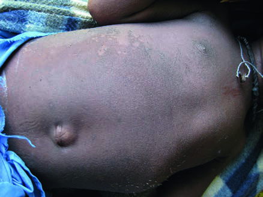

# Page 131 A 6-Year-Old Boy from Malawi With Fever, Cough and Impaired Consciousness CHARLOTTE ADAMCZICK Clinical Presentation History You review a 6-year-old boy in the paediatric high depen-dency unit of a Malawian Central Hospital. The boy was admitted the night before because of high fever, dyspnoea and a dry cough which had started 3 days before. On admis-sion, he was started on presumptive antimalarial treatment; the results of the malaria smear are pending. The boy is known to be HIV-positive but is not yet on antiretroviral therapy (ART). Clinical Findings Examination reveals a sick child with a temperature of 39.8°C (103.6°F) and laboured breathing. The Blantyre coma score is 3/5. The boy has coryza and bilateral conjunc-tivitis. Behind both ears and on the forehead, you notice a fine maculopapular rash that has not been described before. There is bilateral axillary lymphadenopathy. Questions 1. What is your differential diagnosis? 2. What complications do you expect and how do you man-age the child? Discussion An HIV-positive Malawian boy presents with high fever, dry cough, coryza, conjunctivitis and impaired level of con-sciousness together with a fine maculopapular rash on the neck and face. Answer to Question 1 What is Your Differential Diagnosis? The symptoms and signs are rather non-specific and the list of differential diagnoses is long, ranging from malaria and typhoid fever to atypical pneumonia and various viral infec-tions. Also a combination of different diagnoses has to be considered, given his state of immunosuppression. However, the boy shows the three ‘Cs’ of “cough, coryza and conjunctivitis”. Together with his rather con-spicuous rash starting behind his ears, measles should be suspected. Bright red spots with a whitish centre (‘Koplik’s spots’) on the buccal mucosa would be pathognomonic; however, they may be absent, or may appear only for a short period of time. Other viral infections presenting with a similar rash are rubella, enterovirus infection and infectious mononucleosis. Bacterial infections to consider include scarlet fever, menin-gococcal disease and rickettsial infections. Answer to Question 2 What Complications Should You Expect and How Do You Manage the Patient? Complications in measles are much more common in indi-viduals with cellular immune defects than in the immuno-competent. Severe diarrhoea, septicaemia, giant cell pneumonia, superimposed bacterial pneumonia, encephali-tis, otitis media and corneal ulcerations can complicate the course of disease. In this case, with a reduced Blantyre Coma Scale and laboured breathing, encephalitis and pulmonary involvement have to be considered. Because the rash in this boy has only just appeared, he is still contagious and needs to be isolated and nursed in a separate room. 85 # Page 2 The Case Continued… The boy required IV fluids, and vitamin A was given for cor-neal protection. Malaria treatment was stopped as smears turned out to be negative. Within the next 3 days, the rash covered the trunk and skin scaling started over the chest (Fig. 31.1). The boy developed severe pneumonia and received antibiotic treatment. After recovery, antiretroviral therapy was started in the out-patient-clinic. SUMMARY BOX Measles Measles is a highly contagious viral infection, caused by a para-myxovirus and transmitted through droplets. The course of the disease is strongly influenced by both nutritional and immune status of the affected individual. Despite the availability of a highly effective vaccine, large measles outbreaks continue to occur worldwide. After an incu-bation period of 8 to 12 days, the non-specific prodromal stage presents with fever, conjunctivitis, rhinitis and cough, followed after a few days by a maculopapular rash, evolving behind the ears and in the face, spreading over the trunk and limbs. Severe desquamation of the skin may develop during the course of the illness. The patient is highly contagious from about 4 days before until up to 4 days after the appearance of the exanthema. Immunocompromised individuals may not show the rash (‘white measles’), nevertheless they are highly vulnerable to developing complications. Furthermore, a sub-acute ‘inclusion-body’ encephalitis has been described in the immunocompromised, which occurs a few months after the acute measles infection. A late complication after several years is subacute severe sclerosing panencephalitis (SSPE), which is invariably fatal. SSPE has an incidence of one in 10000 to one in a million cases of measles. The Case Fatality Rate (CFR) in well-resourced settings is around 0.3 per 1000 whereas worldwide CFRs range between 3 and 5% and up to 30% in refugee settings. More than 95% of deaths occur in developing countries, mostly in children below the age of 5 years old. There is no specific antiviral treatment. In developing coun-tries, all children with measles should receive vitamin A supple-mentation, which prevents blindness and death. Vaccination or application of human immunoglobulin within 6 days of exposure may help protect non-vaccinated contacts. Routine measles vaccination of children is recommended by WHO. Recent adaptations in international vaccination schedules are recommending measles vaccination in infants of 9 months of age. Almost 100% of children vaccinated with two doses of the safe live measles vaccine will have protective immunity. However, since measles is highly contagious, around 95% of a population need to be vaccinated to preserve herd immunity. Asymptomatic and not severely immunocompromised chil-dren with HIV should receive measles vaccine because the risk of severe measles complications outweighs possible side effects of the vaccine. In severely immunocompromised persons with HIV, ART should be started and measles vaccination should be delayed until immune reconstitution. However, immune response may be hampered in HIV-positive individuals, particularly if the viral load is high at the time of vaccination. Further Reading 1. Munoz FM. Viral exanthemas. In: Farrar J, editor. Manson’s Trop-ical Diseases. 23rd ed. London: Elsevier; 2013 [chapter 20]. 2. Maldonado A, Shetty A. Rubeola Virus: Measles and Subacute Scle-rosing Panencephalitis. In: Long S, editor. Pediatric Infectious Dis-eases. 5th ed. Philadelphia: Elsevier; 2018 [chapter 227]. 3. Mekki M, Ely B, Hardie D, et al. Subacute sclerosing panencepha-litis: clinical phenotype, epidemiology, and preventive interven-tions. Dev Med Child Neurol 2019;61(10):1139-44. https:// doi.org/10.1111/dmcn.14166. 4. Haban H, Benchekroun S, Sadeq M, et al. Seroprevalence of mea-sles vaccine antibody response in vertically HIV-infected children in Morocco. BMC Infect Dis 2018;18:680. https://doi.org/10.1186/ s12879-018-3590-y. • Fig. 31.1 Scaling of the erythematous rash. 86 CHAPTER 31 A 6-Year-Old Boy from Malawi With Fever, Cough and Impaired Consciousness

## Images

