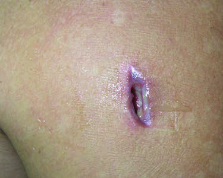
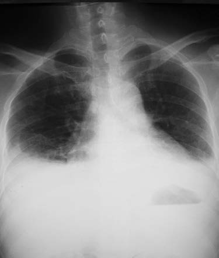

# Page 132 A 44-Year-Old Male Farmer from Laos With Diabetes and a Back Abscess SAYAPHET RATTANAVONG, VALY KEOLUANGKHOT, SIHO SISOUPHONH, VATTHANAPHONE LATTHAPHASAVANG, DAVID A.B. DANCE AND CAOIMHE NIC FHOGARTAIGH Clinical Presentation History A 44-year-old male rice farmer presents to a provincial hos-pital in Southern Laos in the rainy season with a 1-month history of fever, headache, generalized myalgia and arthralgia and a painful swelling over the left scapula. The swelling has gradually increased in size, without any history of preceding trauma. He has not noticed any lesions elsewhere. He was diagnosed with type 2 diabetes 4 years previously but was not compliant with oral antidiabetic drugs or follow-up. The lesion on his back was incised and drained at a local health centre the previous week, since when he has been tak-ing cloxacillin 1g four times daily. However, there has been no improvement and during the 2 days prior to admission he has deteriorated, with high fever, chills and severe malaise. Clinical Findings The patient appears septic, with a fever of 40°C (104°F), a heart rate of 136bpm, blood pressure of 140/80mmHg and a respiratory rate of 30 breath cycles per minute. He is pale and jaundiced. In the left scapular region, there is an ery-thematous swelling of 2.54cm with pus discharging from a central wound (Fig. 32.1). There is no regional lymphade-nopathy. On chest auscultation there are bilateral crepita-tions and reduced breath sounds at both lung bases. Heart sounds are normal. The abdomen is soft, without any palpa-ble organomegaly. Laboratory Results The laboratory results are shown in Table 32.1. Questions 1. What are your differential diagnoses? 2. What additional investigations would you like to do? • Fig. 32.1 Wound on the patient’s left shoulder, after incision and drain-age of the abscess. (Side finding: hypopigmented macular skin lesions of Pityriasis versicolor (Malassezia spp.), commonly seen in humid tropical climates.) TABLE 32.1 Laboratory Results Parameter Patient Reference Range WBC ( 109/L) 16.26.0-8.0 Polymorphs (%) 92.145-70 Haemoglobin (g/dL) 12.512.0-16.0 Platelets ( 109/L) 112150-300 Glucose (mmol/L) 20.64.1-6.1 Serum creatinine (μmol/L) 5662-120 Urea (mmol/L) 6.85.4-16.1 AST (U/L) 1310-37 ALT (U/L) 830-40 Serum total bilirubin (μmol/L) 111.21.71-20.5 Serum direct bilirubin (μmol/L) 56.40-787 # Page 2 Discussion A male Lao rice famer presents during the rainy season with prolonged fever, jaundice, a back abscess and chest signs. He is a known type 2 diabetic but has been non-adherent to his antidiabetic medication. Answer to Question 1 What Are Your Differential Diagnoses? Bacterial abscess with sepsis may be caused by Staphylococcus aureus, Streptococcus pyogenes or other Streptococcus species, Klebsiella pneumoniae, Vibrio vulnificus or anaerobes. This patient, however, has epidemiological and clinical risk factors for melioidosis, caused by Burkholderia pseudomallei. This may cause a spectrum of disease in immunocompromised patients, especially diabetics, ranging from localized abscesses to pneumonia and septicaemia with disseminated abscess formation and high mortality. There is often no history of an inoculation injury or trauma. Tuberculosis should also be considered with the sub-acute history of abscess with respiratory findings; however, tuber-culous abscesses are usually ‘cold’, without much pain, ery-thema or warmth. Disseminated fungal infection seems unlikely but would be possible if there was additional immunocompromise such as HIV. Answer to Question 2 What Additional Investigations Would You Like to Do? Essential investigations include blood culture and abscess swab (or deep pus) for microscopy and culture. A throat swab, or sputum sample if there is pulmonary involvement, may also be cultured on selective media, such as Ashdown’s agar. A chest radiograph (CXR) should be done looking for evidence of pneumonia or pleural effusion. An ultrasound of the abdomen, or other imaging such as CT or MRI scan, should also be considered, because the findings of liver and splenic abscesses would strongly support a diagnosis of melioidosis while culture results are awaited. Biochemistry assays to check glucose and creatinine are important to opti-mize glycaemic control and adjust drug dosage respectively. Depending on the CXR findings, sputum, pleural fluid and pus may be sent for staining for acid-fast bacilli (e.g. Ziehl-Neelsen stain) and M. tuberculosis-PCR (e.g. Xpert MTB/RIF). The Case Continued… Pus culture yielded B. pseudomallei after 48 hours, and later his blood culture also grew the same bacterium. Three throat swabs were cultured on selective media but failed to grow the organism. The CXR revealed bilateral pleural effusions (Fig. 32.2). A shoulder radiograph showed no evidence of bony involvement. Abdominal ultrasound showed hepatos-plenomegaly without evidence of liver or splenic abscesses. The patient was empirically treated with ceftriaxone and gentamicin while awaiting the culture results. Treatment was switched to ceftazidime after 48 hours when the laboratory alerted the clinicians to the suspicion of melioidosis. The patient improved after 7 days of treatment and was afebrile by day 14, when he was switched to oral co-trimoxazole to complete 20 weeks. Glycaemic control was established. No other foci of infection were detected by locally available investigations. The patient was discharged after 21 days of hospitalization and continued on oral ‘eradication’ treatment for 5 months. He remains well. SUMMARY BOX Melioidosis Melioidosis is an infectious disease caused by B. pseudomallei, an environmental saprophyte endemic to South and South-east Asia and northern Australia. The disease is being described with increasing frequency both in non-endemic and in endemic areas. This may be because of a combination of greater awareness, improving laboratory facilities and research and possibly also as a result of a genuine increase in incidence. A modelling study has estimated 165,000 human melioidosis cases with 89,000 deaths per year worldwide making it a significant neglected tropical disease (NTD), even though it does not feature on the WHO’s list of NTDs. North-eastern Thailand and northern Australia are highly endemic areas, where B. pseudomallei is an important cause of community-acquired sepsis and pneumonia. It is probably widely distributed elsewhere outside the endemic region and may be greatly underdiagnosed. Humans are thought usually to become infected by percuta-neous inoculation through cuts and abrasions (e.g. when working in rice fields), inhalation/aspiration during severe weather events and ingestion (e.g. ingestion of contaminated and unchlorinated water supplies), although it is often difficult to determine precisely the mode of acquisition. Host factors are very important; the majority of cases occur in those who are immunocompromised, especially with diabetes mellitus, but also alcoholism, chronic lung • Fig. 32.2 Admission chest radiograph of the patient, showing bilateral pleural effusions. 88 CHAPTER 32 A 44-Year-Old Male Farmer from Laos With Diabetes and a Back Abscess # Page 3 disease, chronic renal disease, thalassaemia, steroid use, immunosuppressive therapy and cancer, but surprisingly not HIV infection. The disease is highly seasonal, with 80% of cases presenting during the wet season. Clinical presentation varies from benign localized infection to rapidly progressive septicaemia. The bacteraemic form accounts for 40% to 60% of cases; and over half present with pneumonia, which carries a case fatality rate of 10% to 40%. The lethality is even higher in resource-poor settings where there is limited access to early diagnosis, appropriate antibiotic treatment and intensive care facilities. The organism may localize in the lungs, liver, spleen, prostate, parotid, skin and soft tissue, bones and joints, or the central nervous system, causing abscesses and granulomas; but approximately 10% to 15% of bacteraemic cases have no evident clinical focus. It is important to use available imaging to identify the extent of infection and monitor the course of treatment. The confirmation of the diagnosis of melioidosis is based on the isolation and identification of B. pseudomallei in clinical samples, and in endemic areas it may be possible to reduce the time to diagnosis using immunofluorescence and lat-eral flow immunoassay on clinical specimens, and B. pseudo-mallei antigen latex agglutination on isolates. Serology has relatively low sensitivity and specificity with high rates of back-ground seropositivity in those living in endemic regions. PCR assays on clinical specimens, aiming to provide a more rapid diagnosis, showed high specificity however the sensitivity on blood specimens depends on adequate bacterial concentration. Parenteral antibiotics (e.g. ceftazidime, meropenem) are usually given for 2 weeks in the acute phase, followed by oral co-trimoxazole to complete 3 to 6 months eradication therapy to minimize risk of relapse. For patients unable to take co-trimoxazole, co-amoxiclav is an alternative but has higher relapse rates. Supportive treatment of sepsis and surgical drainage of abscesses, as well as control of predisposing factors are also critical in optimizing outcome. Further Reading 1. Dance DB. Melioidosis. In: Farrar J, editor. Manson’s Tropical Diseases. 23rd ed. London: Elsevier; 2014 [chapter 16]. 2. Currie BJ. Melioidosis: evolving concepts in epidemiology, patho-genesis, and treatment. Seminars in respiratory and critical care medicine 2015;36(1):111-25. 3. Limmathurotsakul D, Golding N, Dance DA, et al. Predicted global distribution of Burkholderia pseudomallei and burden of melioidosis. Nat Microbiol 2016;1(1):15008. 4. Wiersinga WJ, Virk HS, Torres AG, et al. Melioidosis. Nat Rev Dis Primers 2018;4:17107. 5. Dance D. Treatment and prophylaxis of melioidosis. Int J Antimi-crob Agents 2014;43(4):310-8. 89 CHAPTER 32 A 44-Year-Old Male Farmer from Laos With Diabetes and a Back Abscess

## Images

