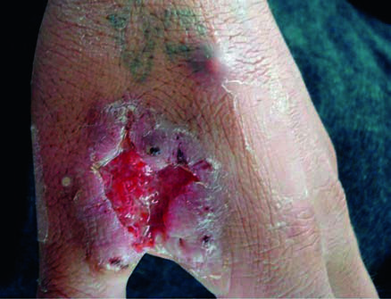
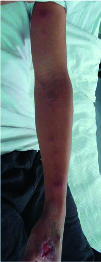

# Page 134 A 35-Year-Old Male Farmer from Peru With a Chronic Ulcer and Multiple Nodular Lesions on the Arm FERNANDO MEJÍA CORDERO, BEATRIZ BUSTAMANTE AND EDUARDO H. GOTUZZO Clinical Presentation History A 35-year-old farmer from the Peruvian highlands presents to a reference hospital in the capital, Lima, with a 2-month history of a slowly growing ulcer and multiple painless nod-ules on his left arm. Two months before presentation, the patient suffered a scratch on his left hand from a tree branch while working in the fields. After a few days, he noticed a small painless ery-thematous papule that later developed into a pustule. He took antibiotics without improvement. Over the following weeks new pustules appeared, and the lesion started to ulcer-ate and increased in size, despite continued antibiotics and topical traditional medicines. Four weeks after the initial papule the patient noticed painless firm nodules on his left forearm. The patient was seen at a regional hospital and trea-ted empirically for cutaneous leishmaniasis with a 20-day course of pentavalent antimonials, but showed no improve-ment. He was then referred for further diagnosis and treatment. The patient was previously healthy. He denied recent contact with animals or travel. Clinical Findings The patient appears generally well. His vital signs are normal and he is afebrile. On his left hand there is a single ulcerative lesion (2030mm) with irregular elevated borders (Fig. 34.1) and mul-tiple subcutaneous erythematous nodules (1010mm) along the lymphatic tract of the left arm (Fig. 34.2). The rest of the physical examination is normal. Laboratory Results The WBC is 4.5109/L (reference range 4-10109/L) with normal differential count; haemoglobin is 11.3g/dL (12-16g/dL). The remainder of the full blood count is normal. Questions 1. What are your differential diagnoses? 2. How would you approach this patient? Discussion A Peruvian farmer presents with a chronic ulcerative lesion on his left hand and contiguous involvement of the lym-phatic tract compatible with nodular lymphangitis. The • Fig. 34.1 Initial ulcerated lesion on the left hand. Note the pustular lesion near the ulcer. 93 # Page 2 lesions started after a minor traumatic injury. The patient denies systemic symptoms. Laboratory examination shows mild anaemia. Answer to Question 1 What Are Your Differential Diagnoses? In Peru, the common differential diagnoses of a chronic ulcer with nodular lymphangitis include cutaneous leishmaniasis, sporotrichosis and mycobacterial infection by Mycobacterium tuberculosis or M. marinum. Leishmaniasis is endemic in the Andes between 1000 and 3000m altitude and in the Amazon Basin. The patient’s ori-gin and clinical presentation are highly suggestive of cutane-ous leishmaniasis. However, the lack of clinical improvement after a complete course of pentavalent antimonials (>80% cure rate) makes this diagnosis unlikely. Sporotrichosis is the second most important diagnosis to consider. The patient’s clinical features are typical and the disease is commonly seen in Peru. Another diagnosis to keep in mind is secondary cutaneous tuberculosis, especially because the patient has likely been exposed to M. tuberculosis during his lifetime. The patient has no history of exposure to fresh and saltwater environments to suggest infection with M. marinum. Nocardiosis (Nocardia brasiliensis) and tularae-mia (Francisella tularensis) are other causes of nodular lym-phangitis but are unlikely in this patient, because nocardiosis is rare and tularaemia has never been reported in the southern hemisphere. Answer to Question 2 How Would You Approach This Patient? The first step is the collection of specimens for microscopy (smears for Gram, Giemsa and Ziehl-Neelsen stains), cul-ture and, if available, PCR for Leishmania and Mycobacte-rium species and Sporothrix schenckii. Specimens should be collected by scraping of the base of the active ulcer, biopsy of the edge of the lesion, and fine-needle aspiration of one of the lymphatic nodules. If available, a leishmanin skin test would be a useful diagnostic tool. Fungi such as S. schenckii grow on special media and the laboratory should be informed of the clinical suspicion of sporotrichosis. The initial evalu-ation should also include chest radiography and a PPD skin test to rule out tuberculosis. The Case Continued… The chest x-ray was normal and PPD skin testing was negative. No leishmania parasites were observed by direct microscopy, and the leishmanin skin test was negative. Leishmania culture was not performed. Mycobacterial cultures were negative. However, culture of the ulcer scraping and nodule aspiration were positive for S. schenckii. A diagnosis of lymphocutaneous sporotrichosis was made. The mild anaemia was likely to be unrelated. The patient was started on itraconazole PO 200mg/day. After 8 months of treatment the ulcer and nodular lesions had resolved and the patient was considered to be cured. SUMMARY BOX Sporotrichosis Sporotrichosis is a sub-acute to chronic fungal infection caused by S. schenckii, a dimorphic fungus with a worldwide distribu-tion, existing as a saprophytic mould in soil and plants and as a yeast in tissues. Cutaneous sporotrichosis is the most common form of the disease, which is acquired by inoculation during minor injury by animal bites, plant thorns or other cutting vege-tation. Sporotrichosis has in addition emerged as a zoonosis transmitted mainly by infected cats, with epidemic outbreaks in Brazil and some countries in South America, caused by S. brasiliensis. The upper limbs are most commonly affected. The infection is usually limited to the cutaneous, subcutaneous and lymphatic tissues surrounding the injury. The initial papule at the inoculation site typically grows slowly into a nodule and then ulcerates. Contiguous lymphatic spread is very common (48-92%) and is referred to as ‘nodular lymphangitis’ or ‘spor-otrichoid lymphangitis’. The majority of cases are sporadic. Farmers, veterinarians, rose gardeners and others regularly engaged in outdoor activities are at highest risk. Persons with pre-existing chronic conditions (e.g., alcohol abuse) or immu-nosuppression (e.g., HIV/AIDS) are at risk of developing pul-monary sporotrichosis after mould inhalation or disseminated sporotrichosis after haematogenous spread from the cutaneous lesion. • Fig. 34.2 Multiple subcutaneous nodules along the lymphatic tract. 94 CHAPTER 34 A 35-Year-Old Male Farmer from Peru With a Chronic Ulcer and Multiple Nodular Lesions on the Arm # Page 3 The fungi are scarce in tissues and generally not detected on microscopy. Serology is not useful because of low sensitivity and specificity. Diagnosis is based on isolation of the organism by culture of the skin biopsy, lesion aspirate, or sputum. S. schenckii grows on Saboraud agar at 25 to 27°C. Also, molecular methods may be used. Spontaneous resolution of the lesions is rare. Itraconazole PO 200mg/day is considered the drug of choice for cutaneous sporotrichosis. The treatment should be continued for 2 to 4 weeks after resolution of all lesions, typically 3 to 6 months but sometimes even requiring years. Saturated solution of potas-sium iodide, a cheap and effective drug, has also been widely used but its low tolerability and many unpleasant side effects (e.g., salivary gland swelling, metallic taste, rash and fever) limit its use. Terbinafine is also an alternative treatment. Itraconazole (200mg PO bd for 1-2 years) is also the preferred drug for pulmonary or osteoarticular sporotrichosis. In severely ill patients or patients with disseminated disease, initial therapy with amphotericin B is recommended, with conversion to oral itra-conazole after a favourable response and stabilization. Relapses are infrequent with all forms and therapy, although long-term secondary prophylaxis might be required in patients with HIV/ AIDS. Further Reading 1. Hay RJ. Fungal infections In: Farrar J, editor. Manson’s Tropical Diseases. 23rd ed. London: Elsevier; 2013 [chapter 38]. 2. Sanchotene KO, Madrid IM, Klafke GB, Bergamashi M, Terra PPD, Rodrigues AM, Xavier MO. Sporothrix brasiliensis out-breaks and the rapid emergence of feline sporotrichosis. Mycoses 2015;58:652-8. 3. Barros MB, de Almeida Paes R, Schubach AO. Sporothrix schenckii and sporotrichosis. Clin Microbiol Rev 2011;24(4):633-54. 4. Kauffman CA, Bustamante B, Chapman SW, et al. Clinical practice guidelines for the management of sporotrichosis: 2007 update by the Infectious Diseases Society of America. Clin Infect Dis 2007;45 (10):1255-65. 5. Hay R, Denning DW, Bonifaz A, Queiroz-Telles F, Beer K, Bustamante B. The Diagnosis of Fungal Neglected Tropical Diseases (FungalNTDs)andtheRoleofInvestigationandLaboratoryTests:An Expert Consensus Report. Trop Med Infect Dis 2019;4(4):E122. 95 CHAPTER 34 A 35-Year-Old Male Farmer from Peru With a Chronic Ulcer and Multiple Nodular Lesions on the Arm

## Images

