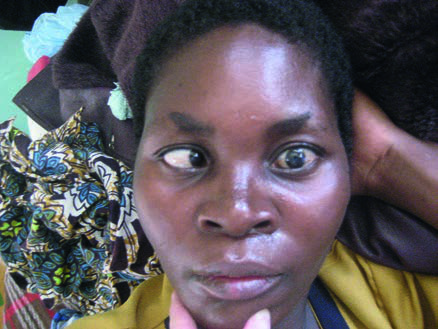
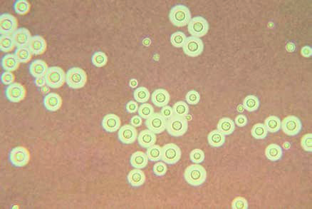

# Page 135 A 32-Year-Old Woman from Malawi With Headache and Blurred Vision CAMILLA ROTHE Clinical Presentation History A 32-year-old Malawian woman presents to a local hospital with a 3-week history of headache and blurred vision. The headache has been gradual in onset and does not respond to over-the-counter painkillers. There is no fever and no his-tory of convulsions or of head trauma. The patient presented to a local health centre where she received presumptive antimalarial treatment (artemether/ lumefantrine) and a course of antibiotics (amoxicillin 500mg tds for 5 days), which was of no benefit. Clinical Findings The patient appears wasted and slightly anaemic. All vital signs are normal and she is afebrile. The GCS is 15/15. There is no neck stiffness. The visual acuity is normal on both sides. On left lateral gaze there is an abduction deficit of the left eye with ‘blurring of vision’ reported by the patient (Fig. 35.1). The rest of the examination is normal. Laboratory Results See Table 35.1. Questions 1. What are your differential diagnoses? 2. What investigations would you like to do? Discussion A Malawian woman presents with a chronic headache and ‘blurred vision’. She is wasted and has a unilateral abdu-cens nerve palsy. She is afebrile and has no neck stiffness. The full blood count shows normocytic anaemia and thrombocytopenia. Answer to Question 1 What Are Your Differential Diagnoses? The patient’s clinical presentation suggests chronic meningi-tis. The two most important differential diagnoses are cryp-tococcal meningitis and tuberculous meningitis. Also, partially treated bacterial meningitis is a possibility because she received amoxicillin at the health centre, but the gradual onset of symptoms makes this less likely. • Fig. 35.1 Abducens nerve palsy on the left in a patient with sub-acute headache. TABLE 35.1 Laboratory Results on Admission Parameter Patient Reference WBC ( 109/L) 3.74-10 Haemoglobin (g/dL) 10.212-16 MCV (fL) 9280-98 Platelets ( 109/L) 91150-350 Fasting blood glucose (mmol/L) 5.435.0-6.7 Malaria RDT Negative Negative 96 # Page 2 Chronic meningitis is commonly associated with immu-nosuppression. The patient lives in a part of the world with a high HIV prevalence. Her laboratory findings (anaemia and thrombocytopenia) are also common in untreated HIV infection. Even though malaria may present with non-specific symptoms and both thrombocytopenia and anaemia are commonly seen in malaria patients, the absence of fever, the negative rapid diagnostic test (RDT) and the history of taking artemisinin combination therapy make it an unlikely differential diagnosis. Also, malaria usually does not cause cranial nerve palsies. Answer to Question 2 What Investigations Would You Like to Do? An HIV test is crucial and a lumbar puncture should be done without delay. Cerebrospinal fluid (CSF) opening pressure should be measured and documented. Routine CSF exami-nation should include India Ink stain and bacterial and fun-gal cultures. Cryptococcal antigen (CrAg) should be tested in blood and CSF. The Case Continued… A lumbar puncture was done on admission. The CSF looked clear, but the opening pressure was increased at 50cmH2O (normal: 10-18cmH2O). The CSF results are shown in Table 35.2. A diagnosis of cryptococcal meningitis was made based upon a positive fungal culture result. India Ink was negative, but sensitivity is only at around 50-70%. CrAg, which is >95% sensitive, was not available. The HIV serology came back positive. The CD4 count was very low at 22/μL. The patient was started on oral flu-conazole 1200mg (see Summary Box), because the preferred fungicidal drugs Amphotericin B and flucytosine were not available. She was also started on co-trimoxazole prophylaxis. She received repeated therapeutic lumbar punctures until the headache settled. Antiretroviral therapy was commenced 4 weeks into her antifungal treatment. The patient returned to her village yet died 6 weeks later of an unknown cause. SUMMARY BOX Cryptococcal Meningitis Cryptococcal meningitis (CM) occurs worldwide. Ninety-five per cent of CM cases in developing countries are HIV-associated. CM is the most common cause of adult meningitis in sub-Saharan Africa and parts of Asia where HIV prevalence is high. Cryptococcal meningitis is caused by the encapsulated environmental yeast, Cryptococcus neoformans. It is an oppor-tunistic infection, which occurs at advanced stages of immuno-suppression, in HIV mostly at CD4 counts below 100/μL. Patients usually present with a sub-acute headache of several days to weeks duration. Other common clinical findings are cranial nerve palsies (N VI), confusion and impaired consciousness. Altered mental state is associated with increased lethality. CM is clinically indistinguishable from tuberculous meningitis (TBM), although fever and neck stiffness are more common in TBM. CSF opening pressure is often markedly elevated. Further CSF findings are commonly non-specific, and the CSF may even be normal. Diagnosis of CM is made by demonstrating the fungus in the CSF. This is traditionally done by light microscopy after India-Ink staining (Fig. 35.2), but this method is user-dependent and the sensitivity is therefore variable. Detection of CrAg e.g. by latex-agglutination test or lateral flow assay (LFA) is better. Fungal culture of CSF is required to isolate the organism for antimicrobial susceptibility testing. CM treatment consists of three phases: induction, consolidation, and maintenance. The gold standard is an induction therapy with two fungicidal drugs that rapidly decrease the fungal burden in the CSF i.e. combined (liposomal) amphotericin B plus flucytosine (IV or oral) for the initial 2 weeks, followed by oral fluconazole 400mg daily for at least 8 weeks and fluconazole maintenance therapy 200mg daily until immune reconstitution. The reality in many resource-limited settings is however hampered by poor drug availability and therefore commonly dif-fers from the gold standard. Oral fluconazole is often the only available drug, thanks to a drug donation programme by the manufacturing company. Fluconazole is only fungistatic, which may be effective as a secondary prophylaxis, but is less useful as induction therapy when potent fungicidal drugs are needed to rapidly bring down the fungal burden. Studies in low-income settings have demonstrated that even short courses of Ampho-tericin B (5-7 days) are preferable to treatment with fluconazole alone. Flucytosine, the other fungicidal drug, is expensive; and despite its great value in the treatment of CM, remains unlicensed TABLE 35.2 CSF Results on Admission Parameter Patient Reference Leukocytes (cells/μL) 180-5 Protein (g/L) 0.80.15-0.40 Glucose (mmol/L) 1.972.22-3.88 India Ink Negative Negative Culture C. neoformans Negative • Fig. 35.2 Photomicrograph of Cryptococcus neoformans (India Ink stain). (Source: www.cdc.gov; www.cdc.gov/fungal/cryptococco sis-neoformans/) 97 CHAPTER 35 A 32-Year-Old Woman from Malawi With Headache and Blurred Vision # Page 3 in many African and Asian countries. Steroids are of no benefit in the treatment of HIV-associated cryptococcal meningitis. Many patients with CM suffer from severe headaches, which do not respond to analgesics. The headache is caused by raised intracranial pressure (ICP) and therapeutic lumbar punctures (LPs) bring immediate pain relief. LPs may have to be repeated on a daily basis until the ICP has come down and sustained pain control has been achieved. HIV-positive patients with CM should start antiretroviral ther-apy, but the optimum timing is not yet clear. Introduction of ART 4 to 10 weeks after starting antifungal treatment is currently considered the safest approach. Prognosis of CM in resource-limited settings is poor and 10-week lethality on fluconazole monotherapy may exceed 60%. Further Reading 1. Wood R. Clinical features and management of HIV/AIDS. In: Farrar J, editor. Manson’s Tropical Diseases. 23rd ed. London: Elsevier; 2013 [chapter 10]. 2. Perfect JR, Dismukes WE, Dromer F, et al. Clinical practice guide-lines for the management of cryptococcal disease: 2010 update by the Infectious Diseases Society of America. Clin Infect Dis 2010;50 (3):291-322. 3. Sloan DJ, Dedicoat MJ, Lalloo DG. Treatment of cryptococcal meningitis in resource limited settings. Curr Opin Infect Dis 2009;22(5):455-63. 4. Sloan DJ, Parris V. Cryptococcal meningitis: epidemiology and therapeutic options. Clin Epidemiol 2014;6:169-82. 5. Molloy SF, Kanyama C, Heyderman RS, et al. Antifungal Combi-nations for Treatment of Cryptococcal Meningitis in Africa. N Engl J Med 2018;378:1004-17. 98 CHAPTER 35 A 32-Year-Old Woman from Malawi With Headache and Blurred Vision

## Images

