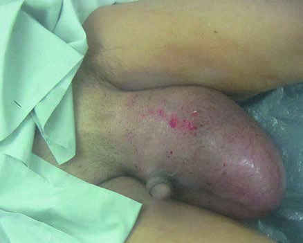

# Page 136 A 23-Year-Old Farmer from Myanmar With Unilateral Scrotal Swelling KENTARO ISHIDA AND CAMILLA ROTHE Clinical Presentation History A 23-year-old farmer presents to a district hospital in Myan-mar with a 3-year history of left-sided scrotal swelling. The swelling is non-tender and has gradually increased in size. There is no history of fever. He has attempted to treat the swelling with traditional herbal medicine to no avail. The patient comes from the central part of Myanmar. He reports that scrotal swelling is not an uncommon problem in his home region. Clinical Findings The patient is a 23-year-old man in fair general condition. His vital signs are normal and he is afebrile. There is unilat-eral scrotal swelling, which cannot be reduced (Fig. 36.1). There are no palpable inguinal lymph nodes. Questions 1. What is the differential diagnosis? 2. What investigations would you like to do? Discussion A young Burmese farmer presents with progressive unilateral scrotal swelling. On examination, the swelling is non-tender and non-reducible. He does not have any other symptoms or signs. Answer Question 1 What is Differential Diagnosis? The most common differentials to consider in a chronic, non-tender, unilateral scrotal swelling are inguinal hernia and hydrocoele. A testicular tumour also needs to be taken into consideration. Unlike hydrocoeles, hernias can often be manually reduced. Hydrocoeles may be verified by trans-illumination with a penlight. The patient reports that scrotal swelling is common in the region where he comes from. This may suggest a possible infectious aetiology. The most important infectious disease to consider in this patient is lymphatic filariasis (LF) caused by Wuchereria bancrofti. Hydrocoele is the most common clinical abnormality in men with bancroftian filariasis. Also, urogenital schistosomiasis (Schistosoma haemato-bium) may lead to unilateral scrotal swelling, but it is not endemic in South-east Asia. Testicular tuberculosis is another infectious disease that may manifest with scrotal swelling. However, the long duration of the swelling in the absence of other signs and symptoms make this unlikely, and it would not explain the large number of cases seen in his home region. Answer Question 2 What Investigations Would You Like to Do? Ultrasound can help distinguish a testicular tumour from a hydrocoele or hernia. Also, in case of lymphatic filariasis, adult worms may be seen on scrotal ultrasonography (“filarial dance sign”). • Fig. 36.1 Massive unilateral scrotal swelling. The swelling is non-tender and non-reducible. 99 # Page 2 The traditional diagnostic gold standard for lymphatic filariasis is the proof of microfilariae in the blood. Samples should be collected when microfilaraemia is highest. For the majority of filarial species, this is between 9 PM and 3 AM because of the nocturnal biting activities of most vectors. Microfilarial PCR assays have a sensitivity and specificity comparable to microscopy with an experienced microsco-pist, but are usually not available in a district hospital setting. Circulating filarial antigen (CFA) tests detect antigens released by adult W. bancrofti. They are available as immu-nochromatographic card tests and can use finger-prick blood. Because there is no periodicity of adult-worm antigens, CFA tests can be taken at any time. Their sensitivity and specific-ity are high. CFA tests are also the preferred method for diag-nosis and treatment monitoring of bancroftian filariasis within national control programmes. Antifilarial antibody testing lacks specificity and is of limited value. The Case Continued… Hydrocoele was confirmed on ultrasound. The patient underwent hydrocoelectomy, and 3litres of clear fluid could be drained during the operation. He also received antifilarial treatment. He lived in a remote area and was lost to follow-up afterwards. SUMMARY BOX Lymphatic Filariasis LF is caused by filarial nematodes (W. bancrofti, Brugia malayi and B. timori). LF is transmitted by a variety of mosquito species. It is endemic in South and South-east Asia, sub-Saharan Africa and parts of South America and the Caribbean. Around 68 million people worldwide are estimated to be infected with filarial parasites; an additional 20 million are suffering from chronic morbidity. Lymphatic filariasis is a result of chronic, repeat exposure to filarial nematodes. It is therefore not a problem relevant for short-term travellers to endemic regions. Adult worms reside in the lymphatic vessels of the human host. They shed microfilariae which are ingested by female mosquitoes during blood-meals. The most common features of bancroftian filariasis are hydrocoele, acute adenolymphangitis (ADLA) and lymphoedema. Hydrocoele results from the accumulation of fluid in the tunica vaginalis surrounding the testes. Most cases are unilateral. In endemic areas, hydrocoeles start to develop in early adulthood. Prevalence rates rise steadily with age. Rupture of dilated abdominal lymphatic vessels into the urinary tract may lead to chyluria. Brugian filariasis is milder than infection with W. bancrofti, and urogenital complica-tions do not occur. Acute ADLA occurs in episodic events that start with fever, chills and severe malaise. Regional lymph nodes are tender and enlarged, the affected limb may become swollen and hot and the skin may peel off. Repeated episodes of ADLA can lead to lymphoedema. Chronic lymphoedema most commonly affects the lower leg, but may also involve the arms, breasts and genitals, as shown in this case. The most advanced stage of chronic lymphoedema (stage III) is also referred to as ‘elephantiasis’. Chronic ulceration with bacterial and fungal superinfection is a common problem. Moreover, in areas of high HIV prevalence, lymphatic filari-asis was found to increase susceptibility to HIV infection by inducing systemic CD4 T-cell activation. Drugs used for treatment and control of lymphatic filariasis include diethylcarbamazine (DEC), ivermectin, albendazole and doxycycline. Albendazole 400mg STAT with either DEC (6mg/kg) or ivermectin (200 μg/kg) reduces microfilaraemia to very low levels (Table 36.1). A triple therapy combining all three drugs appears even more efficacious. However, DEC should not be given in areas co-endemic for onchocerciasis or loiasis because of potentially severe side effects, and care must be taken to administer ivermectin in areas with Loa loa co-endemicity. Treatment in mass drug administration (MDA) programmes is recommended annually; whereas individual patients should get treatment every 6 months until microfilariae and CFA tests are negative, or life-long, if transmission goes on. Doxycycline kills endosymbiotic Wolbachia bacteria, which adult worms require for viability and reproduction. Several weeks of treatment are required, and doxycycline is contrain-dicated in pregnancy and in children under the age of 8 years, which make it an unsuitable option for mass treatment. Its role may be in individual treatment of LF patients who lack any of the contraindications. For management of lymphoedema, meticulous hygiene is crucial, such as daily washing with water and soap and careful drying of the affected limb. Bacterial and fungal infections should be treated early. Specialized shoes should be worn to prevent injury if the lower limbs are affected. Integration of lymphoedema care and leprosy or diabetic foot care pro-grammes are being promoted. Small hydrocoeles sometimes regress after anthelmintic treatment. Large hydrocoeles require surgery. Further Reading 1. Simonsen P, Fischer PU, Hoerauf A, et al. The Filariases. In: Farrar J, editor. Manson’s Tropical Diseases. 23rd ed. London: Elsevier; 2013 [chapter 54]. 2. Taylor MJ, Hoerauf A, Bockarie M. Lymphatic filariasis and onchocerciasis. Lancet 2010;376(9747):1175-85. 3. WHO. Lymphoedema and the chronic wound. The role of com-pression and other interventions. In: Macdonald JM, Geyer MJ, TABLE 36.1 Direct Effect of Most Commonly Used Drugs on Different Stages of W. bancrofti and Brugia species Microfilariae Adults Diethylcarbamazine (DEC) ++ + Ivermectin ++ Albendazole + Doxycycline ++ ++ ¼ most eliminated; + ¼ few/some eliminated; ¼ no effect. 100 CHAPTER 36 A 23-Year-Old Farmer from Myanmar With Unilateral Scrotal Swelling # Page 3 editors. Wound and Lymphoedema Management. Geneva: World Health Organization; 2010. p. 1-136. 4. Thomsen EK, Sanuku N, Baea M, et al. Efficacy, safety and phar-macokinetics of co-administered diethylcarbamazine, albendazole and ivermectin for treatment of Bancroftian filariasis. Clin Inf Dis 2016;62(3):334-41. 5. Kroidl I, Saathoff E, Maganga L, et al. Effect of Wuchereria ban-crofti infection on HIV-incidence in southwest Tanzania: a pro-spective cohort study. Lancet 2016;388:1912-20. 101 CHAPTER 36 A 23-Year-Old Farmer from Myanmar With Unilateral Scrotal Swelling

## Images

