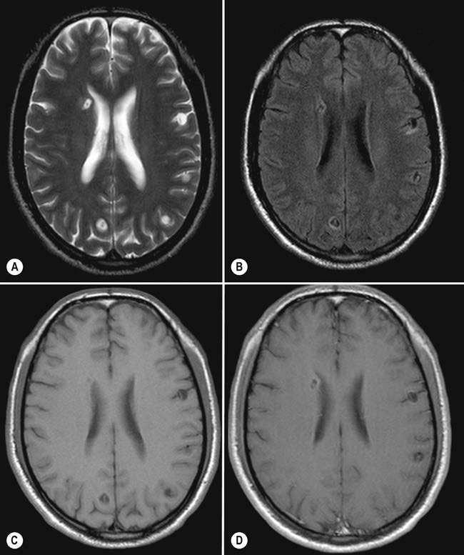

# Page 138 A 24-Year-Old Female Globetrotter With Strange Sensations in the Right Side of Her Body JURI KATCHANOV AND EBERHARD SIEBERT Clinical Presentation History A 24-year-old Dutch yoga instructor presents to an emer-gency room in Berlin, Germany, with one episode of strange sensations in the right side of her body. This started in the right side of her face, marched to her right arm and then con-tinued to involve her right leg. She describes the feeling as ‘pins and needles’ lasting for about 2 minutes. She had a sim-ilar episode several months ago. At that time, she did not consult a doctor. Four years before this presentation, after finishing school, she had left her home town in The Netherlands to go back-packing for 2 years. She travelled extensively through South America (Ecuador, Peru, Argentina) and South-east Asia (Thailand, Laos, Cambodia), staying in hostels or private accommodations. She describes herself as an ‘eco-traveller’, visiting the countryside and staying with local people. She has been a strict vegan for the past 8 years. She would eat food from local vendors but never any animal products. Her main diet during her travelling consisted of fruits, veg-etables, nuts and rice. Clinical Findings On examination she looks well and is afebrile. Her neurolog-ical examination is completely unremarkable. The rest of her physical examination is also normal. Laboratory Results Her routine blood investigations, including differential blood count and C-reactive protein are completely normal. Her CSF examination is unremarkable. Imaging The MRI of her brain with gadolinium enhancement shows multiple cortical and subcortical cystic lesions in both hemi-spheres (Fig. 38.1). Questions 1. What is the clinical syndrome the patient presents with and what is the most likely diagnosis in light of the imag-ing findings and the patient’s travel history? 2. How would you treat this patient? Discussion A young Dutch woman presents with paraesthesias that spread over the right side of her body, lasting for about 2 minutes. Four years previously she went on an extensive backpacking trip around the world, visiting various places in South America and Asia. She lives on a vegan diet. Her physical examination including her neurological status are completely normal. The basic blood and CSF results are normal and do not reveal any signs of inflammation. The MRI of the brain shows multiple cystic lesions in both hemispheres. 105 # Page 2 Answer to Question 1 What is the Clinical Syndrome? The patient presents with a focal epileptic seizure. Her paraesthesias represent a so-called Jacksonian ‘sensory march’. Neuroimaging reveals multiple cortical and sub-cortical lesions. The cortical lesions in the left hemisphere are likely to be responsible for the patient’s epileptic dis-order on the contralateral side of her body. The lesions are cystic, some of them show gadolinium enhancement of the wall and surrounding oedema. Given the presentation (healthy-looking patient, no immunosup-pression, no fever, one similar episode a while ago with no progression of symptoms) and her travel history to South America and South-east Asia the most likely diagnosis is neu-rocysticercosis with multiple cysts in the vesicular and colloi-dal stage. An enzyme-linked immunoelectrotransfer blot (EITB) for the detection of anticysticercal antibodies in serum and CSF should be done to confirm the diagnosis. Answer to Question 2 How Would You Treat This Patient? The patient should receive antiparasitic treatment, cortico-steroids and antiepileptic drugs (see Summary Box and Table 38.1). The Case Continued… The EITB came back positive for serum and CSF and a diag-nosis of neurocysticercosis was made. The patient was treated with albendazole 400mg bd pig faeces which contain for 10 days and started on antiepileptic drugs. She declined treatment with steroids. She did not attend her 3-month follow-up but returned as an outpatient 1 year later. She had remained seizure-free for 1 year. MRI of the brain showed regression of all cysts. A CT scan on 2-year follow-up showed two calcifications. Her antiepileptic treat-ment was stopped after a seizure-free period of 3 years. • Fig. 38-1 Cerebral MRI of the patient. T2-weighted (A), Fluid attenuation inversion recovery (B), T1-weighted (C) and contrast-enhanced T1-weighted (D) images show multiple CSF isointense (cystic) lesions containing a scolex (central dot) in cortical and subcortical distribution. Some lesions show perifocal oedema and ring-enhancement after contrast administration (D). 106 CHAPTER 38 A 24-Year-Old Female Globetrotter With Strange Sensations in the Right Side of Her Body # Page 3 SUMMARY BOX Neurocysticercosis Neurocysticercosis is a CNS infestation with the larval form of Taenia solium (the pork tapeworm). It is widely prevalent in Africa, Asia and Latin America and is considered by the WHO to be the most common preventable cause of epilepsy in the developing world. Humans acquire neurocysticercosis by eating food, e.g. salad or vegetables, contaminated with T. solium eggs. This explains why even individuals who do not eat pork meat for religious or ideological reasons can get neurocysticercosis, as seen in this case. (Consuming infested pork meat leads to intestinal infection with adult pork tapeworm). Consumed ova release oncospheres that penetrate the intestinal wall to spread haematogenously throughout the host’s body. In the CNS they become encysted affecting either the CNS parenchyma or, less commonly, the subarachnoid space. Symptoms and signs depend on the location of cysts. The most common clinical presentation is focal epileptic seizures. Cysts in the subarachnoid space can cause hydrocephalus, producing headache and altered mental state. Diagnosis is based on neuroimaging, serology and epidemiological evidence. Only vesicular and colloidal cysts are amenable to anthelmintic treatment (Table 38.1). Albendazole or the combination of albendazole and praziquantel can decrease the number of active lesions and reduce long-term seizure frequency. Adjunctive corticosteroid therapy before antiparasitic drugs is recommended for all patients treated with anthelmintic drugs. In patients with untreated hydrocephalus or diffuse cerebral oedema, management of elevated intracranial pressure alone without antiparasitic treatment is recommended. The manage-ment of patients with diffuse cerebral oedema should be antiin-flammatory therapy with corticosteroids; hydrocephalus usually requires a surgical approach. The duration of antiepileptic therapy depends on the course of the disease. Radiological follow-ups at 6-month intervals are recommended. If the patient has remained seizure-free for 24 consecutive months with cysts resolved on neuroimaging, anti-epileptic drugs may be tapered off and then stopped. Further Reading 1. Heckmann JE, Bhigjee AI. Tropical neurology. In: Farrar J, editor. Manson’s Tropical Diseases. 23rd ed. London: Elsevier; 2013 [chapter 71]. 2. Baily G, Garcia HH. Other cestode infections: intestinal cestodes, cysticercosis, other larval cestode infections. In: Farrar J, editor. Manson’s Tropical Diseases. 23rd ed. London: Elsevier; 2013 [chapter 57]. 3. Garcia HH: Neurocysticercosis. Neurol Clin 2018;36(4):851-4. 4. Coyle CM. Neurocysticerosis: an individualized approach. Infect Dis Clin North Am 2019;33(1):153-68. https://doi.org/ 10.1016/j.idc.2018.10.007. 5. White Jr. AC, Coyle CM, Rajshekhar V, et al. Diagnosis and treatment of neurocysticercosis: 2017 Clinical Practice Guidelines by the Infectious Diseases Society of America (IDSA) and the American Society of Tropical Medicine and Hygiene (ASTMH). Clin Infect Dis 2018;66(8):1159-63. TABLE 38.1 Stages of Cysticercal Cyst and Treatment Recommendations4 Neuroimaging Stage Biology Anticysticercal Treatment Isointense/isodense to CSF, no contrast enhancement Vesicular Viable, non-immunogenic, can persist asymptomatically for years 1-2 cysts Albendazole∗+ steroids for 10-14 days Enhanced wall (‘ring enhancement’) on contrast imaging, surrounding oedema Colloidal Viable but degenerating, immunogenic >2 cysts Albendazole∗+ Praziquantel∗ + steroids for 10-14 days Thickened retracted cyst without oedema Granulo-nodular Degenerated No anthelmintic treatment Calcification Calcified Final involuted stage ∗diffuse cerebral oedema is a contraindication for antihelminthic treatment 107 CHAPTER 38 A 24-Year-Old Female Globetrotter With Strange Sensations in the Right Side of Her Body

## Images

