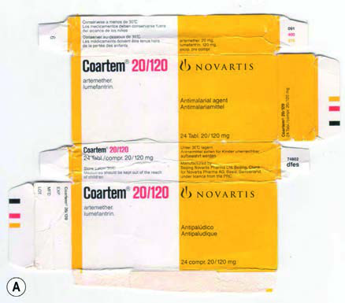
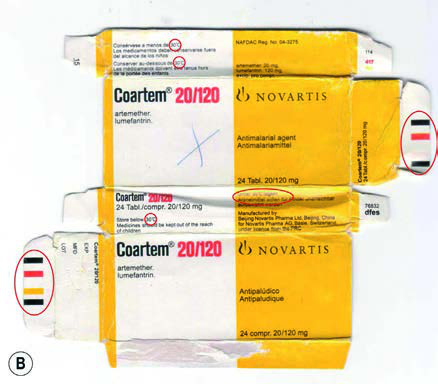

# Page 139 A 30-Year-Old Male Chinese Trader With Fever in Laos PAUL N. NEWTON, VALY KEOLUANGKHOT, MAYFONG MAYXAY, MICHAEL D. GREEN AND FACUNDO M. FERNÁNDEZ Clinical Presentation History A 30-year-old male Chinese itinerant trader is referred to a hospital in Vientiane, Laos, with 7 days of fever, chills, head-ache and a dry cough. He developed slide-positive falciparum malaria whilst living in southern Laos and was treated with intravenous infusions and intramuscular artemether 80 mg for 5 days, which he had brought from China as standby ther-apy, but did not improve. The fever persisted, jaundice devel-oped and he was therefore transferred to the capital Vientiane. Clinical Findings On admission he was febrile (39.5°C, 103.1°F) with normal blood pressure and Glasgow Coma Score, but had nausea, dry cough, moderate dehydration, chest pain and abdominal tenderness. His chest was clear and no hepatosplenomegaly was detected. Investigations Giemsa smear was negative for malaria parasites but a rapid diagnostic test (HRP-2) was positive for Plasmodium falci-parum, consistent with recent falciparum malaria. Serum cre-atinine and glucose were normal. His further laboratory results are shown in Table 39.1. Questions 1. What are your most important differential diagnoses? 2. How would you approach this patient? Discussion A 30-year-old Chinese itinerant trader presents to a hospital in Laos with persistent fever after receiving a 5-day course of antimalarial treatment with artemether for falciparum malaria. His blood smear is negative, but his rapid diagnostic test is positive for P. falciparum. Answer to Question 1 What are your most important differential diagnoses? With falciparum malaria the patient is at risk of bacterial co-infection, especially with Salmonella species. He could have another common infectious disease contracted in Laos such as scrub typhus (Orientia tsutsugamushi), murine typhus (Rickettsia typhi), leptospirosis, tuberculosis or dengue fever. Artemisinin-resistant falciparum malaria has been described from southern Laos, Cambodia border, the Burma (Myanmar)/Thai border, Myanmar and southern Vietnam, manifested as prolonged parasite clearance times. Other pos-sibilities are that the artemether was given at the incorrect dose, was of poor quality or that there were issues with intes-tinal absorption of the medicine. Answer to Question 2 How would you approach this patient? Repeat history, physical examination and investigations (such as blood culture and chest radiography) looking for other causes of infection, review of the antimalarial dosage TABLE 39.1 Laboratory Results on Admission Parameter (unit) Patient Reference range ALT (U/L) 301 <40 AST (U/L) 230 <37 ALP (U/L) 470 <120 Total bilirubin (μmol/L) 14 <14.5 Direct bilirubin (μmol/L) 6.4 <4.3108 # Page 2 received and likely efficacy and consider retreatment with a known, quality-assured antimalarial. The Case continued… The patient was treated with oral quinine sulphate 10 mg/kg every 8 hours and doxycycline 100 mg every 12 hours for 7 days. His fever cleared 35 hours after starting this therapy and he was discharged well. No evidence was found for any other infections. Intramuscular artemether has been widely used for the treatment of severe P. falciparum malaria, and clinical trial evidence suggests that it has similar efficacy to parenteral qui-nine, but is probably inferior to parenteral artesunate. There is a common error of package inserts advising 5 days, rather than the international guidelines of 7 days of monotherapy. In our case, examination of the vial and packaging of the suspect sample did not reveal any overt differences from gen-uine samples suggesting that it was not falsified. However, high performance liquid chromatography (HPLC) and mass spectrometry (MS) analysis of the suspect sample demon-strated that it only contained 59 mg artemether (74% of that stated on the vial). Electrospray mass spectra demonstrated that suspect and genuine samples were identical in terms of their qualitative chemical composition, i.e. their “finger-prints”, but differed in active ingredient content. The arte-mether was therefore substandard, containing inadequate amounts of artemether because of factory error or negligence or a good quality genuine product that deteriorated during storage and transport. The conventional dose of intramuscular artemether is 3.2 mg/kg STAT followed by 1.6 mg/kg once daily for 7 days. The patient probably received an actual dose of only approx-imately 1.0 mg/kg per day as monotherapy of inadequate duration. The combination of underdosing and poor-quality drug most likely resulted in his poor clinical response. He would presumably have recovered rapidly if oral artemether-lumefantrine had been given, as specified in the Lao national treatment guidelines. This case emphasizes the importance of appropriate ther-apy and dosage, of following national guidelines and of checking the quality of a medicine taken if expected improvement does not occur. SUMMARY BOX Poor-Quality Medicines Poor-quality medicines are of two main types-substandard and falsified drugs. Substandard drugs are produced by authorized manufac-turers; but because of unintentional errors in production or neg-ligence, they fail to meet pharmaceutical standards. They often contain reduced amounts of active ingredients or their bioavail-ability is poor. Medicines may also leave the factory of good quality but deteriorate because of poor storage in the distribution chain. In contrast, falsified drugs are deliberately produced by criminals by fraud and often, but not always, contain none of the stated active ingredients. In the 1990s and early 2000s, there was a large epidemic of falsified oral artesunate throughout mainland South-east Asia and, most alarmingly, there are increasing reports of falsified and substandard artemisinin-based combination therapies (ACTs) in Africa. Some contain wrong active ingredients that may be toxic or engender resistance. There have been false reports of antimalarial drug resistance in both Africa and Asia, which upon further investigation were shown to be because of poor medicine quality. The use of arte-misinin derivative combinations with subtherapeutic drug content (whether falsified or substandard) and prescriptions for inade-quate doses or duration raise concern that these factors may facilitate the spread of resistance to this vital class of antimalarials. • Fig. 39.1 Examples of genuine (A) and falsified (B) artemether-lumefantrine discovered in Africa. The red circles indicate errors made by the criminals. The falsifiers confused ‘m’ with ‘rn’ in ‘lagern’ (German for “storing”) and printed the packets with the word ‘lagem’ in error. The falsified samples contained no detectable artemether or lume-fantrine but did contain subtherapeutic pyrimethamine. (Reproduced from Newton, P.N., Green, M.D., Mildenhall, D.C., et al., 2011. Poor quality vital anti-malarials in Africa-an urgent neglected public health priority. Malar J. 10, 352.) 109 CHAPTER 39 A 30-Year-Old Male Chinese Trader With Fever in Laos # Page 3 Inspection of packaging, although difficult, is key in detecting falsified medicines (Fig. 39.1). Unexpectedly low-cost medications, unexpectedly poor patient outcomes, unexpected adverse events and differences in packaging from those that patients and pharmacists are used to should signal alerts that should be reported to national regulatory authorities and the WHO (at rapidalert@who.int). There are very few quality-assured laboratories in malaria-endemic countries for the packaging and chemical analysis of antimalarial quality, making the timely and affordable checking of medicine quality very difficult. Further Reading 1. Shrestha P, Roberts T, Homsana A, et al. Febrile illness in Asia: gaps in epidemiology, diagnosis and management for informing health policy. Clin Microbiol Inf 2018;24(8):815-26. 2. Ashley EA, Dhorda M, Fairhurst RM, et al. Tracking Resistance to Artemisinin Collaboration (TRAC). Spread of artemisinin resis-tance in Plasmodium falciparum malaria. N Engl J Med 2014;371(5):411-23. 3. Jackson Y, Chappuis F, Loutan L, et al. Malaria treatment failures after artemisinin-based therapy in three expatriates: could improved manufacturer information help decrease the risk of treatment fail-ure? Malar J 2006;5(81):1-5. 4. World Health Organization. WHO Global Surveillance and Monitoring System for substandard and falsified medical products, Geneva: World Health Organization; 2017; http://apps.who.int/ medicinedocs/en/m/abstract/Js23373en/. 5. Newton PN, Green MD, Mildenhall DC, et al. Poor quality vital anti-malarials in Africa-an urgent neglected public health priority. Malar J 2011;10:352. 110 CHAPTER 39 A 30-Year-Old Male Chinese Trader With Fever in Laos

## Images

