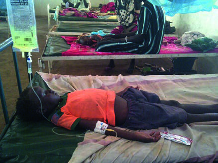

# Page 144 A 7-Year-Old Girl from South Sudan With Undulating Fever KAREN ROODNAT AND KOERT RITMEIJER Clinical Presentation History A 7-year-old girl is presented at a clinic in South Sudan with a 4-week history of undulating fever. The fever occurs mainly in the afternoon hours accompanied by chills and sometimes convulsions. Between the febrile episodes she was initially fine and played normally. However, over time she has devel-oped progressive anorexia, dry cough, chest pain, joint and back pain. She has never been admitted to a hospital, but she has pre-sented at another clinic recently where she received some unspecified tablets that did not bring any improvement. Clinical Findings The girl is alert and pale, but not jaundiced. She is severely malnourished (Z-score <3). Her vital signs are: temperature 39.6°C (103.3°F), pulse 96bpm, blood pressure 100/ 60mmHg. Her chest sounds clear; normal heart sounds; soft abdomen with a splenomegaly of 4cm below the left costal margin. There are multiple enlarged lymph nodes of about 1cm in diameter in the cervical, axillary, inguinal and epitro-chlear region. There are no skin lesions and no peripheral oedema. Laboratory Results The patient’s blood test results are shown in Table 44.1. Plasmodium falciparum rapid diagnostic test (RDT) and a blood film for malaria parasites are negative. Brucella species serology (IgG and IgM) is negative. Visceral leishmaniasis: rK39-antibody RDT is negative. Questions 1. What are your most important differential diagnoses? 2. How would you approach this patient? Discussion In South Sudan, a young girl presents with a 4-week history of fever, progressive anorexia, general body pains and a dry cough. On examination she is pale and severely malnour-ished. She has splenomegaly and generalized lymphadenop-athy. The full blood count (FBC) shows pancytopenia. Serological rapid diagnostic tests for malaria, brucellosis and visceral leishmaniasis are negative. Answer to Question 1 What Are Your Most Important Differential Diagnoses? Chronic fever, splenomegaly and wasting in a child from South Sudan should raise the suspicion of visceral leishman-iasis or brucellosis. Tuberculosis and HIV infection both need to be ruled out, because they can cause chronic fever, anorexia, weight loss, splenomegaly and generalized lymphadenopathy. Malaria can cause fever, anaemia and splenomegaly, but two different negative tests make this unlikely. In addition, the chronic fever is unusual; in a child one might expect a more acute course. Furthermore, malaria does not cause any lymphadenopathy. Hyperreactive malarial splenomegaly syndrome (HMS) has been described in children. It can cause gross splenomegaly and anaemia in regions hyperen-demic for malaria, but HMS does not present with a fever, neither is lymphadenopathy part of the picture. TABLE 44.1 Laboratory Results on Admission Parameter Patient Reference WBC ( 109/L) 1.354-10 Haemoglobin (g/dL) 6.812-16 Platelets ( 109/L) 98150-300121 # Page 2 Typhoid fever can present with persistent fever and splenomegaly; a dry cough is also common. The duration of fever in this case may be slightly too long though, and gen-eralized lymphadenopathy is not a common feature of typhoid. A splenic abscess could cause chronic fever and spleno-megaly, but would not explain the generalized lymphade-nopathy and the haematological changes, unless the patient was acutely septic. Chronic schistosomiasis caused by Schistosoma mansoni infection can cause splenomegaly in the context of portal hypertension, but patients would not be febrile and lymph-adenopathy is not part of the picture either. Malignancies like leukaemia and lymphoma should be ruled out. Answer to Question 2 How Would You Approach this Patient? The little girl appears very sick and should be admitted to the hospital. The list of differential diagnoses is long and there are many tests that would be requested if the same patient presented in an affluent setting. In a resource-constrained place like South Sudan, a prag-matic clinical approach is necessary. The history should be taken as accurately as possible to narrow down the differen-tial diagnosis. One should try to find out if the patient comes from an area where visceral leishmaniasis (VL) is endemic. For possible HIV infection, it would be of great importance to find out if the parents and siblings are alive and well; and enquiries should be made if there are any close contacts who are suspected to have TB or who have a history of recent TB treatment. The clinician has to cope with the investigations available, which may commonly not be in line with the internationally recommended standards. Gold standard for diagnosis of VL is the proof of the parasite in tissue specimens. However, this is often not feasible under field conditions and serological tests are used instead. The rapid antigen test for VL (rK39) used in this case was negative (sensitivity of this test in South Sudan is 85-90%). Because VL is high on the list of differential diagnoses, a second serological test such as the Direct Agglutination Test (DAT) should be done, and direct proof of the parasite should be attempted. Sensitivity is highest for splenic aspirates (93-99%), fol-lowed by bone marrow (53-86%) and lymph node aspira-tion (53-65%), which can be further increased by culture and PCR. Splenic aspiration is complicated with life-threatening haemorrhages in about 0.1% of procedures and therefore requires strict precautions, technical expertise and postinterventional monitoring. Blood cultures, if available, would be helpful for diagnosis of typhoid fever, brucellosis and septicaemia. The Case Continued… The mother of the patient reported that the family came from an area where visceral leishmaniasis was known. It turned out that the uncle of the child had been treated for VL before. The girl’s sister had recently been treated for TB. The child’s health continued to deteriorate. She had per-sistently high fever and became increasingly pale. The DAT came back positive with a high titre ( 1:6.400), which supported the suspected diagnosis of vis-ceral leishmaniasis. Considering her critical condition, with severe malnutri-tion and progressive anaemia, the patient was started on lipo-somal amphotericin B and a broad-spectrum antibiotic (ceftriaxone). The girl also received nutritional support with high-energy/high-protein ready-to-use therapeutic food (RUTF) and vitamin/mineral supplementation. After 5 days, the fever settled and the patient started to recover. Two weeks later the girl had gained some weight and was again able to walk and play. SUMMARY BOX Visceral Leishmaniasis (Kala-Azar) VL is a vector-borne systemic parasitic infection caused by Leishmania protozoans, most commonly L. donovani and L. infantum. Large epidemics have been described in East Africa and the Indian subcontinent. As a result of efforts to eliminate the disease on the Indian subcontinent, the incidence of VL has decreased substantially in the past decade. Ninety per cent of all cases occur in only five countries: India, Sudan, South Sudan, Ethiopia and Brazil. Transmission can be anthroponotic or zoonotic, differing by region and parasite strain. Humans most commonly acquire VL through the bite of an infected female sandfly, but other modes of transmission have been described. • Fig. 44.1 A child is receiving liposomal amphotericin B on a paediatric ward in South Sudan. 122 CHAPTER 44 A 7-Year-Old Girl from South Sudan With Undulating Fever # Page 3 Leishmania promastigotes invade cells of the human reticu-loendothelial system where they metamorphose into amastigotes and multiply. The incubation period varies greatly, from 10 days to several years, but usually takes between 2 and 8 months. The clinical presentation depends on the infecting species, as well as on the host’s genetic background and immune status. Most infections remain asymptomatic. Clinical VL presents with symptoms and signs of a chronic systemic infection (fever, fatigue, anorexia, weight loss) and of parasite invasion of the mononuclear phagocyte system (enlarged lymph nodes, splenomegaly, hepatomegaly) resulting in severe immunosuppression. In India, hyperpigmentation has led to the name ‘kala-azar’ (Hindi for ‘black sickness’). VL is typically fatal if not treated, and potentially fatal complications include bacterial superinfections and congestive heart failure because of severe anaemia and haemorrhage. In low-resource settings, diagnostic options for VL are often limited. On FBC all three cell lines can be depleted. Demonstration of Leishmania amastigotes in samples from bone marrow, spleen and lymph node is the classic confirmatory test for VL. Under field conditions, direct proof of the parasite is often not feasible, and several serological tests have been developed instead. Sensitivity and specificity of these tests generally vary and they should always be used in combination with a standardized case definition as suggested by the WHO. The rK39 immuno-chromatographic test (ICT) and the direct agglutination test (DAT) were found to have the highest sensitivity and specificity. The rK39 ICTs are easy to perform, rapid (10-20 minutes), cheap and give easily reproducible results. The semiquantitative DAT has a longer turnaround time of about 24 hours, and requires a laboratory with well-trained technicians. Treatment of VL is complex: efficacy of the individual drugs varies geographically and depends on parasite susceptibility and the immune status of the patient. Parenteral drugs currently used are pentavalent antimonials, paromomycin and (liposomal) amphotericin B (Fig. 44.1). The oral drug in use is miltefosine. Combinations of antileishmanial drugs seem to help shorten therapy courses, reduce side effects, improve treatment out-comes, delay resistance development and reduce treatment costs. In HIV patients, VL is even more difficult to treat because it does not respond well to the classic antileishmanial drugs and has a higher tendency to relapse. Further Reading 1. Boelaert M, Sundar S. Leishmaniasis. In: Farrar J, editor. Manson’s Tropical Diseases. 23rd ed. London: Elsevier; 2013 [chapter 47]. 2. WHO. Control of the Leishmaniases. WHO Technical Report Series 949. Geneva: World Health Organization; 2010. 3. Burza S, Croft SL, Boelaert M. Leishmaniasis. Lancet 2018;392 (10151):951-70. 4. Chappuis F, Sundar S, Hailu A, et al. Visceral Leishmaniasis: what are the needs for diagnosis, treatment and control? Nat Rev Micro-biol 2007;5(11):873-82. 5. Alves F, Bilbe G, Blesson S, et al. Recent development of visceral leishmaniasis treatments: successes, pitfalls, and perspectives. Clin Microbiol Rev 2018;31(4):e00048-18. 123 CHAPTER 44 A 7-Year-Old Girl from South Sudan With Undulating Fever

## Images

