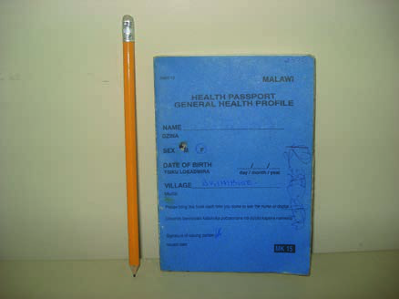
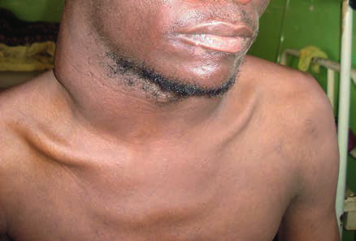

# Page 147 A 32-Year-Old Man from Malawi With a Painfully Swollen Neck JOEP J. VAN OOSTERHOUT Clinical Presentation History A 32-year-old Malawian man presents to the outpatient department of a local tertiary hospital with a 6-week history of productive cough and chest pain associated with weight loss, fevers and night sweats. He has also noticed that his neck has swollen and is painful. There are no other symp-toms. He has never been admitted to a hospital but has been tested HIV positive and was started on antiretroviral therapy (ART) and co-trimoxazole prophylaxis 2 months earlier at a nearby health centre. His health passport (Fig. 47.1) reveals that a recent CD4 count was 95 cells/μL and that the patient had been treated for acid-fast bacilli (AFB) sputum smear-negative pulmonary tuberculosis 12 years ago. Clinical Findings He looks moderately ill, is pale, is sweating and has a temper-ature of 39.2°C (102.56°F), pulse 112bpm, respiratory rate 28 breath cycles per minute and normal blood pressure. There are large, matted lymph glands palpable in his neck. The rest of the examination is unremarkable. Investigations Full blood count: WBC 14.3109/L (reference range: 4-10), haemoglobin 6.3g/dL (13-15), MCV 66fL (80-98), platelets 246109/L (150-350). Three sputum samples are negative for AFB. Fine-needle aspiration (FNA) of a neck gland yields purulent material. Microscopy for AFB is 2+ positive. There is no growth on blood culture. Initial treatment The patient is admitted to the hospital and started on TB repeat treatment for tuberculous lymphadenitis with strepto-mycin, isoniazid, rifampicin, pyrazinamide and ethambutol, while continuing the same ART. Against expectation, he does not improve after 3 weeks. He still has fevers, night sweats, lack of appetite and the glands in the neck have fur-ther swollen and are now clearly fluctuant (Fig. 47.2). • Fig. 47.1 The patient’s “health passport”. The health passport is a booklet all patients in Malawi hold which documents their medical history. • Fig. 47.2 Increasing and fluctuant lymphadenitis in the neck. 129 # Page 2 Questions 1. What could be the reasons for the lack of clinical improvement? 2. Which investigations are indicated? Discussion A 32-year-old Malawian man who is known to be HIV pos-itive is admitted with a diagnosis of tuberculous lymphade-nitis and immune reconstitution inflammatory syndrome (IRIS) of the unmasking type (see Summary Box). The TB diagnosis is based on microscopic findings. He unexpect-edly deteriorates on antituberculous treatment. Answer to Question 1 What Could Be the Reasons for the Lack of Clinical Improvement? Although the diagnosis of TB lymphadenitis is very likely when AFB are identified in a lymph gland sample, atypical mycobacteria should also be considered now that the initial response to TB treatment is unsatisfactory, especially given the deep immune suppression the patient had at the start of ART. Other reasons for a poor response to TB treatment are non-adherence, malabsorption and drug resistance. Given the frank fluctuation that is present, a bacterial lymph-adenitis is probable, whereas a lymphoma seems much less likely. Answer to Question 2 Which Investigations Are Indicated? HIV viral load and a CD4 count should be done to deter-mine the response to ART. A repeat FNA should be per-formed to check for AFB. A Gram stain and bacterial culture should help rule out bacterial superinfection. Ideally, the aspirate should be examined by PCR (XPert MTB/RIF) and also be cultured to rule out infection with resistant Myco-bacterium tuberculosis or atypical mycobacteria (culture). The Case Continued… The patient denied missing any tablets, had no diarrhoea or other gastrointestinal symptoms, and had not left Malawi, where multi-drug resistance for TB is uncommon. IRIS of the paradoxical type was also considered to explain the lack of improvement (see Box), therefore corticosteroids were initiated. Further investigations were done, with the following results: CD4109 cells/μL; HIV-1 RNA <400 copies/mL. Repeat FBC results were: WBC 7.8109/L, haemoglobin 6.7g/dL, MCV84 fL, platelets 428109/L. Because of the increasingly fluctuant swelling in the neck, a second FNA was done, now showing frank yellowish pus. On microscopic examination, numerous coccoid bacteria and polymorphonuclear lymphocytes were observed. Unfor-tunately results from a bacterial culture were never received. The diagnosis at this point was superimposed bacterial lymphadenitis, possibly iatrogenic because of the earlier aspi-ration, with Staphylococcus aureus being the most likely microorganism. The patient recovered well after incision and drainage, antibiotic treatment and a short course of cor-ticosteroids while he continued on TB treatment and ART. In the first full blood count, severe microcytic anaemia was present. Anaemia is extremely common in patients with advanced HIV immunosuppression and TB co-infection; however, the marked microcytosis is unusual. There was no good explanation for this finding because there was no source of blood loss in the history, and the MCV had nor-malized in the second full blood count, which was against β-thalassaemia as a cause of microcytic anaemia. The first full blood count also showed a leukocytosis when TB lymphad-enitis was diagnosed. This finding is paradoxical because later, when the florid purulent bacterial infection was pre-sent, it had resolved. Multiple dynamic factors were appar-ently influencing the white blood cell count in this patient, including HIV, TB, bacterial infection, immune reconstitution, corticosteroids, antiretroviral and antituber-culous drugs and co-trimoxazole. SUMMARY BOX Immune Reconstitution Inflammatory Syndrome HIV-associated immune reconstitution inflammatory syndrome (IRIS) is a deterioration of the clinical situation caused by increased inflammation because of improving immune compe-tence resulting from successful ART. The clinical manifestations are wide-ranging and depend on the underlying condition, which is mostly an opportunistic infec-tion, but can also be a tumour, an autoimmune disease or another condition. In sub-Saharan Africa, tuberculosis and cryptococcal meningitis are the two most important IRIS presentations. IRIS is very common, occurring in between 10 and 25% of patients who start ART. There are no validated tests for IRIS. The diagnosis is therefore clinical. A widely accepted definition does not exist, although stan-dardization has been attempted. Definitions include measures of successful ART, exclusion of other causes of the clinical deteri-oration, such as toxicity, and a relationship in time between the symptoms and the start of ART. IRIS is classified into two types: In “unmasking IRIS”, a con-dition is present but remains subclinical and undiagnosed because of severe immunosuppression before the start of ART, and becomes clinically apparent within 6 months after ART initi-ation. In “paradoxical IRIS”, a condition has been diagnosed and is being treated successfully, but clinical worsening occurs because of the increased inflammation after immune recovery, e.g. after starting ART. Risk factors for HIV-associated para-doxical IRIS include a low pre-ART CD4 count and haemoglobin level, a high pre-ART viral load, large pre-ART weight loss, large and rapid increase of the CD4 count, rapid reduction of the viral load on ART and a short period between the start of treatment for an opportunistic infection and initiation of ART. Prednisone initi-ated alongside ART in selected patients with CD4 counts <100 cells/μL seems to reduce the risk of paradoxical IRIS and is not associated with significant adverse effects. Paradoxical IRIS may also occur in other conditions, e.g. in TB alone without HIV co-infection when TB treatment itself induces immune reconstitution. Patients have to be prepared for the IRIS phenomenon when starting treatment. 130 CHAPTER 47 A 32-Year-Old Man from Malawi With a Painfully Swollen Neck # Page 3 Further Reading 1. Thwaites G. Tuberculosis. In: Farrar J, editor. Manson’s Tropical Diseases. 23rd ed. London: Elsevier; 2013 [chapter 40]. 2. Haddow LJ, Moosa MY, Easterbrook PJ. Validation of a published case definition for tuberculosis-associated immune reconstitution inflammatory syndrome. AIDS 2010;24(1):103-8. 3. Yu G, Zhong F, Ye B, et al. Diagnostic Accuracy of the Xpert MTB/ RIF assay for lymph node Tuberculosis: as systematic review and meta analysis. Bio Med Res Int 2019;2019:4878240. 4. Walker NF, Stek C, Wasserman S, et al. The tuberculosis-associated immune reconstitution inflammatory syndrome: recent advances in clinical and pathogenesis research. Curr Opin HIV AIDS 2018;13(6):512-21. 5. Meintjes G, Stek C, Blumenthal L, et al. Prednisone for the Preven-tion of Paradoxical Tuberculosis-Associated IRIS. N Engl J Med 2018;379(20):1915-25. 131 CHAPTER 47 A 32-Year-Old Man from Malawi With a Painfully Swollen Neck

## Images

