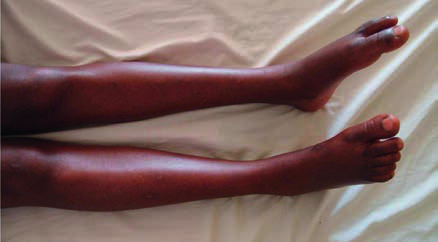

# Page 148 A 31-Year-Old Woman from Tanzania With Acute Flaccid Paraplegia WILLIAM P. HOWLETT Clinical Presentation History A 31-year-old woman is referred to a hospital in northern Tanzania with a loss of power and feeling in her legs. She describes being perfectly well up until 2 days earlier when she felt acute back pain which radiated band-like to the level of her umbilicus. The pain was severe, continuous, burning and unrelieved by analgesics or position. Within 12 hours the pain had lessened but she developed numbness in her feet and legs ascending to the level of her waist, loss of power in her legs and loss of control of her bladder. There is a history of a febrile illness 3 weeks previously, treated as malaria. There is no past or family history of similar illness and no history of trauma. She is married with 3 children, the last born is 12 months old. She does not smoke or take alcohol, and her HIV status during her last pregnancy was negative. Clinical Findings Clinically, she is well nourished with normal vital signs. Gen-eral examination is unremarkable; there is no spinal tender-ness, deformity or gibbus. On neurological examination she is fully orientated and higher mental functions appear nor-mal. Cranial nerves including fundoscopy and upper limbs are normal. She is unable to move her legs and examination of the lower limbs reveals a flaccid paraparesis with a sensory level at T10. On inspection feet are in a slightly plantar-flexed position (Fig. 48.1). Tone is reduced bilaterally, power is reduced (MRC grade 1/5) in all muscle groups. Reflexes are absent bilaterally, and plantar reflexes are extensor. Sen-sation is reduced to light touch to the level of the umbilicus. Joint position sense is impaired in the feet and ankles, and vibration sense is absent to the anterior iliac crest bilaterally. Questions 1. What is the clinical syndrome and where is the lesion? 2. What investigations will you plan to do? Discussion A 31-year-old woman from northern Tanzania presents with an acute-onset inability to walk. She had a febrile illness 3 weeks prior, but has otherwise been well. Answer to Question 1 What is the Clinical Syndrome and Where is the Lesion? The clinical syndromic diagnosis is acute flaccid paraparesis. The main neuroanatomical differential diagnoses of flaccid paraparesis are lesions of peripheral nerves, including their roots (polyneuropathies or polyradiculoneuropathies), and acute lesions of the spinal cord (myelopathies). The sensory impairment up to the umbilicus (T10 level) and extensor plantar reflexes localise the site of the lesion to the spinal cord. The flaccidity and loss of reflexes can be explained by the early flaccid phase of acute spinal cord injury when spasticity appears days or weeks later (Table 48.1). Answer to Question 2 What Investigations Will You Plan to Do? If available, the following investigations should be performed: Full blood count, ESR, blood glucose, renal and liver function tests, HIV serology, VDRL test and schistosomiasis • Fig. 48.1 A patient with an acute-onset flaccid paraplegia. Note the plantar flexion of her feet. 132 # Page 2 serology. The latter has to be interpreted with caution because it stays positive after past infection. Urine and stool analysis for ova of Schistosoma species should be done. Lumbar puncture should be performed with measure-ment of opening pressure and testing cell differentiation, CSF protein, glucose, Gram and Ziehl-Neelsen stain, Xpert MTB/RIF for M. tuberculosis and VDRL. Imaging should include x-rays of the chest and spine. Neuroimaging (e.g. spi-nal CT/MRI) is recommended mainly to exclude a compres-sive spinal cord lesion but is usually not readily available in sub-Saharan Africa. The Case Continued… The patient’s full blood count, renal and liver function tests were normal. Results of further blood tests are shown in the Table 48.2. A spinal tap was done. The CSF opening pressure was normal and looked clear. Further CSF results are shown in the Table 48.3. The x-rays of her chest and thoracolumbar spine were normal. The main differential diagnosis of acute non-compressive flaccid paraparesis that localizes in the spinal cord is acute spinal cord inflammation (acute transverse myelitis), and vascular spinal cord ischaemia (“spinal stroke”). The CSF findings of increased lymphocytes and elevated protein level are suggestive of inflammation in the spinal cord. Hence, the clinicolaboratory diagnosis is that of acute transverse myelitis. The management is based on principles of establishing and treating the cause and preventing complications. Treat-ment in this patient includes steroids and acyclovir directed against the main causes of acute transverse myelitis, e.g. auto-immune inflammation and viral infections (see Summary Box). Counselling of patient and family is very important, and family members/guardians should from the beginning on be actively involved in physiotherapy and mobilization of the patient. General measures include strict 2 hourly TABLE 48.1 Flaccid versus Spastic Paraparesis Clinical Presentation Neuroanatomical Diagnosis Examples of Common Aetiologies in Tropical Countries Flaccid paraparesis with bladder involvement and/or sensory level Acute spinal cord lesion inflammation of the spinal cord (¼ myelitis), ischaemia of the spinal cord (¼ spinal infarction) Acute cauda equina lesion metastatic malignancy, schistosomiasis without bladder dysfunction, without sensory level Polyradiculoneuropathy Guillain-Barr e-syndrome, tuberculous arachnoiditis, CMV in HIV Polyneuropathy Diabetes, HIV-related, nutritional Spastic paraparesis Chronic spinal cord lesion Compression of spinal cord because of Pott´s disease, chronic viral infections such as HTLV-1 and HIV TABLE 48.2 Laboratory Results on Admission Parameter (Unit) Patient Normal range ESR (mm/h) 1910 Random blood glucose (mmol/l) 5.63.9-11.1 HIV-Serology and p24 Antigen negative negative VDRL negative negative Schistosomiasis-serology negative negative Urine for ova of S. haematobium negative negative Stool for ova of S. mansoni negative negative TABLE 48.3 CSF Results Parameter (Unit) Patient Normal range CSF white cell count (cells/μl) 11 (90% lymphocytes) 0-5 CSF protein (g/L) 1.11 <0.45 CSF glucose (mmol/l) 3.92.8-3.8∗ Gram stain negative negative Ziehl-Neelsen stain negative negative Xpert MTB/RIF negative negative VDRL in the CSF negative negative ∗{1/2} to {2/3} of paired serum glucose sample 133 CHAPTER 48 A 31-Year-Old Woman from Tanzania With Acute Flaccid Paraplegia # Page 3 turning, frequent passive movements, urinary catheterization if non-functioning bladder, and adequate analgesia according to the WHO analgesic ladder. The patient was treated with corticosteroids and acyclovir. She partially improved and was discharged after 3 weeks. The power in her legs had slightly improved (MRC 2-3/5) and she had a urinary catheter in situ. She will be reviewed in the outpatient department. SUMMARY BOX Acute Transverse Myelitis Acute transverse myelitis (ATM) is an inflammation of the spinal cord characterized by an acute (hours) or sub-acute (days) onset, presenting typically with back pain, flaccid paraplegia, a sensory level on the trunk and urinary incontinence. The incidence of ATM in tropical countries is reported to be <1/100000 but is likely to be much higher particularly in Africa. Women are more frequently affected, typically in their second and fourth decades. Evidence of inflammation within the spinal cord is shown by increased lym-phocytes and elevated protein in the CSF. It can be associated with infections and autoimmune disorders. Symptoms that sug-gest infection include fever, rash, adenopathy, concurrent sys-temic infection and symptoms of herpes zoster radiculopathy. If the aetiology remains unknown as is frequently the case, the ATM is termed idiopathic (Table 48.4). Idiopathic ATM is considered to be an autoimmune phenomenon. “Idiopathic” ATM can be the first attack of an autoimmune demyelinating disease such as neuromyelitis optica (NMO) and rarely multiple sclerosis. How-ever, multiple sclerosis is very rare in tropical latitudes. Treatment of idiopathic ATM in adults is largely empirical with high doses of IV corticosteroids followed by oral prednisolone for 2 to 3 weeks. Empirical acyclovir is also recommended if VZV or HSV myelitis cannot be excluded. The majority (70% to 80%) of patients with ATM remain disabled with flaccid paraparesis/ paraplegia and incontinence. Further Reading 1. Heckmann JE, Bhigjee AI. Tropical neurology. In: Farrar J, editor. Manson’s Tropical Diseases. 23rd ed. London: Elsevier; 2013 [chapter 71]. 2. Borchers AT, Gershwin ME. Transverse myelitis. Autoimmun Rev 2012;11(3):231-48. 3. Howlett WP. Paraplegia, In: Neurology in Africa. Kilimanjaro Christian Medical Centre and University of Bergen; 2012. Avail-able from:www.uib.no/cih/en/resources/neurology-in-africa. 4. Musubire AK, Meya DB, Bohjanen PR, et al. A systematic review of non-traumatic spinal cord injuries in sub-Saharan Africa and a proposed diagnostic algorithm for resource-limited settings. Front Neurol 2017;8:618. https://doi.org/10.3389/fneur. 2017.00618. TABLE 48.4 Pathophysiology of Acute Transverse Myelitis Pathophysiology Treatment Idiopathic, (majority of the cases) Presumably an autoimmune phenomenon Might be a manifestation of a chronic autoimmune demyelinating CNS disease (such as NMO and multiple sclerosis) Corticosteroids against inflammation Associated with infection Direct invasion of the spinal cord by microorganisms Causative treatment e.g. acyclovir for VZV myelitis Autoimmune phenomenon as a result of infection elsewhere (“parainfectious”) Might be associated with vaccination against the microorganism Corticosteroids against inflammation Associated with a systemic autoimmune disorder Autoimmune phenomenon Often the autoimmune disorder (e.g. lupus or secondary vasculitis) in the patient is already known Corticosteroids against inflammation 134 CHAPTER 48 A 31-Year-Old Woman from Tanzania With Acute Flaccid Paraplegia

## Images

