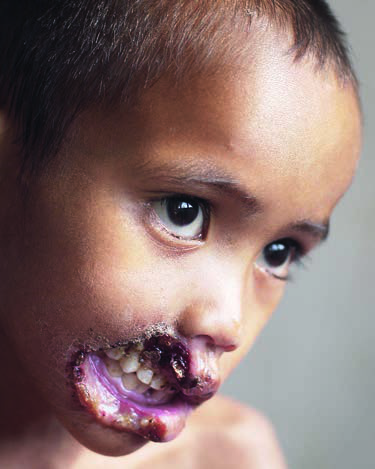
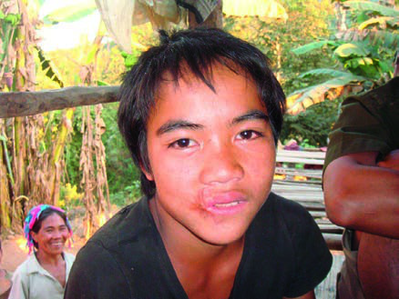

# Page 15 A 4-Year-Old Boy from Laos With a Lesion of the Lip and Cheek M. LEILA SROUR Case Presentation History You are sent a picture of a 4-year-old boy taken by a visitor at a remote district hospital in Laos (Fig. 5.1). You receive a limited history and physical examination: Three days ago, the family noticed a dark sore on the child’s cheek. The child’s breath smells bad, he is not eating and he appears list-less. The lesion progressed quickly from a sore to eat through the child’s cheek. The child, who is unimmunized, had a fever and rash about 2 months ago and recovered. The family is very poor. The local doctors do not recognize this disease. Clinical Findings The 4-year-old child appears small and quiet. He is stunted and thin. His mouth has a gangrenous lesion that has destroyed part of his upper and lower lips and cheek, expos-ing his teeth. Questions 1. What is your differential diagnosis? 2. What should you recommend to help this child? Discussion This chronically malnourished child, living in a remote vil-lage of a poor developing country, has a rapidly advancing gangrenous lesion of the face. Answer to Question 1 What Is Your Differential Diagnosis? A few days earlier, when the child had a sore on the face and bad breath, you may have suspected a tooth abscess and cel-lulitis. The rapid destruction of tissue is typical of noma, an opportunistic infection that affects poor children whose immune systems are compromised by malnutrition and often other infections, commonly measles or malaria. Other ulcerating facial lesions such as oral cancer, syphilis and yaws are unlikely in a young child. Cutaneous leishmaniasis is unlikely to develop at such a rapid pace and be so destructive. Mucocutaneous leishmaniasis may lead to severe tissue destruction but it is non-endemic in Laos. There are no diag-nostic laboratory tests because the diagnosis is made clinically. • Fig. 5.1 A 4-year-old Lao boy with a necrotizing lesion on the right cheek. 13 # Page 2 Answer to Question 2 What Should You Recommend to Help This Child? You recommend treating the child with penicillin and met-ronidazole to cover the suspected aerobic and anaerobic oro-pharyngeal bacteria. You emphasize the need for nutritional support, which can be challenging with a mouth lesion. Local foods, including eggs, milk, soy products and peanuts, can be liquefied and fed orally or enterally. Other diseases such as malaria, intestinal parasites, tuberculosis and vitamin deficiencies should be looked for and treated. Necrotic tissue can be removed. Physiotherapy will be needed to prevent contractures with healing. Reconstructive surgery should not be attempted for at least 1 year and be done only by an experienced surgical team. Improved nutrition before sur-gery may improve the outcome. Survivors of noma suffer from disfigurement and func-tional problems with speech and eating. They may present as young adults seeking help. Their history reveals the illness as a child of younger than 10 years of age. The Case Continued. . . The child was treated successfully with antibiotics and nutri-tional support. His face healed with contractures, resulting in disfigurement and salivary incontinence. At age 9 years, he was referred for surgery by a visiting international surgical team. After two surgeries, his appearance was improved, and the salivary incontinence corrected (Fig. 5.2). SUMMARY BOX Noma Noma is an opportunistic infection, primarily affecting children aged 1 to 7 years, whose immunity is compromised by malnu-trition and vitamin deficiencies. Risk factors include extreme poverty, malnutrition, poor oral hygiene, viral infections (especially measles and HIV), poor sanitation and living in close proximity to livestock. The true aetiology of noma is unknown. The patho-genesis appears to be a complex combination of factors, including poverty, poor oral hygiene facilitating necrotizing ulcerative gingivitis, malnutrition and infectious diseases such as malaria and measles leading to impaired immunity. Noma is a neglected and forgotten disease, because it pri-marily affects the poorest children living in remote areas of developing countries. Health workers throughout the world often do not recognize this disease, so it remains underreported and unknown. Case fatality rate if untreated is 70% to 90%. Treatment with antibiotics and nutritional support can prevent disease pro-gression and save the child’s life. Survivors suffer with disfigure-ment, functional impairment and psychosocial isolation. Noma is an indicator of extreme poverty and inadequate public health systems. The elimination of extreme poverty, provision of prenatal care, promotion of exclusive breastfeeding, immunizations, food security and improved nutrition for the poorest children can lead to the eradication of this preventable childhood disease. Further Reading 1. Srour L, Wong V, Wyllie S. Noma, actinomycosis and nocardia. In: Farrar J, editor. Manson’s Tropical Diseases. 23rd ed. London: Elsevier; 2013 [chapter 29]. 2. Srour L, Marck K, Baratti-Mayer D. Noma: overview of a neglected disease and human rights violation. Am J Trop Med Hyg 2017; 96(2):268-74. 3. WHO Regional Office for Africa. Information brochure for early detection and management of noma. 2016; http://www.who.int/ iris/handle/10665/254579. 4. Bolivar I, Whiteson K, Stadelmann B, et al. Bacterial diversity in oral samples of children in Niger with acute noma, acute necrotiz-ing gingivitis, and healthy controls. PLoS Negl Trop Dis 2012;6(3): e1556. • Fig. 5.2 At age 9 after two surgeries correcting facial contractures and salivary incontinence. 14 CHAPTER 5 A 4-Year-Old Boy from Laos With a Lesion of the Lip and Cheek

## Images

