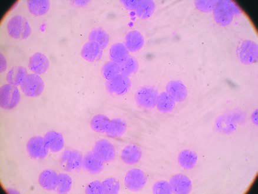
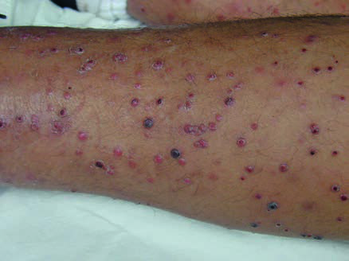

# Page 152 A 56-Year-Old Man from Peru With Prolonged Fever and Severe Anaemia CIRO MAGUIÑA, CARLOS SEAS AND FREDERIQUE JACQUERIOZ Clinical Presentation History A 56-year-old male Peruvian is admitted to a hospital in the capital, Lima, with a 2-week history of fever, jaundice and confusion. Daily fever started 3 months after leaving a rural area in the highlands of northern Peru (altitude of 2400m), where the patient spent 3 weeks on vacation. In the second week of illness the patient noticed dark urine and jaundice, and few days before admission his wife noticed confusion and som-nolence. While in the rural area, the patient and his wife were bitten at night by tiny mosquitoes; no personal protection was used. Otherwise there has been no animal contact. The past medical history is unremarkable. Clinical Findings His blood pressure is 90/60mmHg, pulse 110bpm and reg-ular, temperature 39.2°C (102.6°F), respiratory rate 22 breaths per minute. The patient appears confused and disor-ientated without any focal neurological findings or menin-geal signs (GCS 14/15). Skin and conjunctivae are markedly pale and there is scleral jaundice. Cardiovascular and pulmonary examination are normal. The liver is slightly enlarged but there is no splenomegaly. Laboratory Results Creatinine, electrolytes and alkaline phosphatase are normal. His additional routine laboratory results are shown in Table 52.1. Coomb’s test is negative. The CSF results are normal. Further Investigations A CT scan of the brain is normal. Abdominal ultrasound reveals hepatomegaly, but no focal lesions. Questions 1. What are your differential diagnoses? 2. How would you approach this patient? Discussion A Peruvian man presents with a history of prolonged fever, altered neurological status and evidence of haemolysis after a stay in a rural area in the highlands of Peru. Answer to Question 1 What Are Your Differential Diagnoses? The most important differential diagnoses in this patient are malaria and bartonellosis. Plasmodium vivax is the only species of Plasmodium prev-alent in the highland regions of Peru. Interestingly, the patient presents with several features of severe and compli-cated malaria, including severe anaemia, jaundice and impaired consciousness. However, P. vivax is not TABLE 52.1 Blood Results on Admission Parameter Patient Reference Range WBC ( 109/L) 14.94-10 Neutrophils ( 109/L) 13.11.8-7.2 Lymphocytes ( 109/L) 0.91.5-4 Band forms (%) 40-5 Haemoglobin (g/dL) 613-15 Reticulocytes (%) 80.5-1.5 Platelets ( 109/L) 454150-350 LDH (U/L) 1500 <250 Total bilirubin (μmol/L) 239 <19 Direct bilirubin (μmol/L) 103 <5144 # Page 2 commonly associated with severe malaria. Bartonellosis is another important diagnosis to consider given the recent travel history in the highlands of Peru, where sandflies, the vectors of bartonellosis, are present. The patient also reported being bitten by tiny mosquitoes. Less common infections to include in the differential diagnosis are rickett-sial diseases (both endemic and epidemic typhus are present in Peru), leptospirosis, typhoid fever, brucellosis and several viral diseases, including viral hepatitis and yellow fever. However, none of them produces significant haemolysis and some are not endemic in the highlands (yellow fever for instance). Non-infectious causes of haemolysis should also be considered. Answer to Question 2 How Would You Approach This Patient? The first step is to rule out malaria by performing a thick and thin smear or by using rapid diagnostic tests. Based on the exposure history and the high suspicion of bartonellosis, a thin film should be performed to calculate the differential leukocyte count and to look for the presence of Bartonella bacilliformis in red blood cells. The Case Continued… The patient progressed to shock. He was transferred to the intensive care unit (ICU) and required treatment with vaso-pressors. Blood films were negative for malaria. However, the thin film revealed massive red blood cell infestation by pleo-morphic cocco-bacillary structures compatible with B. bacil-liformis (Fig. 52.1). Blood cultures were negative, including cultures in special media for Bartonella. The patient was started on a combination of intravenous ciprofloxacin and ceftriaxone for 10 days. Altered mental status resolved after 3 days of antimicrobial treatment and fever subsided after 5 days. By day 4 the bacteria had disappeared from the blood smears. No further complications were observed during a 3-month follow-up period. SUMMARY BOX Bartonellosis-Oroya Fever and Verruga Peruana Bartonellosis, caused by B. bacilliformis, is a vector-borne dis-ease mainly found in the Andean valleys of Peru at an altitude between 500 and 3200 metres, although transmission may occur at higher altitudes and in jungle areas as well. Colombia and Ecuador have also reported sporadic cases. The disease is transmitted by female sandflies, mostly Lutzomyia verrucarum or L. peruensis, which characteristically bite indoors at nighttime. Human beings are the only known reservoir. Non-vectorial B. bacilliformis transmission from mother to child or through blood transfusions has been described but remains scarce. Most infections are asymptomatic or oligosymptomatic. However, a minority of patients progress to severe disease (‘Oroya fever’) after a mean incubation period of 3 to 8 weeks (longer incubation periods up to 9 months have been observed). Oroya fever is characterized by high fever, malaise, myalgias and severe haemolytic anaemia with jaundice. Complications during this acute phase include heart failure, as well as pericardial and pleural effusions. CNS involvement, characterized by impaired consciousness, agitation and coma, occurs in approximately 20% of patients and is associated with higher case fatality rates. Secondary immunosuppression may occur during this phase and patients may present with opportunistic infections similar to those seen in advanced HIV-infection, e.g. salmonellosis, toxoplas-mosis or Pneumocystis jirovecii pneumonia. After acute Oroya fever, within 1 to 2 months a chronic angioproliferative cutaneous stage (‘verruga peruana’) may occur in approximately 5% of treated patients and in an unknown percentage of untreated individuals. Occasionally, verruga per-uana is seen without noticeable acute-phase manifestations. It is mostly seen in children in endemic areas. Skin lesions are usually small (1-4mm), red-violaceous, painless papules located on the face or the extremities, and can be single or multiple (Fig. 52.2). Nodular lesions can also be observed. The lesions resemble bacillary angiomatosis caused by B. quintana and B. henselae. In the acute phase, diagnosis is made by proof of cocco-bacilli inside red blood cells. B. bacilliformis is a fastidious bacterium, and culture requires a specific medium incubated at 25 to 28°C for up to 2 weeks. Recommended treatment of the acute phase includes cipro-floxacin alone or combined with ceftriaxone in severe cases. These antimicrobials also cover for Salmonella species, the commonest opportunistic infection observed in these patients. Increased antibiotic resistance of both B. bacilliformis and • Fig. 52.1 Thin smear showing massive infestation of red blood cells with cocco-bacillary structures (Wright stain). • Fig. 52.2 Multiple erythematous-violaceous papules of different sizes characteristic of the chronic phase (verruga peruana). 145 CHAPTER 52 A 56-Year-Old Man from Peru With Prolonged Fever and Severe Anaemia # Page 3 concomitant opportunistic pathogens has been observed and should be sought in the absence of a clinical response. Oral azithromycin is the drug of choice for verruga peruana. Alterna-tively, ciprofloxacin can be used. Note: Oroya fever is also named Carrion’s disease after a famous Peruvian medical student, Daniel Carrion, who in 1885 inoculated himself with fluid obtained of a wart from a patient with verruga peruana and developed acute bartonellosis (Oroya fever). He unfortunately died from the disease. However, his experiment demonstrated clearly that verruga peruana and Oroya fever were different clinical forms of the same infection. Further Reading 1. Angelakis E, Raoult D. Bartonellosis, cat-scratch disease, trench fever, human Ehrlichiosis. In: Farrar J, editor. Manson’s Tropical Diseases. 23rd ed. London: Elsevier; 2013 [chapter 30]. 2. Gomes C, Ruiz J. Carrion’s disease: the sound of silence. Clin Microbiol Rev 2017;31(1). e00056-17. 3. Maguina C, Garcia PJ, Gotuzzo E, et al. Bartonellosis (Carrion’s disease) in the modern era. Clin Infect Dis 2001;33(6):772-9. 146 CHAPTER 52 A 56-Year-Old Man from Peru With Prolonged Fever and Severe Anaemia

## Images

