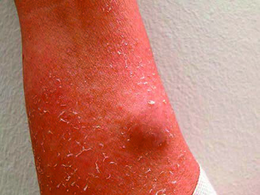
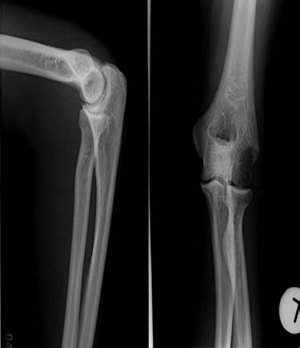

# Page 161 A 48-Year-Old Woman from Thailand With Fever and Disseminated Cutaneous Abscesses SABINE JORDAN Clinical Presentation History A 46-year-old Thai woman is transferred to a German clinic for tropical diseases with a 2-month history of recurrent cuta-neous and subcutaneous abscesses, progressive lymphade-nopathy and weight loss. Despite various antibiotic therapies, clinical symptoms and inflammatory markers had deteriorated, resulting in hos-pital admission. Pus and blood cultures did not yield any growth, and histopathology of a lymph node biopsy showed non-specific lymphadenitis. The symptoms started 6 to 8 weeks after her return from a family visit to northern Thai-land. During her stay the patient had suffered from high fever, dry cough and fatigue. Clinical Findings A 46-year-old woman, 158cm, 65kg (BMI 26kg/m2), afe-brile, blood pressure 130/80mmHg, pulse 80bpm. Enlarged, tender cervical, nuchal, inguinal and axillary lymph nodes. Massive, tender swelling of the upper eyelids. Disseminated fluctuant cutaneous and subcutaneous abscesses with surrounding erythema (Fig. 61.1), discharge of pus on slight pressure. Painful swelling of the left elbow. Otherwise normal physical examination. Laboratory Results and Imaging Lab results on admission are shown in Table 61.1. A radiograph of the patient’s left elbow is shown in Figure 61.2. Questions 1. What are your most important differential diagnoses? 2. What investigations would you like to do? Discussion A 46-year-old woman from Thailand presents with a 2-month history of recurrent and treatment-refractory cuta-neous and subcutaneous abscesses, progressive lymphade-nopathy and weight loss. Her symptoms started 6 to • Fig. 61.1 Subcutaneous abscess on the left forearm. TABLE 61.1 Laboratory Results on Admission Parameter Patient Reference WCC ( 109/L) 30.83.8-11 Haemoglobin (g/dL) 8.212.3-15.3 MCV (fL) 8880-94 Platelets ( 109/L) 592150-400 CRP (mg/L) 267 <5 ESR (mm/h) >110 <20167 # Page 28 weeks after returning from a visit to northern Thailand. On examination, multiple cutaneous and subcutaneous abscesses and a generalized lymphadenopathy are noted. Laboratory findings show elevated systemic markers of inflammation. A radiograph of the swollen elbow reveals osteomyelitis. Answer to Question 1 What Are Your Most Important Differential Diagnoses? The clinical picture and the laboratory and radiological find-ings are highly suspicious of a systemic infection. As previous antibiotic treatment courses were ineffective and microbio-logical tests were negative, fungal infections, such as histo-plasmosis, and mycobacterial infections should be considered. Furthermore, bacterial infections with special requirements for cultivation and/or limited antibiotic sus-ceptibility such as Burkholderia pseudomallei, Brucella species, Francisella tularensis or Actinomyces species could have been misdiagnosed before. As a result of the extensive disease, underlying immuno-deficiency, such as HIV infection, diabetes mellitus, anti-body deficiency or impaired granulocyte function, have to be ruled out. If further microbiological investigations remain negative, rare autoimmune syndromes such as idiopathic nodular pan-niculitis (Weber-Christian disease) or aseptic abscesses syn-drome have to be taken into account. Answer to Question 2 What Investigations Would You Like to Do? Additional microbiological and histopathological investiga-tions seem to be crucial in this case. Biopsies of skin, abscesses and lymph nodes should be sent for culture and his-topathological studies. Testing should focus on fungal and mycobacterial infections. PCR (polymerase chain reaction) methods-where available-can help accelerate the diagno-sis, because isolation of the pathogen from culture might take several weeks. For histoplasmosis, serological antigen and antibody tests are available. These may also help speed up the diagnostic process, but negative results do not rule out infection; antibody testing lacks sensitivity in immunocom-promised patients. Furthermore, the patient should be tested for HIV, and a fasting blood glucose level can help rule out diabetes mellitus. The Case Continued… Initially, the clinically suspected diagnosis was melioidosis, which is a common cause of disseminated abscesses in patients from north-eastern Thailand. The patient received imipenem, which led to a slight improvement of her skin manifestations but inflammation parameters remained grossly elevated. Once various cultures from skin and lymph node biopsies remained sterile, a submandibular lymph node was extir-pated. Histologically, this lymph node showed fungal cells that were identified as Histoplasma capsulatum by PCR. This was later confirmed by culture. Serology for histoplasmosis remained negative. In retrospect, the febrile illness the patient had suffered whilst in Thailand may have been acute pulmonary histo-plasmosis (see Summary Box). While on antifungal treatment with liposomal amphoter-icin B (3mg/kg per day, total dose 3g) the patient developed a generalized seizure. CSF analysis revealed lymphocytic pleocytosis, which, despite the absence of direct pathogen detection, may have been a cerebral manifestation of histoplasmosis. On treatment with liposomal amphotericin B the patient’s clinical state and the laboratory findings improved dramatically. The patient was started on itraconazole main-tenance therapy for an additional 6 months. No evidence of immunosuppression was found in the diagnostic work-up. On follow-up the patient presented in a fair general condition. Some of the former abscess sites showed post-inflammatory hyperpigmentation, enlarged lymph nodes were no longer present and the osteolytic lesions were partly recalcified. Repeat histoplasma serology remained negative. SUMMARY BOX Histoplasmosis Histoplasmosis is caused by H. capsulatum, a dimorphic fun-gus that remains in a mycelial form at ambient temperatures and grows as yeast at body temperature in mammals. The fungus can be found in temperate climates throughout the world, predominantly in river valleys in parts of the USA, the West Indies, Central and South America, Africa, India, South East Asia and Australia. The soil in areas endemic for histoplasmosis provides an acidic damp environment with high organic content that favours mycelial growth. Highly • Fig. 61.2 Radiograph of the left elbow, showing osteolytic lesions of the radial epicondylus, osteomyelitis and articular effusion. 168 CHAPTER 61 A 48-Year-Old Woman from Thailand With Fever and Disseminated Cutaneous Abscesses # Page 3 contaminated soil is found near areas inhabited by bats and birds. Birds cannot be infected by the fungus and do not transmit the disease; however, bird excretions contaminate the soil, thereby enriching the growth medium for the mycelium. In contrast, bats can become infected, and they transmit histo-plasmosis through their droppings. Contaminated soil can be potentially infectious for years. Outbreaks of histoplasmosis have been associated with construction and renovation activ-ities that disrupt soil contaminated with Histoplasma species. Inhalation of fungal spores may lead to acute pulmonary histoplasmosis; however, approximately 90% of individuals with acute infection remain asymptomatic. In patients with underlying lung pathology, chronic pulmonary disease can occur. Patients develop cavities that may enlarge and result in necrosis. Untreated histoplasmosis may lead to progressive pulmonary fibrosis that leads to recurrent infections and respiratory and cardiac failure. In children, older individuals and immunocompromised patients, dissemination of the infection may occur. The symp-toms of disseminated histoplasmosis typically include fever, malaise, anorexia and weight loss. Physical examination will often show hepatosplenomegaly and lymphadenopathy, some patients may present with mucous membrane ulcerations as well as skin ulcers, nodules or molluscum-like papules. Rarely, disseminated infection can also occur in immunocompetent patients. In disseminated disease, culture of tissue samples or body fluids and histopathology should be obtained. PCR can help speed up the diagnostic process because isolation from fungal cultures takes up to 3 weeks. Serology lacks sensitivity, especially in immunocompromised patients. In these cases, blood and urine antigen testing should be performed. In patients with disseminated infection, initial treatment with liposomal amphotericin B (3-5mg/kg daily) is highly effective. Itraconazole (400mg daily) is favoured for maintenance ther-apy. The duration of treatment depends on the severity of infection and the immune status of the patient. IDSA (Infectious Diseases Society of America) guidelines recommends 6 to 18 months in total. Further Reading 1. Hay RJ. Fungal infections. In: Farrar J, editor. Manson’s Tropical Diseases. 23rd ed. London: Elsevier; 2013. 2. Kauffman CA. Histoplasmosis: a clinical and laboratory update. Clin Microbiol Rev 2007;20:115-32. 3. Wheat LJ, Freifeld AG, Kleiman MB, et al. Clinical practice guide-lines for the management of patients with histoplasmosis: 2007 update by the Infectious Diseases Society of America. Clin Infect Dis 2007;45:807-25. 4. Wheat LJ, Azar MM, Bahr NC, Spec A, Relich RF, Hage C. His-toplasmosis. Infect Dis Clin North Am 2016;30(1):207-27. 5. Azar MM, Hage CA. Laboratory diagnostics for histoplasmosis. J Clin Microbiol 2017;55(6):1612-20. 169 CHAPTER 61 A 48-Year-Old Woman from Thailand With Fever and Disseminated Cutaneous Abscesses

## Images

