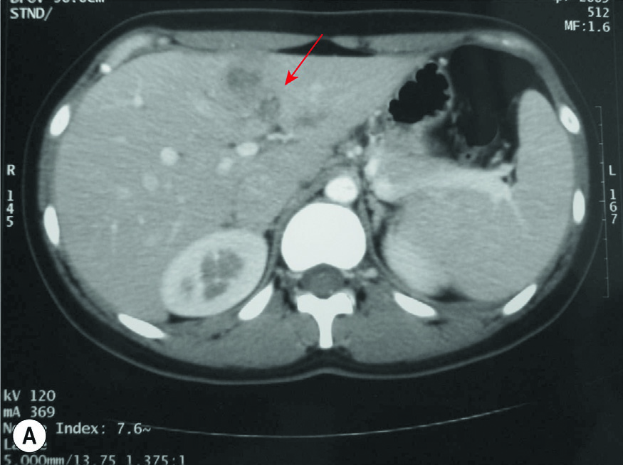
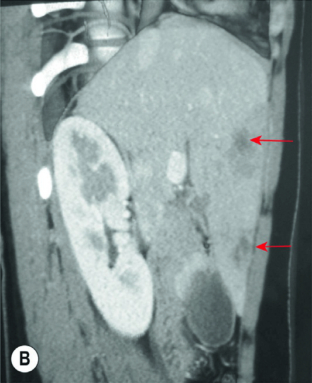

# Page 167 A 24-Year-Old Woman from the Peruvian Andes With Fever and Abdominal Pain FÁTIMA CONCHA VELASCO AND EDUARDO H. GOTUZZO Clinical Presentation History A 24-year-old woman from the highlands of Peru is trans-ferred to a hospital in the capital, Lima, with a 2-month his-tory of upper abdominal pain, weight loss (5kg), nausea and vomiting. She tried analgesics, which did not control the pain. She also reports intermittent fevers for the past 2 weeks. Three days previously, she was seen at the emergency room of the same hospital for the above-mentioned com-plaints. Abdominal ultrasound revealed multiple hypoechoic lesions in her liver. She was treated with ceftriaxone and met-ronidazole for suspected pyogenic liver abscesses but did not show any clinical improvement. The patient reported that about 2 to 3 months ago she started taking over-the-counter medicines to lose weight and changed her diet to vegetarian food. She also reported the consumption of energetic hot drinks made from alfalfa and watercress. Prior to her current illness, she was healthy. She is single and has no children. Clinical Findings The patient looks ill, with pale mucous membranes but no jaundice. Her blood pressure is 95/60mmHg, pulse 105bpm and temperature 38.5°C (101.3°F). On palpation of the abdomen there is right upper quadrant tenderness, and the liver is slightly enlarged with a liver span of 15cm. The rest of the physical examination is normal. Laboratory Results Table 67.1 shows the patient’s laboratory results, taken in the emergency room. Imaging A contrast-enhanced CT scan of her abdomen shows multiple hypodense, non-enhancing lesions in the liver (Fig. 67.1). Questions 1. What are your differential diagnoses? 2. What would be the most useful investigation to establish the diagnosis? Discussion A young woman from the Peruvian Andes presents with a history of fever, weight loss and abdominal pain. The blood count reveals pronounced eosinophilia. The abdominal CT scan shows hypodense non-enhancing hepatic lesions. TABLE 67.1 Laboratory Results on Admission to Emergency Room Parameter Patient Reference Range WBC ( 109/L) 13.944-10 Eosinophils (%) 43 <5 Total eosinophil count 5.97 <0.5 Haemoglobin (g/dL) 12.312-16 AST (U/L) 3410-40 ALT (U/L) 557-40 AP (U/L) 17020-126 Amylase (U/L) 753-100 Lipase (U/L) 10010-140183 # Page 2 Answer to Question 1 What Are Your Differential Diagnoses? The patient was first treated for suspected pyogenic liver abscesses based upon the presence of fever, right upper abdominal pain and hypoechoic liver lesions on ultrasound. However, the lack of any improvement after 3 days of appropriate treatment makes this diagnosis less likely. In a patient from the Andes with high eosinophilia and a known history of alfalfa and watercress consumption, fasci-oliasis is the most important diagnosis to consider. Amoebic liver abscess is also part of the differential diagnosis, but eosinophilia and the presence of multiple lesions are not typ-ical. Also, the infection is uncommon in young women and should respond to metronidazole treatment. Other endemic infections in Peru that could present with similar symptoms are brucellosis, visceral toxocariasis or sec-ondary infections in the context of other infections (i.e. ascari-asisandhydatiddisease).Opisthorchis,anotherliverfluke,could be considered if the patient had a travel history to South-east Asia, as the condition is not present in the Americas. Answer to Question 2 What Would Be the Most Useful Investigation to Establish the Diagnosis? Infection with the sheep liver fluke (Fasciola hepatica) is top of the list of differential diagnoses in this patient with liver lesions, eosinophilia and a history of watercress consumption. Because ova appear in the stool only later in the course of the disease, serology is the diagnostic tool of choice. The Fas2 ELISA is a serological method with good sensitivity and spec-ificity to diagnose the acute phase of F. hepatica infection. Liver biopsy is invasive and has little benefit in this con-text; it could be considered if tests are negative and all treatments fail. The Case Continued… The Fas2 ELISA titre was 0.56 (normal <0.2), supporting the suspected diagnosis of fascioliasis. The patient received one single dose of triclabendazole 10mg/kg. Her clinical symptoms rapidly improved and her laboratory parameters went back to normal. On control tomography her liver lesions were seen to be disappearing. SUMMARY BOX Fascioliasis Fascioliasis is caused by the liver flukes Fasciola hepatica or less frequently F. gigantica. Fascioliasis has the widest latitu-dinal, longitudinal and altitudinal distribution of any known zoonotic diseases. It is a serious public health problem, with between 2.4 and 17 million infected people worldwide and around 90 million at risk. In South America, the infection is encountered in the Andean countries, in particular in Bolivia and Peru. Egypt is another country with a very high prevalence of fascioliasis. Ova of Fasciola species are shed in the faeces of herbivores. Once they reach fresh water, miracidia hatch and infect a snail which acts as an intermediate host. Additional development takes place inside the snail, then cercariae are released into the water. They develop into infective encysted metacercariae on freshwater plants. Humans acquire the disease by eating watercress (salads) or drinking water contaminated with metacercariae. The illness includes four clinical phases: (1) incubation phase, (2) invasive or acute phase, (3) latent phase and (4) obstructive or chronic phase. The incubation phase lasts from ingestion of metacercariae to first symptoms (6-12 weeks). The invasive or acute phase begins with flukes migrating through the small intestinal wall, the peritoneal cavity, the liver capsule and the liver parenchyma. During the acute phase, lasting 3 to 5 months, the patients typically present with intermittent fever, abdominal pain, mal-aise, weight loss, urticaria and respiratory symptoms (e.g. cough, dyspnoea and chest pain). Less common findings include changes in bowel habits, nausea, anorexia, hepato-megaly, splenomegaly, ascites, anaemia and jaundice. Eosin-ophilia is almost always present during the acute phase. At the beginning of the subsequent latent phase the para-sites have crossed the liver parenchyma to finally reach the common bile duct, where they mature and start depositing eggs. Ova appear in the stool 3 to 4 months after the ingestion of infective metacercariae. The latent phase is characterized by the progressive resolution of gastrointestinal and respiratory symptoms. An unknown percentage of patients will progress to the fourth phase of the disease characterized by biliary obstruction, cholelithiasis, ascending cholangitis, cholecystitis, or liver abscess. Haemorrhage (e.g. subcapsular • Fig. 67.1 A contrast-enhanced CT scan showing multiple, round, clustered, hypodense lesions in left median section of liver (A, axial cross-section; B, lateral view). 184 CHAPTER 67 A 24-Year-Old Woman from the Peruvian Andes With Fever and Abdominal Pain # Page 3 haematomas), hepatic fibrosis or biliary cirrhosis might also be observed. During the acute phase, diagnosis of human fascioliasis is based on clinical and radiological findings and immunodiag-nostic assays such as the Fas2-ELISA. Eosinophilia is usually present. During chronic infection, eosinophilia is rare but ova can be detected on stool microscopy. The yield can be improved using rapid sedimentation techniques. Microscopic detection of eggs is considered definitive diagnosis of fascioliasis. Eggs may also accidentally be discovered during surgery for biliary obstruction. Typical lesions seen on CT scan are contrast-enhancement of the Glisson’s capsule, and multiple hypodense nodular lesions. Triclabendazole is the anthelmintic drug of choice. In acute cases a single dose of triclabendazole at 10mg/kg is effective in almost 90% of cases and the same regimen is used in chronic disease. Triclabendazole should be taken with food to increase its bioavailability. Triclabendazole resistance seems to be an emerging problem. Further Reading 1. Sithithaworn P, Sripa B, Kaewkes S, et al. Food-borne trematodes. In: Farrar J, editor. Manson’s Tropical Diseases. 23rd ed. London: Elsevier; 2013 [chapter 53]. 2. Marcos LA, Tagle M, Terashima A, et al. Natural history, clinicor-adiologic correlates, and response to triclabendazole in acute mas-sive fascioliasis. Am J Trop Med Hyg 2008;78(2):222-7. 3. Webb CM, Cabada MM. Recent developments in the epidemiol-ogy, diagnosis, and treatment of Fasciola infection. Curr Opin Infect Dis 2018;31(5):409-14. 4. Carmona C, Tort JF. Fasciolosis in South America: epidemiology and control challenges. J Helminthol 2017;91(2):99-109. 5. Kelley JM, Elliott TP, Beddoe T, et al. Current threat of triclaben-dazole resistance in fasciola hepatica. Trends Parasitol 2016;32(6): 458-69. 185 CHAPTER 67 A 24-Year-Old Woman from the Peruvian Andes With Fever and Abdominal Pain

## Images

