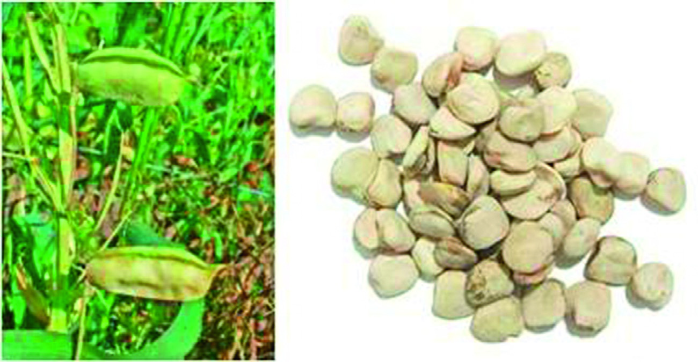
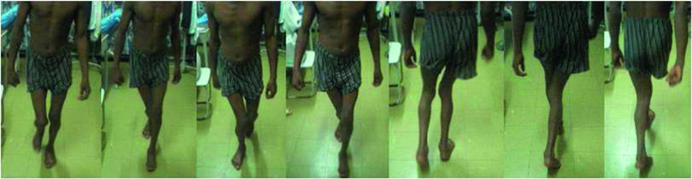

# Page 169 A 22-Year-Old Male Farmer from Rural Ethiopia With Difficulty Walking YOHANNES W. WOLDEAMANUEL Clinical Presentation History A 22-year-old male farmer from rural northern Ethiopia pre-sents to a hospital in the capital with difficulty walking. His problem started 10 years ago, when he woke from sleep one morning and noticed weakness in both legs. There was no history of trauma and no prodromal symptoms; he had been in excellent health before. The weakness in his legs rapidly progressed over 4 to 5 days, leading to him needing a cane for mobility. He had no back pain, sensory complaints, sphincter disturbance or upper limb symptoms. The start of his illness coincided with a period of drought and famine, when his diet almost exclusively consisted of grass peas (Lathyrus sativus, local name guaya), which is known to be drought-resistant (Fig. 69.1). Despite the monotonous diet, he had been engaged in hard physical labour on his family farm, where he was the main breadwin-ner, despite his young age. He lived with his mother and three sisters, who took care of household chores; they con-sumed a similar diet but of overall smaller amounts of guaya. During that time, several similar cases of weakness among young male farmers occurred in his village. His walking dif-ficulty finally meant that he could not return to farm work. At the age of 20, he moved to the capital city seeking an alter-native job. He migrated along with another young male farmer from his village who had suffered a similar fate; he had weakness of both legs and arms, which he had developed during the same period of drought. There was no history of cassava exposure in the region. Clinical Findings An alert young man with a normal mental state. The gait is spastic (‘scissor gait’), with foot-dragging and toe-scraping (Fig. 69.2). There is mild bilateral lower limb spastic weak-ness of pyramidal pattern, with pathological brisk deep ten-don reflexes and sustained foot clonus. Extensor plantar response is elicited on the right, while equivocal on the left. Cranial nerves and upper limbs are normal. There is no sensory or bladder dysfunction. Laboratory Results Full blood count, liver and renal function tests, cerebrospinal fluid, nerve conduction studies and electromyography are normal. His HIV-1 serology is non-reactive. HTLV-1 and-2 serology and MRI are not available. • Fig. 69.1 Lathyrus sativus (local name guaya) grass pea plant and its leguminous seeds. 189 # Page 2 Questions 1. What clinical syndrome can you apply for a diagnostic approach and how do you narrow down your differential diagnoses? 2. What management and disease prevention plans can be used? Discussion A male, teenage farmer from rural northern Ethiopia develops irreversible spastic paraparesis. The onset of symp-toms coincides with a period of drought when diet mainly consists of grass peas. There is no sensory deficit and no blad-der dysfunction. Another young male farmer from the same village is similarly affected. Answer to Question 1 What Clinical Syndrome Can You Apply for a Diagnostic Approach and How Do You Narrow Down Possible Differential Diagnoses? Upper motor neuron lesion with spastic paraparesis is the cli-nical syndrome. Absence of radicular symptoms, sensory level, sphincter disturbance, back pain, non-progression, HIV-seronegativity and negative family history rule out most com-pressive, hereditary, infectious and metabolic myelopathies. Among tropical myelopathies, HTLV-associated myelop-athy (HAM) is highly unlikely. HAM has usually an insid-ious onset and a slowly progressive course, bladder impairment and sensory symptoms are prominent. Neuro-cassavism (konzo) may also present with a sudden-onset spas-tic paraparesis but is improbable in the absence of cassava exposure. Male gender, pre-onset physical exertion, excessive prolonged guaya consumption and a history of similarly affected village members favour a distinct form of toxico-nutritional disease called neurolathyrism. Answer to Question 2 What Management and Disease Prevention Plans Can be Employed? Neurolathyrism is a preventable neurotoxic myelopathy leading to permanent disability. Treatment is symptomatic with anti-spastic drugs and physiotherapy. Tendon and muscle release surgery can be employed to lengthen contrac-tures of calf muscles and hip adductors. Walking canes, foot braces and wheelchairs need to be provided. Education to avoid consumption of L. sativus and mea-sures to reduce toxin burden are important public health interventions. New cases of this preventable disease continue to occur. Behaviour change communication among high-risk communities can promote positive practices to reduce toxin exposure. Such practices include the use of metallic cooking utensils rather than traditional clay pots to avoid accrued tox-icity from iron-induced oxidation, addition of antioxidant seasonings, soaking seeds in lemon water and avoiding unripe seeds. The Case Continued… The patient received physiotherapy and muscle relaxants; however, this achieved only mild short-lasting improvement of his spasticity. A walking cane and wheelchair were pro-vided. The patient was counselled to avoid further consump-tion of L. sativus. SUMMARY BOX Neurolathyrism Neurolathyrism is a preventable toxic myelopathy caused by excessive ingestion of the Lathyrus sativus grass pea. Clinical presentation is an irreversible acute to subacute spastic paraparesis or quadriparesis without prominent sensory involvement. Bladder and bowel function are maintained. L. sativus is a hardy, high-yield pest-and insect-resistant cash crop that can endure monsoon, drought or water-logging. It has been consumed in ancient Egypt, Europe, South Asia and in the northern highlands of Ethiopia. Currently more than 100 million people in drought-and monsoon-prone areas use L. sativus as staple crop. Being a multipurpose legume, it makes a protein-rich, filling diet. It is an ‘almost perfect’ crop, were it not for causing disability. L. sativus contains the neu-rotoxin β-N-oxalyl-a,b-diaminoproprionic acid (β-ODAP), a glutamate receptor agonist that results in excitotoxicity. Toxicity is dose-dependent, and risk factors are prolonged heavy ingestion of grass peas, malnutrition, physical exertion, concurrent illness, illiteracy, male gender and young age. Onset occurs within 3 to 6 months of monotonous exces-sive grass pea consumption. Weakness that develops sud-denly or on waking from sleep is a classical presentation. Stage 1 neurolathyrism presents with spastic gait and independent mobility; Stage 2 is requiring a cane for mobility; Stage 3 is • Fig. 69.2 Images demonstrating the patient’s gait: paraplegic narrow-based ‘scissor gait’ with foot-dragging, and toe-scraping. 190 CHAPTER 69 A 22-Year-Old Male Farmer from Rural Ethiopia With Difficulty Walking # Page 3 requiring a crutch; Stage 4 is characterized by the inability to bear weight with resultant contractures. By virtue of affecting young breadwinners of rural families, neurolathyrism poses a high economic burden on poor com-munities in a setting where no social services or disability pensions are available. Further Reading 1. Aronson JK. Plant poisons and traditional medicines. In: Farrar J, editor. Manson’s Tropical Diseases. 23rd ed. London: Elsevier; 2013 [chapter 76]. 2. Woldeamanuel YW, Hassan A, Zenebe G. Neurolathyrism: two Ethiopian case reports and review of the literature. J Neurol 2012;259(7):1263-8. 3. Tekle Haimanot R, Feleke A, Lambein F. Is lathyrism still endemic in northern Ethiopia?-The case of Legambo Woreda (district) in the South Wollo Zone, Amhara National Regional State. Ethiop J Health Dev 2005;19(3):230-6. 4. Bick AS, Meiner Z, Gotkine M, Levin N. Using advanced imaging methods to study neurolathyrism. Isr Med Assoc J 2016;18 (6):341-5. 5. Lambein F, Travella S, Kuo YH. Grass pea (Lathyrus sativus L.): orphan crop, neutraceutical or just plain food? Planta 2019;250:821-38. 191 CHAPTER 69 A 22-Year-Old Male Farmer from Rural Ethiopia With Difficulty Walking

## Images

