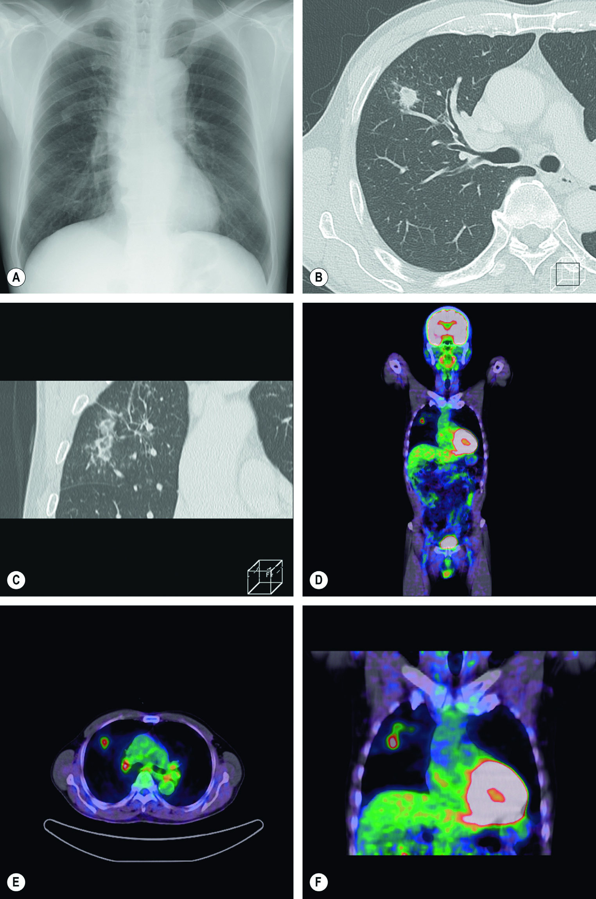
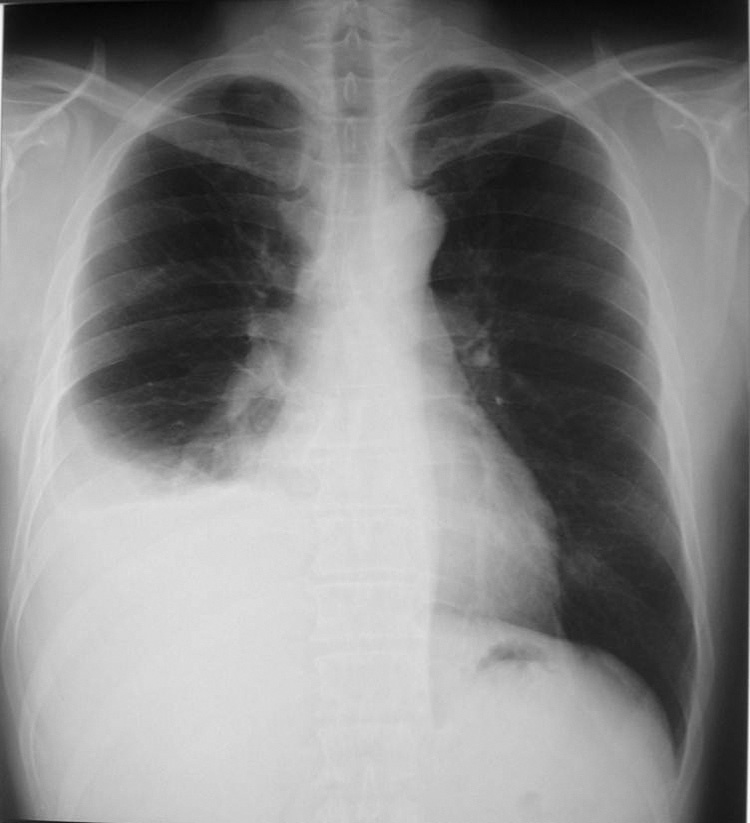
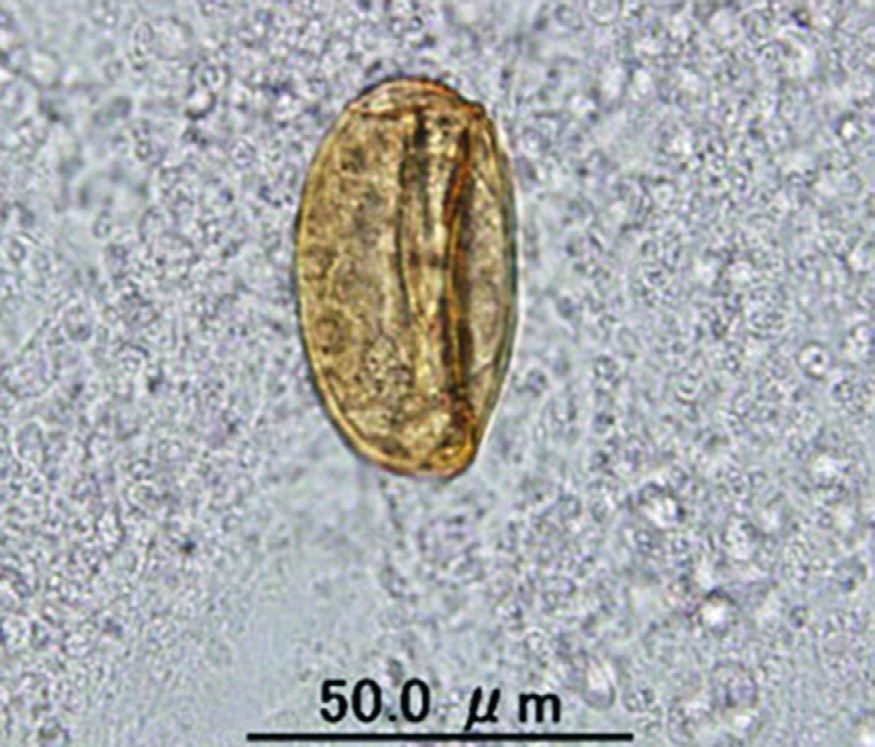
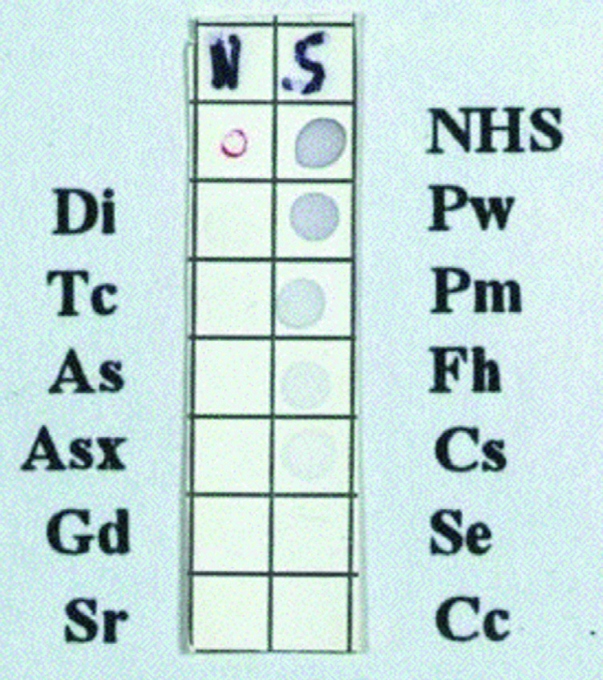
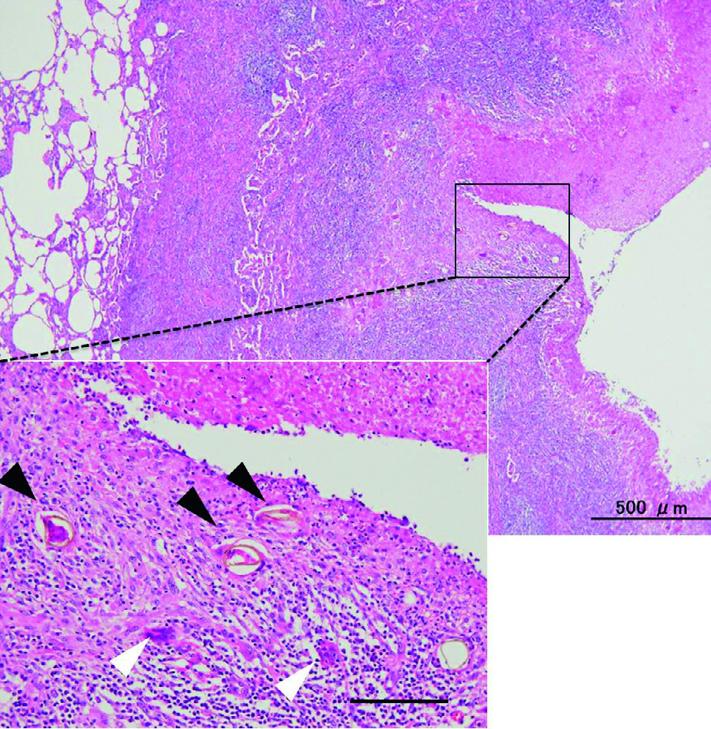

# Page 171 A 71-Year-Old Man from Japan With Eosinophilia and a Nodular Lesion in the Lung YUKIFUMI NAWA, HARUHIKO MARUYAMA AND MASAKI TOMITA Clinical Presentation History A 71-year-old Japanese man is referred to a local tertiary care hospital for further work-up of a nodular lesion in his right lung. He is clinically well and does not report any complaints. The lesion was first detected 2 years earlier during a routine healthcheck.Initiallyitwasoflinearshape.Thepatienthasbeen regularly followed up since then. At his most recent follow-up visititwasfoundbychestradiography(Fig.71.1A)andCTscan (Fig. 71.1B, C) that his linear lung shadow had turned into a nodular lesion of about 2cm in diameter. The patient was born in Kyushu district, southern Japan, where he is still living. He has no history of travelling overseas. Clinical Findings The vital signs were normal. The chest was clear. The remainder of the physical examination was also normal. Investigations His full blood count and total IgE are shown in Table 71.1. Liver and renal function tests as well as electrolytes are nor-mal. LDH and CRP are not raised. Serologies Cryptococcus Ag negative, Aspergillus Ag negative, β-D-glucan 6.0pg/mL (<20pg/mL), QuantiFERON test (QFT-2G) negative. Imaging Fluorodeoxyglucose-positron emission tomography (FDG-PET-CT) shows increased FDG-uptake into the lesion in the right upper lobe (Fig. 71.1D-F). Questions 1. What kind of diseases should be considered in your dif-ferential diagnosis? 2. What further information should you obtain from the patient? TABLE 71.1 Full Blood Count Results at Presentation Parameter Patient Reference WBC ( 109/L) 6.54-10 Haemoglobin (g/dL) 15.314-16 Platelets ( 109/L) 190150-300 Neutrophils (%) 46.130-80 Lymphocytes (%) 38.615-50 Monocytes (%) 6.41-12 Eosinophils (%) 8.30-6 Total eosinophil count ( 109/L) 0.54 <0.45 Basophils (%) 0.60-2 IgE (U/mL) 185.7 <100195 # Page 2 Discussion A 71-year-old Japanese man who is clinically well is worked up for a nodular lesion in his right lung. Blood tests reveal a mild eosinophilia and a slightly raised IgE. On PET scan the pulmonary lesion shows an increased FDG uptake. Answer to Question 1 What Kinds of Diseases Should be Considered in Your Differential Diagnoses? The most important differential diagnosis for a nodular lesion with or without cavitation in the lung is either pulmo-nary tuberculosis or lung cancer. The PET-CT is unable to • Fig. 71.1 Chest x-ray (A) and CT scan (B, C) of the patient showing a nodular lesion in the right upper lobe. (D-F) Fluorodeoxyglucose-positron emission tomography (FDG-PET) with increased FDG uptake into the lesion in the right upper lobe. 196 CHAPTER 71 A 71-Year-Old Man from Japan With Eosinophilia and a Nodular Lesion in the Lung # Page 3 distinguish between a malignancy and an inflammatory lesion of other aetiology, e.g. an infectious process. Systemic endemic mycoses (e.g. histoplasmosis, blasto-mycosis and paracoccidioidomycosis) may present with a wide variety of pulmonary lesions in otherwise asymptom-atic patients; however, they are not endemic in East Asia and the patient does not have a history of travelling abroad. In addition to abnormal findings on the chest radiograph, this patient shows eosinophilia and elevated total IgE levels. One therefore needs to consider the possibility of pulmonary helminth infections, especially of lung fluke infection (paragonimiasis). Answer to Question 2 What Kind of Information Should You Obtain from the Patient? When suspecting lung fluke infection, it is important to find out if the patient may at any time have been exposed to this parasite. Paragonimus species are endemic all over Asia, in West and Central Africa and parts of Latin America. If the patient lives in an endemic area, or has a positive travel history, one should find out if he or she has ever eaten raw or undercooked freshwater crabs, which may harbour the infective stage (metacercariae) of Paragonimus species. Also, consumption of raw wild boar meat is a risk, because wild boar act as paratenic hosts, harbouring juvenile worms. Traditional medicine used in some East Asian countries may contain raw crab meat and juice and potentially act as a source of infection. However, some patients have a negative exposure history, and it has been suggested that even con-taminated fingers and cooking utensils may act as a source of infection. The Case Continued… Bronchoscopy did not reveal any signs of malignancy. Cytology of the bronchoalveolar lavage (BAL) fluid was negative for malignant cells and acid-fast bacilli. The QuantiFERON test and a wide range of tumour markers were negative. In view of the elevated IgE levels, the patient’s eosino-philia and the fact that the patient originated from Southern Japan, paragonimiasis was strongly suspected and the patient’s serum was submitted for immunodiagnosis of par-asitic diseases. Multiple-dot ELISA was strongly positive for P. westermani. The patient was treated with oral praziquantel 25mg/kg tds for 3 consecutive days. The lung lesion gradually faded and eventually disappeared. His serum antibody titre also declined. TABLE 71.2 Predominant Paragonimus Species by Region Region Predominant Paragonimus spp. East Asia P. westermani P. skrijabinia South and South-east Asia P. heterotremusb Africa P. africanus P. uterobilateralis North America P. kelicottii Central and South America P. mexicanus asyn. P. myazakii. bException: Philippines-P. westermani. • Fig. 71.2 Chest x-ray of a patient with acute paragonimiasis, showing right-sided pleural effusion. • Fig. 71.3 Paragonimus westermani egg in sputum. 197 CHAPTER 71 A 71-Year-Old Man from Japan With Eosinophilia and a Nodular Lesion in the Lung # Page 4 SUMMARY BOX Paragonimiasis Paragonimiasis is a sub-acute to chronic lung disease caused by infection with lung flukes of the genus Paragonimus. Paragonimus westermani is the most widely distributed species in Asia, but several additional species also cause disease (Table 71.2). Apart from Asia, paragonimiasis occurs in the Americas and in sub-Saharan Africa. Adult flukes live in the lungs of a mammalian host (felines, canines, humans). Ova are coughed up and either expectorated or swallowed and passed in the faeces. When eggs reach fresh water, miracidia hatch and infect a snail (first intermediate host). After asexual multiplication, cercariae are released and infect a crab or crayfish (second intermediate host). Human infection occurs mainly via consumption of raw or undercooked freshwater crabs or crayfish contaminated with Paragonimus metacercariae. In addition, eating raw meat of wild boar, which is a paratenic host, is an important route of infection, especially in Japan. Venison (deer meet) has also been proven as the potential source of P. westermani infection in humans. Because the range of paratenic hosts may even be wider, eating wild animal meat in general may be a risk factor for this disease. Metacercariae excyst in the small intestine and penetrate the intestinal wall. They pass through the liver and diaphragm, invade the pleural space and finally enter the lung parenchyma where they mature into adults and produce eggs. Juvenile worms sometimes migrate into subcutaneous soft tissue or the central nervous system to cause unexpected, potentially deleterious lesions. Clinical features of the disease are similar to those of pulmo-nary TB or lung cancer. Patients may have chronic cough, hae-moptysis, chest pain, fever, night sweats and abnormal findings on chest imaging. Pleural effusion (Fig. 71.2) with marked eosinophilia in the exudate and pneumothorax without apparent nodular lesion/cavitation may occur in the early stages and/or in light infections. Extrapulmonary paragonimiasis may present as painless, mobile subcutaneous swellings. Migration into the CNS may lead to acute eosinophilic meningoencephalitis and epilepsy. However, about 20% of patients are asymptomatic and the disease is accidentally found on routine chest radiography, when nodules, ring shadows or cavities are typically seen. Eosinophilia is prominent during acute and sub-acute infection but may be only mild or absent in chronic disease. The definitive diagnosis is made by detection of ova in sputum, BAL fluid or faeces (Fig. 71.3). However, sensitivity is below 50% in light infections. Instead, an immunodiagnostic screening test such as multiple-dot ELISA (Fig. 71.4) should be used in com-bination with the patient’s history and additional laboratory results. Serological tests (e.g. ELISA) may detect early as well as chronic infections, and titres decline rapidly after cure. Prazi-quantel is the drug of choice. A course of 25mg/kg tds for 3 consecutive days is usually effective against all Paragonimus species. Even in paragonimiasis-endemic areas, physicians often do not pay much attention to this disease and misdiagnose it as pulmo-nary tuberculosis or lung cancer. Such diagnostic errors result in enormous socioeconomic loss, and create a mental and physical burden for the patient because of unnecessary hospitalization and laboratory investigations, surgical interventions and/or long-term medication. Figure 71.5 shows a typical example of such a case, in which postoperative histopathology revealed the presence of Paragonimus eggs in the resected nodular lesion, which had been diagnosed as a lung cancer by FDG-PET imaging. • Fig. 71.4 Multiple-dot ELISA for helminthiases showing positive reaction against P. westermani antigen. NHS: normal human serum for positive control; Pw: P. westermani; Pm: P. miyazakii; Fh: Fasciola hepatica; Cs: Clonorchis sinensis; Se: Spirometra erinacei europaei; Cc: Cysticercus cellulosae; Di: Dirofilaria immitis; Tc: Toxocara canis; As: Ascaris sum; Asx: Anisakis simplex; Gd: Gnathostoma doloresi; Sr: Strongyloides stercoralis. • Fig. 71.5 Histopathology of the nodular lung lesion that was surgically resected after diagnosis of lung cancer based on FDG-PET imaging. Note the chronic granulomatous lesion containing numerous Paragoni-mus eggs (black arrows). Foreign body giant cells (white arrows) are also seen in the tissue. 198 CHAPTER 71 A 71-Year-Old Man from Japan With Eosinophilia and a Nodular Lesion in the Lung # Page 5 Further Reading 1. Sithithaworn P, Sripa B, Kaewkes S, et al. Food-borne trematodes. In: Farrar J, editor. Manson’s Tropical Diseases. 23rd ed. London: Elsevier; 2013 [chapter 53]. 2. Kong Y, Doanh PN, Nawa Y. Paragonimus. In: Xiao L, Ryan U, Yaoyu Feng Y, editors. Biology of foodborne parasites. Boca Raton: CRC Press; 2015. p. 445-62. 3. Nawa Y, Thaenkham U, Doanh PN, Blair D. Paragonimus wester-mani and Paragonimus species. In: Motarjemi Y, Moy G, Todd E, editors. Encyclopedia of food safety: hazards and diseases. San Diego, CA, USA: Elsevier; 2014. p. 179-88. 4. Nakamura-Uchiyama F, Mukae H, Nawa Y. Paragonimiasis: a Jap-anese perspective. Clin Chest Med 2002;23(2):409-20. 5. Yoshida A, Matsuo K, Moribe J, et al. Venison, another source of Paragonimus westermani infection. Parasitol Int 2016;65: 607-12. 199 CHAPTER 71 A 71-Year-Old Man from Japan With Eosinophilia and a Nodular Lesion in the Lung

## Images

