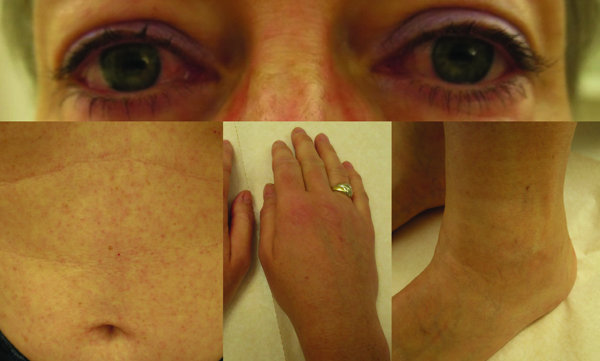
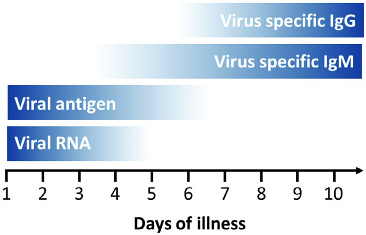

# Page 177 A 51-Year-Old Female Traveller Returning from Central America With Conjunctivitis, Rash and Peripheral Oedema ANDREAS NEUMAYR AND JOHANNES BLUM Clinical Presentation History A 51-year-old female Swiss traveller presented to the outpa-tient department 6 days after returning from a 2-week hol-iday to Guatemala and El Salvador. Four days after her return, the patient noticed a generalized slightly pruritic maculopapular rash on the face, trunk, and extremities. There was no fever and no other accompanying symptoms. On the next day the rash worsened and a non-purulent bilat-eral conjunctivitis developed. The patient did not report any chronic underlying disease nor the intake of any medication. Clinical Findings The patient was afebrile. Upon inspection there was con-junctivitis and a generalised maculopapular rash, also involv-ing the face. Additionally, the patient showed tender oedema of the hands, elbows, knees and feet (Fig. 77.1). There was also generalized lymphadenopathy (cervical, axillary, and inguinal). Laboratory results The full blood count was normal. CRP was 8 mg/L (<5) and creatinine was very mildly elevated (87 μmol/L, range 35-80 μmol/L). Liver function tests were normal. Questions 1. What are your differential diagnoses? 2. What diagnostic tests would you perform? Discussion Six days after returning from a 2-week holiday to Guate-mala and El Salvador, a 51-year-old female Swiss traveller presents with a slightly pruritic disseminated maculo-papular rash, conjunctivitis, peripheral painful oedema (hands, elbows, knees and feet) and a generalized lym-phadenopathy. Answer to Question 1 What Are Your Differential Diagnoses? The clinical presentation is highly suggestive of an arbo-viral infection, which is also in line with the putative incu-bation period. The three most important arboviral infections in Central and South America are dengue, chi-kungunya and zika. Dengue is endemic throughout much • Fig. 77.1 Conjunctivitis, maculopapular skin rash, and peripheral oedema of the patient. 214 # Page 2 of Central and South America, and it is the most frequent arboviral infection in travellers returning from the tropics. Chikungunya was absent in Central and South America until the virus was introduced in 2013. After its introduc-tion, the virus spread to most tropical regions of the American continent. Zika was absent in Central and South America until 2015, when the virus was introduced to Brazil and caused a pandemic affecting most tropical regions of the American continent in the subsequent years. Acute dengue, chikungunya, and zika infections have similar presentations and may be clinically indistinguishable. However, the presence of a skin rash, conjunctivitis and peripheral oedema in an afebrile patient is highly suggestive of a Zika virus infection (Table 77.1). Answer to Question 2 What Diagnostic Tests Would You Perform? When testing for arboviral infections, the kinetics of the dif-ferent test parameters have to be taken into account. During the early phase of infection, viral RNA and viral antigen (e.g. dengue specific NS1) are circulating in the blood and can be detected by RT-PCR and specific antigen assays, respec-tively. After some days, viraemia is fading, terminated by the host’s immune response, and viral RNA and antigen become undetectable in the blood samples, while now spe-cific IgM and IgG rise and become detectable (Fig. 77.2). The diagnosis is made by the detection of viral RNA, viral antigen or specific IgM, or by the documentation of a four-fold rise of specific IgG antibody titres in paired (acute and convalescent) serum samples. In resource-poor countries, as well as in daily clinical practice in travel medicine, rapid diag-nostic tests (RDTs) for dengue (testing for NS1-Ag, IgM, and IgG) and chikungunya (testing for IgM) are widely available and often the primarily performed diagnostic tests. RDTs to diagnose Zika virus infections are under development. In our case, RDTs for dengue and chikungunya were negative. The Case continued… Because the performed RDTs for dengue and chikungunya both showed a negative result, the patient’s blood samples were sent to a reference laboratory for arboviruses and our clinical suspicion of a Zika virus infection was confirmed by PCR as well as seroconversion (Table 77.2). A rise in TABLE 77.1 Comparative Clinical Symptom Patterns Observed in Dengue, Chikungunya and Zika Infections. Dengue Chikungunya Zika Incubation period (days) 4-103-73-12 Asymptomatic infection (%) 50-803-2880 Fever +++ +++ + Headache +++ ++ + Conjunctivitis--++ Arthralgias ++ +++ + Myalgias ++ + + Skin rash ++ ++ +++ Peripheral oedema--++ Haemorrhagic manifestations ++ (+)-Circulatory collapse/ shock +--Thrombocytopenia ++ ++-Lymphadenopathy ++ ++ + • Fig. 77.2 Kinetics of the different arboviral test parameters. TABLE 77.2 Blood Test Results First serum sample† Second serum sample‡ Interpretation Dengue IgM IIFT negative negative negative Dengue IgG IIFT 1:201:5120 cross-reactivity Dengue NS1-Ag negative negative negative Chikungunya IgM ELISA negative ND negative Chikungunya IgM IIFT ND negative negative Chikungunya IgG IIFT ND negative negative Zika IgM IIFT negative 1:640 positive Zika IgG IIFT 1:201:5120 positive Zika RT-PCR positive ND positive †obtained 6 days after onset of symptoms ‡obtained 7 days after the first serum sample IIFT: Indirect Immunofluorescence Test; RT-PCR: real-time reverse transcription polymerase chain reaction; ELISA: Enzyme-linked Immunosorbent Assay; ND: not done. 215 CHAPTER 77 A 51-Year-Old Female Traveller Returning from Central America With Conjunctivitis, Rash... # Page 3 anti-Dengue IgG was interpreted as cross-reactivity which is common among viruses of the same family. SUMMARY BOX Acute Arboviral Infection Acute dengue, chikungunya, and Zika infections have similar presentations and are often clinically indistinguishable. Although the pattern of clinical symptoms can point towards the correct diagnosis, specific molecular or immunological tests are nec-essary to make a final diagnosis. Interpretation of serological test results demands some caution, because cross-reactivity of antibodies directed against viruses belonging to the same family of viruses may be misleading. Although dengue virus NS1 antigen tests are mostly specific for dengue virus infection, serological assays may show cross-reactivity with Zika virus (ZIKV) specific antibodies (as in our case). The diagnostic value of RT-PCR for detection of Zika virus RNA in the blood is limited because viraemia is usually low and limited to the first few days after disease onset. However, Zika virus RNA detection in urine provides a feasible alternative: ZIKV is detectable with higher RNA loads and for a longer period (10-20 days after onset of symptoms) in urine samples than in serum samples. Arboviral infections are self-limiting and, in the absence of specific treatment options, clinical management is exclusively supportive. Special features of Zika virus include its sexual transmissibility, the potential to trigger post-infectious Guillan-Barr e-Syndrome, and, in the case of intrauterine infection, its ability to cause severe foetopathy (primarily microcephaly). Further Reading 1. Young PR, Ng LFP, Hall RA, et al. Arbovirus Infections. In: Farrar J, editor. Manson’s Tropical Diseases. 23rd ed. London: Elsevier; 2013 [chapter 14]. 2. Baud D, Gubler DJ, Schaub B, et al. An update on Zika virus infec-tion. Lancet 2017;390(10107):2099-109. 3. Peters R, Stevenson M. Zika virus diagnosis: challenges and solu-tions. Clin Microbiol Infect 2019;25(2):142-6. 216 CHAPTER 77 A 51-Year-Old Female Traveller Returning from Central America With Conjunctivitis, Rash...

## Images

