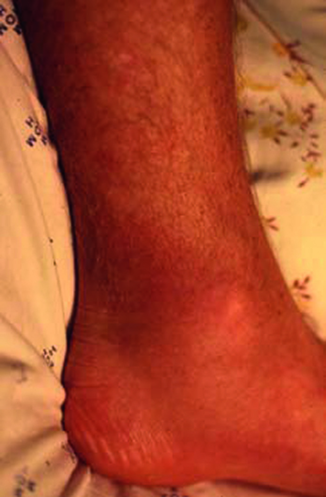
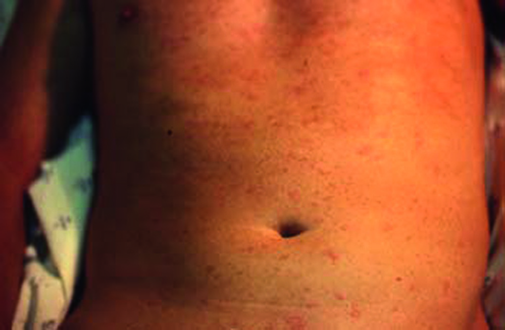

# Page 178 A 42-Year-Old British Man Living in Malawi With Anaphylactic Shock ANTHONY D. HARRIES Clinical Presentation History A 42-year-old British male expatriate who has lived in Malawi for 18 months presents to the local hospital emer-gency room with a florid itchy rash, difficulty in breathing and a feeling he is going to die. He thinks he might have been bitten on his ankle by a tick 2 days previously while out walk-ing in the countryside. Twenty-four hours after this event he noticed a circumscribed, painless, indurated lesion on the inside of his left ankle and this was accompanied by fever and arthralgia. He went to a clinic where a blood film for malaria parasites was reported negative. He was treated with paracetamol. On the day of admission, he developed a wide-spread itchy rash and shortly afterwards became progressively unable to breathe and felt faint. There was a family history of allergy. He had kept bees in the United Kingdom and had frequently been stung without ill effect. However, 9 months previously he had been bitten by insects while at Lake Malawi and had developed an asthmatic attack which resolved spontaneously over 2 days. Clinical Findings On examination, he is clammy, in a state of collapse and has a widespread urticarial rash. There is respiratory distress and stridor. There is an indurated circumscribed swelling on the inside of his left ankle (Fig. 78.1). His vital signs are: temperature 38°C, pulse rate 130 bpm, systolic blood pressure 60 mmHg. Chest auscultation reveals expiratory wheezes. Laboratory results Haemoglobin 17.4 d/dL; white cell count 6.1 G/L (poly-morphs 85%, lymphocytes 10%); erythrocyte sedimentation rate5 mm/hour;bloodfilmnegativeformalariaparasites;chest radiograph normal; stool and urine microscopy negative. Questions 1. Based on the clinical history and examination and inves-tigations done, what are the possible causes of this man’s illness? 2. How should he be further managed? Discussion This male British expatriate presents with the clinical pic-ture of anaphylactic shock. He relates this to a tick bite he suffered few days prior. On admission is also febrile • Fig. 78.1 Circumscribed, painless slighly erythematous swelling on the inside of the left ankle. 217 # Page 2 and besides his rash has an erythematous lesion on his ankle. Answer to Question 1 Based on the Clinical History and Examination and Investigations Done, What Are the Possible Causes of This Man’s Illness? With a story of possible tick bite, a positive family history of allergy, a history of bee keeping, an asthmatic episode after insect bites 9 months previously in addition to the dramatic clinical presentation of urticarial rash and anaphylactic shock, the initial diagnosis was of a possible hypersensitivity reaction to a tick bite. Other differentials to include are inva-sive helminthiasis such as acute schistosomiasis (Katayama syndrome), acute fascioliasis and Loeffler’s syndrome (the acute pulmonary stage of infection with Ascaris lumbricoides); rickettsial disease; and connective tissue disease. Both in allergic reactions and in invasive helminth infections though, eosinophilia would be typical which is absent in this case. Answer to Question 2 How Should He Be Further Managed? A firm diagnosis has not been made and he needs to remain in the hospital under observation receiving treatment as needed for his intermittent allergic manifestations. The Case Continued… A diagnosis of anaphylactic shock is made and 0.5ml of 1:1000 adrenaline is given by deep intramuscular injection with good effect. He is admitted to hospital and over the next 2 days he is treated with intermittent injections of intramus-cular adrenaline, intravenous hydrocortisone and oral anti-histaminics for intermittent episodes of widespread urticaria associated with stridor and audible wheezing. On day 3 of his hospital admission, his condition changes. The stridor and wheezing cease, the urticarial rash is replaced by a diffuse erythematous rash (Fig. 78.2), his face becomes slightly puffy, he has a bad headache and a sustained fever of 38 to 39°C. On direct enquiry, he says he visited a national game park 2 weeks before this current illness where he has suffered numerous painful bites by tsetse flies. The fever, headache, puffy face and erythematous rash suggest trypano-somiasis and the circumscribed swelling on the ankle is now recognized to be a “trypanosomal chancre”. A thick blood film reveals 5 to 10 trypanosomes per high power field and the diagnosis of trypanosomiasis is confirmed. He is given a test dose of suramin 0.25 g with no ill effect, 0.5 g 2 days later, 1.0 g another 2 days later and this is followed by weekly doses of 1.0 g to a total of 5.75g suramin without ill effect. 24 hours after the first dose of suramin, his cerebro-spinal fluid (CSF) is examined by lumbar puncture to assess whether there has been central nervous system invasion-his CSF is normal. His urine is monitored weekly during the sur-amin treatment; towards the end of treatment his urine shows protein, casts and white cells, but these all disappear a few weeks after treatment has finished. SUMMARY BOX Human African Trypanosomiasis (HAT) The patient was diagnosed with HAT. East African trypano-somiasis (Trypanosoma brucei rhodesiense) appears epidemiologically and clinically likely. It is primarily a zoonosis, and animal reservoir hosts include domestic and game animals; its clinical course therefore tends to be rapid with a high case fatality rate if untreated. In contrast, West African • Fig. 78.2 Abdominal rash. TABLE 78.1 Standard Treatment for Human African Trypanosomiasis by Species and Stage West African trypanosomiasis (T. brucei gambiense) East African trypanosomiasis (T. brucei rhodesiense) First stage Pentamidine IM or IV OD 7 days or Fexinidazole PO OD 10 days Suramin IV, 6 injections, e.g. days 0,1,3,7,14, 21. Or Pentamidine IM or IV OD 7 days Second stage Nifurtimox-Eflornithine combination therapy (NECT) (Nifurtimox PO TDS 10 days+ Eflornithine IV BD 7 days) or Fexinidazole PO OD 10 days Melarsoprol IV OD 10 days IM ¼ intramuscularly, IV ¼ intravenously, PO ¼ orally, OD ¼ once daily, BD ¼ twice daily, TDS ¼ three times a day After B€uscher, P., et al. 2017. Lancet. 218 CHAPTER 78 A 42-Year-Old British Man Living in Malawi With Anaphylactic Shock # Page 3 trypanosomiasis is considered an anthroponotic disease. The parasite, T. brucei gambiense, is adapted to the human host, causing chronic symptoms and leading to the classic picture of “sleeping sickness”, i.e. a chronic encephalopathy. The reasons for the dramatic presentation of trypanosomiasis with anaphylaxis as with the case of this patient can only be speculative, but his “allergic” preponderance may have made him hypersensitive to the invasive trypanosomes as they migrated from the subcutaneous tissues of the chancre to the blood. Gold standard of diagnosis is the demonstration of trypanosomes in blood smears by microscopy. Why trypanosomes were not identified in the first blood smear 24 hours after his illness started is not clear-they may not have been present in sufficient numbers in the blood at that stage or they may have been missed by the laboratory technician who was focused on searching for malaria parasites. Suramin is the treatment of choice for early stage East African trypanosomiasis (Table 78.1). It needs to be administered carefully with an initial test dose in case of hypersensitivity reactions. It is potentially nephrotoxic, hence the need for urine monitoring. In all cases of trypanosomiasis, it is essential to check the CSF for stage determination. It is best to perform the lumbar puncture 24 hours after the first dose of suramin to avoid introducing trypanosomes from the blood into the CSF during lumbar puncture. If there are >5 cells/μl in the CSF or try-panosomes are found, this is considered stage 2 (neurological involvement). Treatment in case of second stage East African trypanosomiasis is with melarsoprol, a trivalent arsenical drug with severe potential toxic effects (Table 78.1). Further Reading 1. Burri C, Chappus F, Brun R. Human African Trypanosomiasis. pages 606-621. In: Farrar J, Hotez P, Junghanss T, Kang G, Lalloo D, White NJ, editors. Manson’s Tropical Diseases. 23rd ed. London: Elsevier Saunders; 2013 [Chapter 45]. 2. Thwaites GE, Day NPJ. Approach to fever in the returning traveler. N Engl J Med 2017;376:548-60. https://doi.org/10.1056/ NEJMra1508435. 3. B€uscher P, Cecchi G, Jamonneau V, et al. Human African Trypanosomiasis. Lancet 2017;390:2397-2409. https://doi.org/ 10.1016/S0140-6736(17)31510-6. 4. World Health Organization. Human African Trypanosomiasis. Available from: http://www.who.int/trypanosomiasis_african/en/. 5. Neuberger A, Meltzer E, Leshem E, et al. The changing epidemi-ology of Human African Trypanosomiasis among patients from Nonendemic countries-1902-2012. PLoS One 2014;9(2): e88647. https://doi.org/10.1371/journal.pone.0088647. 219 CHAPTER 78 A 42-Year-Old British Man Living in Malawi With Anaphylactic Shock

## Images

