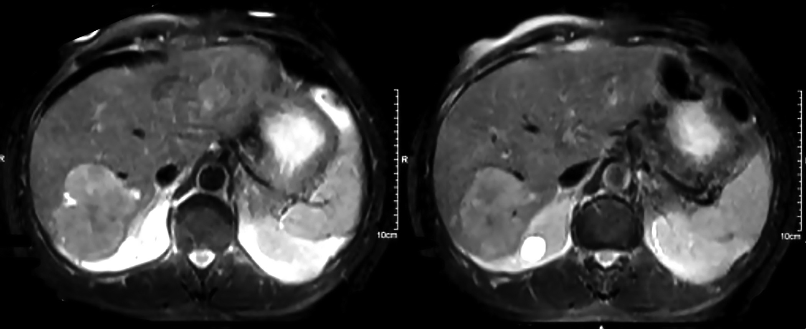
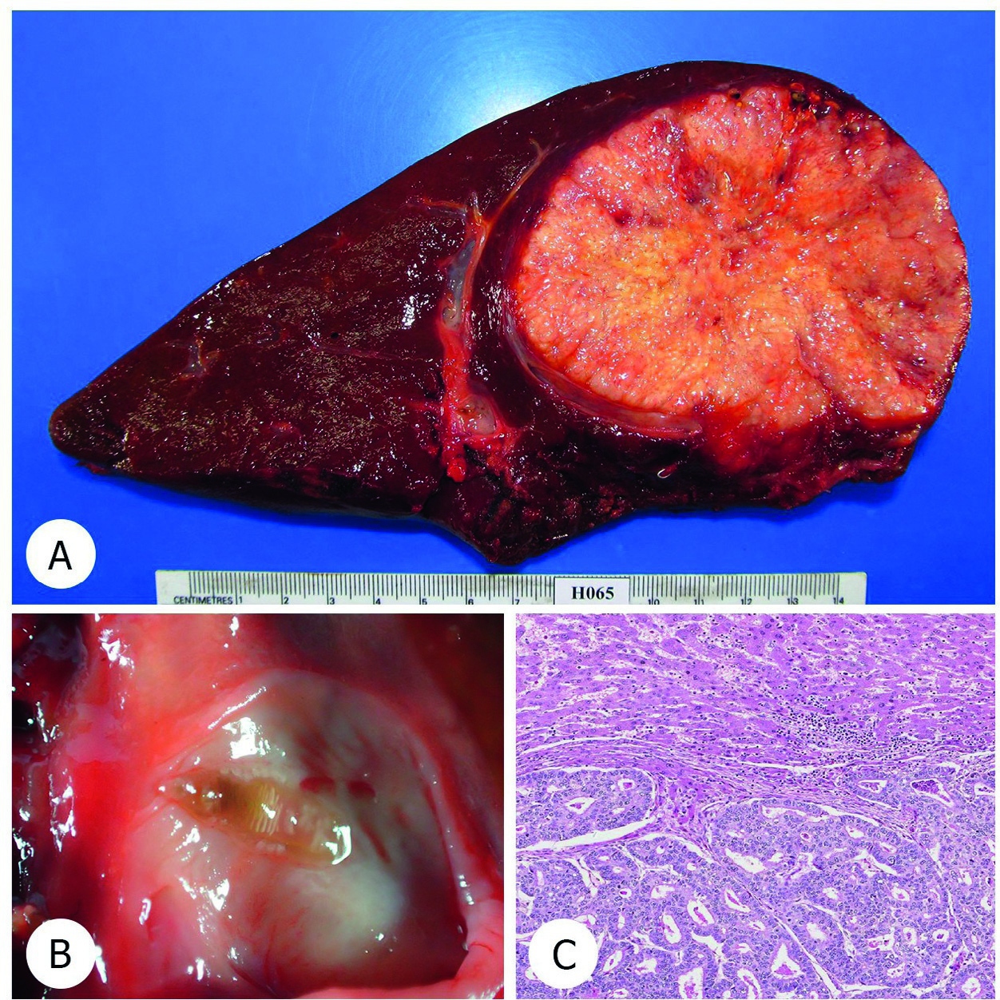

# Page 180 A 62-Year-Old Man from Thailand With a Liver Mass PRAKASIT SA-NGAIMWIBOOL AND YUKIFUMI NAWA Clinical Presentation History A 62-year-old male Thai police sergeant major from Kalasin Province in northeast Thailand presents at an urban hospital for his annual physical check-up. On abdominal ultrasonog-raphy, a solitary mass is found in the liver. He denies any clinical symptoms, there is no weight loss, no jaundice and no other gastrointestinal symptoms. He is referred to a hospital in Khon Kaen for further investigations and treatment. Clinical Findings He appears in good health and vital signs are normal. Phys-ical examination shows no jaundice. Liver and spleen are not palpable. No liver stigmata are found nor is any lymphade-nopathy detected. Laboratory results His laboratory results are shown in Table 80.1. Imaging Abdominal MRI reveals a single solid liver mass in the right liver lobe (segments VI/VII), Fig. 80.1. Questions 1. What is your differential diagnosis? 2. What additional information should you obtain from the patient? Discussion A 62-year-old asymptomatic Thai man undergoes his annual physical check-up. Ultrasound incidentally detects a solitary liver mass. Liver function tests are normal, and Hepatitis B serology suggests previous infection. The CA19-9 level is markedly elevated. Answer to Question 1 What is Your Differential Diagnosis? The most important differential diagnoses in this Thai man in his sixties are hepatocellular carcinoma, cholangiocarci-noma (CCA), a metastatic tumour and some infections, including tuberculosis. In an otherwise asymptomatic patient with a high serum CA19-9 level without a history and signs of chronic viral hepatitis, CCA is the most likely diagnosis. Metastatic cancer should be considered and thorough investigation is required to detect the primary site of the tumour. TABLE 80.1 Laboratory Results of the Thai Patient With a Liver Mass Parameter Patient Reference AST (U/L) 264-36 ALT (U/L) 3212-32 ALP (U/L) 8442-121 Total bilirubin (mg/dL) 0.60.3-1.5 Direct bilirubin (mg/dL) 0.20.0-0.5 HBsAg (MEIA) Negative Negative Anti-HBs (ELISA, IU/L) 24.130.0-10.0 HBeAg (ELISA) Negative Negative Anti-HBc (ELISA) Positive Negative Anti-HCV Negative Negative AFP (U/mL) 2.80.0-10.0 CEA (μg/L) 18.960.0-2.5 CA19-9 (U/mL) 342.800.0-37.0223 # Page 2 • Fig. 80.1 Abdominal MRI revealing a single solid liver mass lesion at the segment VI/VII. No marked bile duct dilatation is seen. • Fig. 80.2 (A) A single heterogenous whitish-yellow mass, size 99 cm in diameter at the segment VII and VIII. The dilated bile duct with a small parasite (arrow). The liver parenchyma appears non-cirrhotic; (B) The adjacent dilated bile duct contains a few liver flukes (O. viverrini); and (C) The histology of the tumour shows infiltrative compact glandular structures, lined by dysplastic columnar cells with necrosis. 224 CHAPTER 80 A 62-Year-Old Man from Thailand With a Liver Mass # Page 3 Answer to Question 2 What Additional Information Should You Obtain from the Patient? Kalasin, where the patient comes from, is a province in northeast Thailand. Given his region of origin it is important to ask for a history of eating raw or undercooked freshwater fish, which frequently contains metacercariae of the liver fluke, Opisthorchis viverrini. Traditional food containing undercooked freshwater fish is usually eaten among the villagers in the region including their children. Exposure to the fluke early in life is an impor-tant risk factor for the development of CCA. Liver fluke infection is easily treated with praziquantel; however, re-infection is common in an area where traditional food is regularly consumed. The Case Continued… The patient was admitted to the hospital and underwent hemihepatectomy. A large tumour (99 cm) of whitish-yellowish colour was found in the right liver lobe. In addi-tion, liver flukes were detected in the adjacent bile duct (Fig. 80.2A and B). The liver parenchyma itself appeared non-cirrhotic. Histology confirmed intrahepatic CCA (Fig. 80.2C) and the patient was started on postoperative chemotherapy. Additional past medical history taken after surgery revealed that he had a history of liver fluke infection and praziquantel treatment in the past 10 years at the local primary care unit. SUMMARY BOX Cholangiocarcinoma CCA is strongly associated with chronic liver fluke infection. O. viverrini and Clonorchis sinensis are therefore classified by WHO as biological carcinogens. The Greater Mekong subregion has the highest reported incidence of liver fluke-associated CCA in the world. It is also endemic in East Asia (southern China, Korea, northern Vietnam) because of C. sinensis infection, and in Kazakhstan, Siberia, other parts of Russia and various European countries, where O. felineus is the major parasite. The infection is acquired by eating raw freshwater fish and uncooked fermented fish containing metacercariae of the parasites. Adult worms live in the small intrahepatic bile ducts of their definitive host, which includes humans, cats, dogs and other mammals. They can live in the bile duct for over 20 years and re-infection may occur. Prevalence and intensity of infection increase with age. Chronic infection may lead to periductal fibrosis, cholecystitis and gallstones. Mutagenesis is thought to be triggered by chronic mechanical and chemical irritation as well as immunological fac-tors. Besides the infection itself, cultural and lifestyle factors have recently been found to be relevant risk factors for CCA; among others, a combination of alcohol use and smoking. The complex interaction of risk factors besides fluke infection may explain why despite the widespread availability of prazi-quantel and massive control efforts, CCA remains a major health problem in endemic regions in Asia. CCA may long be asymptomatic, as shown in this case. Screening and early detection of CCA is crucial but challenging. In Thailand, a comprehensive approach to prevention and control of liver fluke infection has been implemented under the “Cholangiocarcinoma Screening and Care Program” (CASCAP). Also, EcoHealth-based integrated control programmes such as the “Lawa model” have been successfully propagated at the community level. The “Lawa model” (referring to the fluke-endemic Lawa lake region in Thailand) is a programme which includes treatment with anthelmintic drugs, intensive health education methods, ecosystem monitoring and active commu-nity participation. Further Reading 1. Sithithaworn P, Sripa B, Kaewkes S, et al. Food-borne trematodes. In: Farrar J, editor. Manson’s Tropical Infectious Diseases. 23rd ed. London: Elsevier; 2013 [chapter 53]. 2. Sithithaworn P, Andrews RH, De NV, et al. The current status of opisthorchiasis and clonorchiasis in the Mekong Basin. Parasitol Int 2012;61(1):10-6. 3. Sripa B, Tangkawattana S, Sangnikul T. The lawa model: a sustain-able, integrated opisthorchiasis control program using the Eco-Health approach in the lawa lake region of Thailand. Parasitol Int 2017;66(4):346-54. 4. Khuntikeo N, Titapun A, Loilome W, et al. Current perspectives on opisthorchiasis control and cholangiocarcinoma detection in Southeast Asia. Front Med (Lausanne) 2018;5:117. 5. Steele JA, Richter CH, Echaubard P, et al. Thinking beyond Opisthorchis viverrini for risk of cholangiocarcinoma in the lower Mekong region: a systematic review and meta-analysis. Infect Dis Poverty 2018;7:44. 225 CHAPTER 80 A 62-Year-Old Man from Thailand With a Liver Mass

## Images

