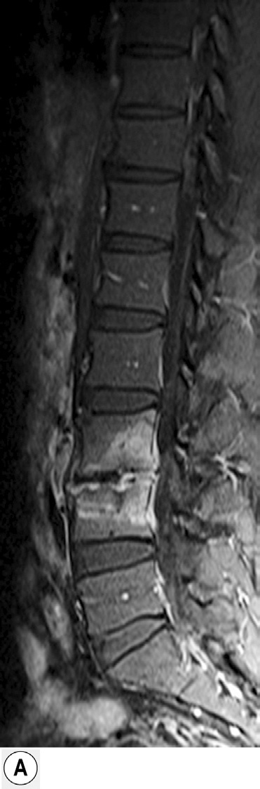
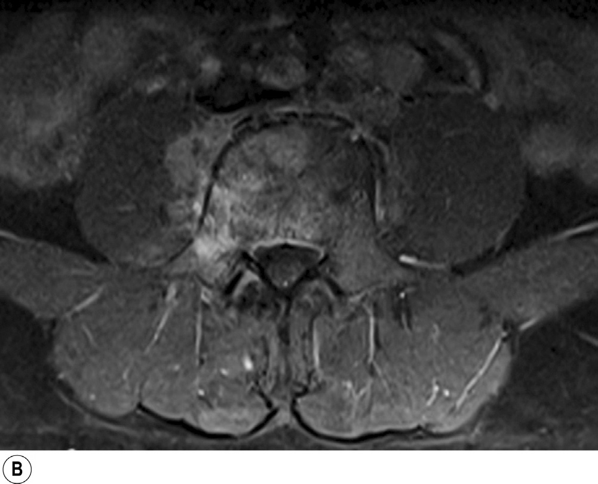

# Page 181 A 33-Year-Old Refugee from Afghanistan With Recurrent Fever and Back Pain PETER SOTHMANN AND CASSANDRA ALDRICH Clinical Presentation History A 33-year-old male refugee from Afghanistan presents to a German clinic with a 6-month history of recurrent fever, night sweats and progressive back pain. After leaving Afghan-istan with his wife and two children, the family first lived in a refugee camp in Iran. There, the patient started feeling ill about 6 months ago and was treated with tablets for several weeks. Initially he also received intragluteal injections. His symptoms subsided whilst on medication but recurred after the treatment ended. After crossing Turkey and Eastern Europe, the family reached Germany 4 months ago. All med-ical documents were lost during the journey. Clinical Findings The patient is afebrile and in fair general condition. Vital signs are normal. On examination, there is marked spinal tenderness in the lumbar region. The remaining examination is unremarkable. Laboratory Results and Imaging Differential blood count, liver and renal function tests as well as LDH are normal. C-reactive protein and erythrocyte sed-imentation rate are slightly raised at 26 mg/L (<5 mg/L) and 40 mm/hour (<20 mm/hour), respectively. Urinalysis is unremarkable. MRI of the spine reveals signal enhancement of the L3 and L4 vertebral bodies, the corresponding vertebral disc and the right psoas muscle, as well as disc space narrowing and irregularities of both adjacent vertebral endplates (Fig. 81.1A and B). A chest x-ray shows no abnormalities. Questions 1. What are the most likely differential diagnoses in this patient? 2. Which investigations are useful to determine the causative agent? Discussion A male Afghan refugee presents with a 6-month history of recurrent fever, night sweats and progressive back pain. Phys-ical examination reveals localized lumbar spinal tenderness. CRP and ESR are slightly raised and an MRI of the spine shows spondylodiscitis of L3/L4 with involvement of the psoas muscle. Answer to Question 1 What are the Most Likely Differential Diagnoses in This Patient? Spondylitis in a febrile young adult is likely to be infectious. Globally, tuberculosis is the main cause of infectious spon-dylitis. Spinal brucellosis may be equally common or even predominant in highly endemic countries, such as Afghanistan. Other infectious causes of spondylitis mirror those of osteomyelitis and usually follow haematogenous spread from a distant site of infection. The spectrum of pathogens includes Staphylococcus aureus, pyogenic and non-pyogenic streptococci and Gram-negative bacteria such as Salmonella species. In addition, histoplasmosis, actinomycosis and melioidosis may be relevant causes depending on local epidemiology. 226 # Page 2 Answer to Question 2 Which Investigations are Useful to Determine the Causative Agent? It is not possible to reliably distinguish spinal tuberculosis from brucellosis by x-ray or CT/MRI imaging; microbiolog-ical testing is required. In patients from highly endemic countries, serological testing and interferon gamma release assays (IGRA) are of limited diagnostic value, because they are not able to distinguish between active and latent/past infection. Definitive diagnosis requires isolation of the caus-ative agent from blood or tissue samples. Spinal tuberculosis is rarely accompanied by pulmonary involvement, and sputum samples often remain negative. In brucellosis, the sensitivity of blood culture is generally high in acute disease and decreases over time. Bone marrow cultures have a better yield at all stages of disease. CT-guided percutaneous vertebral biopsy and subsequent tissue culture and molecular analysis is the diagnostic gold standard in infectious spondylitis. Histopathology should be performed simultaneously to rule out malignancy and to confirm granulomatous inflammation, which is a feature of both tuberculosis (caseous) and brucellosis (non-caseous). It is important to notify laboratory staff that brucellosis is suspected: Brucella cultures are highly infectious and require biosafety level 3 handling; they may also have a prolonged time to positivity (although this is less of an issue with mod-ern automated blood culture systems). The Case Continued… Several blood cultures are taken but remain negative. Spu-tum samples are negative for acid-fast bacilli. A CT-guided biopsy of the lesion is performed without complications. Culture of the tissue sample reveals Brucella melitensis as the causative agent. No additional sites of infection are iden-tified on imaging. Importantly, there is no sign of endocar-ditis on echocardiography. The presentation is classified as “complicated brucellosis” with spondylitis and para-vertebral abscess formation accord-ing to WHO criteria, which requires a prolonged course of antimicrobial combination therapy. The patient is treated with doxycycline 100 mg twice daily and rifampicin 900mg daily for 16 weeks. Additionally, intramuscular strep-tomycin (1 g daily) is given for the first 3 weeks of treatment. The fever subsides after several days and inflammation parameters return to normal several weeks after initiation of antimicrobial therapy. A second MRI at the end of treat-ment shows full resolution of the paravertebral abscess. One year post treatment completion, the patient shows no signs of relapse. • Fig. 81.1A and B MRI of the spine reveals signal enhancement of the L3 and L4 vertebral bodies, the correspond-ing vertebral disc and the right psoas muscle, as well as disc space narrowing and irregularities of both adjacent vertebral endplates. 227 CHAPTER 81 A 33-Year-Old Refugee from Afghanistan With Recurrent Fever and Back Pain # Page 3 SUMMARY BOX Brucellosis Brucellosis is a common zoonotic bacterial infection and an important differential diagnosis in prolonged febrile illness. Cur-rently, around 500000 cases of brucellosis are reported to the WHO each year, with global incidence rates increasing. B. melitensis is the most common cause of brucellosis worldwide and mainly infects camels, sheep and goats. Frequent routes of animal-to-human transmission include consumption of unpas-teurized dairy products as well as exposure to bodily fluids and aerosols during animal birth or slaughter. The possibility of air-borne transmission requires special safety precautions while handling Brucella cultures in the laboratory (biosafety level 3). In the early stages, brucellosis usually presents as a non-focal febrile illness. Clinical signs and symptoms are non-specific and may include night sweats, fatigue, lymphadenopathy and hepatosplenomegaly. Localized infection develops frequently during the course of disease and may affect the musculoskeletal, genitourinary, central nervous or cardiovascular system. Osteoarticular involvement is particularly common (up to 40% of cases) and often presents as peripheral arthritis, sacroiliitis or spondylitis. Serological diagnostic tests are widely available but fail to distinguish current from past infection in areas of high ende-micity. Blood culture has a high sensitivity in acute disease and tissue culture is considered the gold standard in localized infection. Brucellosis therapy generally requires a combination of antimicrobials with activity in the acidic intracellular environment, as well as a prolonged course of treatment to avoid treatment failure and relapse. Preferred drug combinations of brucellosis are doxycylin plus an aminoglycoside (streptomycin or genta-micin) or plus rifampicin. In neurobrucellosis, ceftriaxone is combined with doxycyclin and rifampicin. If contraindications occur, ciprofloxacin and cotrimoxazole may be used. Treatment duration is between six weeks and several months depending upon organ manifestation and severity. Although most osteoarticular complications can be treated with a standard course of 6 weeks’ duration, brucella spondylitis requires prolonged treatment for at least 12 weeks to avoid relapse. Furthermore, surgical intervention may be required in cases of vertebral instability or epidural and paravertebral abscess formation. Further Reading 1. Beeching NJ, Monir Makdour M. Brucellosis. In: Farrar J, editor. Manson’s Tropical Diseases 23rd ed. London: Elsevier; 2014 (chapter 28). 2. Gouliouris T, Aliyu SH, Brown NM. Spondylodiscitis: Update on diagnosis and management. J Antimicrob Chemother 2010;65 (Suppl. 3):11-24. https://doi.org/10.1093/jac/dkq303. 3. PappasG,AkritidisN,BosilkovskiM,etal.Brucellosis.NEnglJ Med 2005;352(22):2325-36. https://doi.org/10.1056/NEJMra050570. 4. Corbel MJ. Brucellosis in humans and animals. WHO; 2006. p. 1-102. 5. Yousefi-Nooraie R, Mortaz-Hejri S, Mehrani M, et al. Antibiotics for treating human brucellosis. Cochrane database Syst Rev 2012;10(10):CD007179. https://doi.org/10.1002/14651858. CD007179.pub2. 228 CHAPTER 81 A 33-Year-Old Refugee from Afghanistan With Recurrent Fever and Back Pain

## Images

