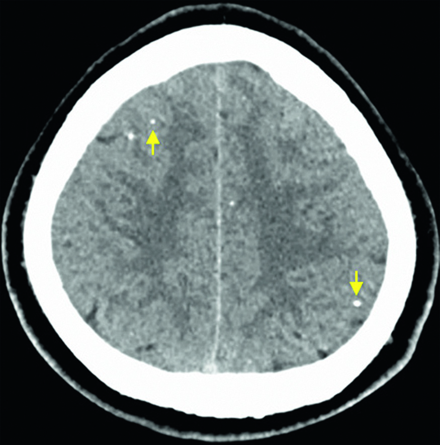
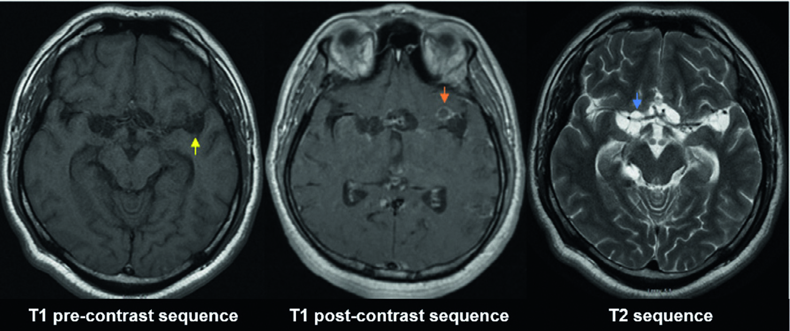

# Page 182 A 31-Year-Old Man from Guatemala With Acute Weakness and Numbness of the Leg CESAR G. BERTO AND CHRISTINA M. COYLE Clinical presentation History A 31-year-old Guatemalan man with no past medical history presents to a hospital in New York City with several minutes of weakness and numbness of the leg. His symptoms resolved just before his arrival at the hospital. Two weeks previously, he also had two episodes of facial twitching that subsided without intervention after 10 seconds. He was born and lived in a rural area of Guatemala before immigrating to New York 5 years ago. In Guatemala, his family owned uncorralled pigs and his house did not have sanitation services. Clinical Findings His vitals were normal. Cranial nerves were intact. Motor and sensory examinations were normal. Deep tendon reflexes and gait was normal. The rest of the exam was unremarkable. Laboratory Results Cell blood count and serum chemistry were within normal limits. Imaging The computed tomography (CT) and magnetic resonance imaging (MRI) on admission are shown in Figures 82.1 and 82.2. A CT angiography showed patent cerebral arteries. Questions 1. What is the most likely diagnosis and what is the patho-physiology of this disease? 2. What is the approach to diagnosis and treatment? Discussion A young, previously healthy man from Guatemala presents with transitory ischemic attack. Imaging reveals parenchymal calcified lesions, complex cystic structures in the subarach-noid space and an old lacunar infarct proximal to a cyst with a normal CT angiography. Answer to Question 1 What is the Most Likely Diagnosis and What is the Pathophysiology of This Disease? These findings and the epidemiological risk factors are highly suggestive of subarachnoid neurocysticercosis. The clinical expression of neurocysticercosis is pleomor-phic and depends on the location, burden of disease and host • Fig. 82.1 CT of the head demonstrates multiple calcifications in the brain parenchyma (yellow arrows). 229 # Page 2 inflammatory response. Disease in the parenchyma behaves differently from neurocysticercosis involving the extra-parenchymal space. Therefore clinical presentation and therapeutic interventions for each location are different. Sub-arachnoid neurocysticercosis (SANCC) is probably the most severe form of neurocysticercosis. In the subarachnoid space, the parasite can undergo an aberrant continued growth and reach large sizes, especially when it is located in the Sylvian fissure. SANCC also has a high frequency of concomitant asymptomatic spinal involvement. Therefore an MRI of the spine should always be included. The pathogenesis of the subarachnoid form is largely mediated by the host’s inflammatory response. Clinically, it can manifest as meningitis, communicating hydrocepha-lus, focal neurological symptoms and cerebrovascular disease. Increased intracranial pressure because of hydrocephalus is the most common presentation. Vascular involvement is a common, but frequently unrecognized manifestation of SANCC. The inflammation of the vessel can result in occlu-sive endarteritis, aneurysm formation and thrombosis. Small perforating vessels are most affected, resulting in lacunar infarcts proximal to cysts as seen in this patient. In many instances, the CT angiography will be negative. Answer to Question 2 What is the Approach to Diagnosis and Treatment? Imaging is the cornerstone in the diagnosis of SANCC. CT is sensitive at detecting parenchymal calcifications, but MRI is superior in delineating cysts in the subarachnoid space and assessing the amount of inflammation. The serological gold standard, the immunoblot, has a sensitivity of 98% and spec-ificity close to 100% in patients with two or more lesions; the sensitivity decreases in cases with a single or calcified lesion. The immunoblot is always positive in SANCC because of the high burden of disease. Circulating parasite antigen pro-vides additional information on the presence of viable cysts, and can be used to monitor efficacy of therapy. Principles of treatment for parenchymal neurocysticerco-sis cannot be extrapolated to those patients with SANCC. Antiparasitics are always indicated in the treatment of SANCC and many experts recommend dual therapy with albendazole and praziquantel. The duration of treatment is still controversial, but cur-rent guidelines recommend treating until resolution on neuroimaging. Corticosteroids are also critical to reduce the inflamma-tion secondary to antiparasitic treatment. A careful taper of steroids should be employed to avoid complications, such as hydrocephalus, meningitis, and vasculitis. Patients may need a long course of treatment with neuroimaging every 3 months to assess the clinical response. The Case Continued… A serum immunoblot for cysticercosis run at the Centers for Disease Control and Prevention (CDC) was positive. The serum cysticercosis antigen was positive at the beginning of therapy. A spine MRI did not show evidence of spinal involvement. The patient was begun on a high dose of pred-nisone followed by a taper, and dual therapy with albenda-zole and praziquantel. After 9 months of treatment, his serum antigen was negative and his lesions resolved on imag-ing. He has been followed closely with no recurrence. SUMMARY BOX Subarachnoid Neurocysticercosis Neurocysticercosis is caused by the larval form of Taenia solium in the central nervous system. It is endemic in Latin America, Asia and Africa, where its transmission is favoured by poor sanitary conditions. The mechanism of transmission is faecal-oral and person to person, but requires the presence of free-roaming pigs to perpetuate the life cycle. Subarachnoid neurocysticercosis is the most severe form because of the large dimension of the cysts, exuberant inflam-matory response leading to complications and slow response to • Fig. 82.2 MRI of the head on T1 sequence reveals dilation of the suprasellar and Sylvian cistern (yellow arrow). Peripheral enhancement (orange arrow) is evidenced after the administration of gadolinium. Corre-sponding fluid filled septated cystic lesions (blue arrow) are seen surrounding the proximal middle cerebral arteries on T2 sequence. An old lacunar infarct in the right frontal white matter proximal to an interhemispheric cyst was also found (not shown). 230 CHAPTER 82 A 31-Year-Old Man from Guatemala With Acute Weakness and Numbness of the Leg # Page 3 therapy. Neuroimaging and serology are complementary for diagnosis. MRI is superior for the detection of subarachnoid cysts than CT, and the serological gold standard is the immunoblot. Compared with the parenchymal form, SANCC needs a longer duration and usually double the antiparasitic treatment along with corticosteroids. Neuroimaging and serum antigen should be repeated periodically to assess for clinical response and decision to stop treatment. Further Reading 1. Baily G, Garcia HH. Other cestode infections: intestinal cestodes, cysticercosis, other larval cestode infections. In: Farrar J, editor. Manson’s Tropical Diseases. 23rd ed. London: Elsevier; 2013 [chapter 57]. 2. Coyle CM. Neurocysticerosis: an individualized approach. Infect Dis Clin North Am 2019;33(1):153-68. https://doi.org/10.1016/ j.idc.2018.10.007. 3. Garcia HH, Nash TE, Del Brutto OH. Clinical symptoms, diagnosis, and treatment of neurocysticercosis. Lancet Neurol 2014;13(12):1202-15. https://doi.org/10.1016/s1474-4422(14) 70094-8. 4. White AC Jr., Coyle CM, Rajshekhar V, et al. Diagnosis and Treat-ment of Neurocysticercosis: 2017 Clinical Practice Guidelines by the Infectious Diseases Society of America (IDSA) and the American Society of Tropical Medicine and Hygiene (ASTMH). Clin Infect Dis 2018;66(8):1159-63. 5. Fleury A, Carrillo-Mezo R, Flisser A, et al. Subarachnoid basal neurocysticercosis: a focus on the most severe form of the disease. Expert Rev Anti Infect Ther 2011;9(1):123-33. https://doi.org/ 10.1586/eri.10.150. 231 CHAPTER 82 A 31-Year-Old Man from Guatemala With Acute Weakness and Numbness of the Leg

## Images

