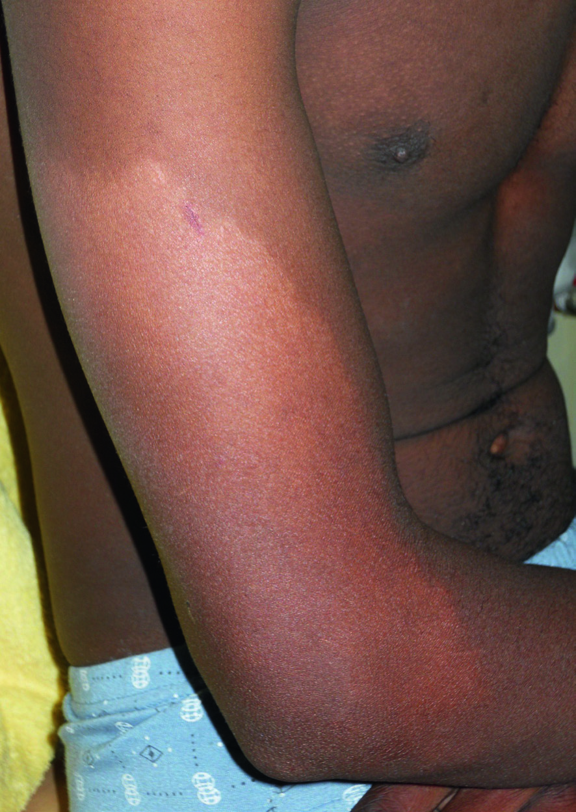

# Page 183 An 18-Year-Old Man from India With a Pale Patch on His Right Upper Limb STEPHEN L. WALKER AND SABA M. LAMBERT Clinical Presentation History An 18-year-old man from India has noticed a pale patch on his right arm and forearm for 3 months. It is not itchy or painful, but he reports reduced sensation in the affected area. He also complains of mild numbness of the little finger of the right hand but no weakness (he is right-handed). Otherwise he is well. There is no family history of skin problems. Clinical Findings There is a 20 cm by 10 cm hypopigmented macule on the outer aspect of the right arm extending on to the forearm (Fig. 83.1). The affected skin is dry. The sensation within the hypopigmented area is reduced compared with the nor-mally pigmented skin. The rest of the skin examination is normal. Both ulnar nerves are palpable, however the right ulnar nerve is thickened. There is reduced sensation on the tip and ulnar border of the right little finger. There are no other neurological abnormalities. Questions 1. What common skin conditions cause hypopigmentation? 2. What further investigations are required? Discussion An 18-year-old man from India presents with a hypopigmen-ted macular lesion on the right arm with reduced sensation. A hypopigmented anaesthetic patch is a cardinal sign of leprosy. The combination of a skin problem and signs of a neuropathy should always raise the suspicion of leprosy. Answer to Question 1 What Common Skin Conditions Cause Hypopigmentation? Hypopigmented skin lesions are very common. Hypopig-mentation may be a non-specific sequela of any inflamma-tory or traumatic process such as dermatitis or a burn. • Fig. 83.1 A hypopigmented macular skin lesion with reduced sensa-tion on the right arm of an 18-year-old Indian male. 232 # Page 2 Common causes of hypopigmentation include pityriasis alba, pityriasis versicolor and seborrheic dermatitis. Vitiligo causes depigmentation rather than hypopigmentation. In leprosy-endemic countries any skin problem causing reduced pigmentation may cause an individual to seek advice because of concern about leprosy. Leprosy awareness campaigns often advise people to get pale patches checked. Answer to Question 2 What Additional Investigations are Required? No additional investigations are required because the patient has the two clinical cardinal signs of leprosy-a hypopigmen-ted skin lesion with reduced sensation and a thickened nerve. However, where available, clinicians may elect to perform a skin biopsy and slit-skin smears. In this case a skin biopsy is likely to show granulomatous dermatitis with destruction of cutaneous nerves and a slit-skin smear is likely to be negative. The Case Continued… The patient was diagnosed with paucibacillary leprosy and commenced on rifampicin and dapsone which he took for 6 months. The sensory neuropathy was treated with oral prednisolone 30 mg daily which was reduced by 5 mg each month. The patient was counselled extensively about the cause of leprosy and that he was not an infection risk to his family or friends, who were examined and had no signs of leprosy. He was advised how to care for his hands and avoid trauma. He made a full recovery. SUMMARY BOX Leprosy Leprosy is a disease predominantly of the skin and peripheral nerves caused by Mycobacterium leprae (and Mycobacterium lepromatosis). The organisms cannot be grown in culture. The vast majority ofindividuals exposed tothe infection do not develop clinical disease,but those who dodevelop a varietyofclinicalsigns determined by their immunological response to the bacteria. Individuals with high cell-mediated immunity develop tuberculoid leprosy or borderline tuberculoid leprosy with one or a few hypopigmented anaesthetic skin patches and thickened peripheralnerves.Bacteriaareusuallynotseenintheskinbiopsies or slit-skin smears of these individuals. Individuals who do not mount a cell-mediated response to M. leprae develop lepromatous leprosy with infiltration of the skin and many skin lesions. These individuals have lots of bacteria in their skin and nasal secretions. The World Health Organization categorises leprosy according to the number of skin lesions for the purpose of treatment with multi-drug therapy. Individuals with paucibacillary leprosy (five skin lesions or fewer) are treated for 6 months and those with multibacillary leprosy (six or more) for 12 months (Table 83.1). In 2018, the WHO recommended that all leprosy patients receive treatment with three drugs. The WHO regime is rifampicin 600 mg, clofazimine 300 mg, dapsone 100 mg once per month and dapsone 100 mg and clofazimine 50 mg daily on the other days (Table 83.2). Prior to this, patients with paucibacillary leprosy received two drugs (dapsone and rifampicin) for 6 months. Multi-drug therapy is provided free of charge to patients. Individuals with recent onset of sensory or motor loss (defined as within the last 6 months) are treated with oral corticosteroids, in addition to multi-drug therapy, to improve nerve function. In rare circumstances leprosy may manifest without skin changes-pure neural leprosy-which makes the diagnosis challenging. The diagnosis of leprosy remains largely clinical as there is no diagnostic or screening test for all cases. Presentations and clinical forms are very varied. The majority of individuals with leprosy do not have identifiable bacteria in slit-skin smears or skin biopsies. Further Reading 1. Walker SL, Withington SJ, Lockwood DNG. Leprosy. In: Farrar J, editor. Manson’s Tropical Diseases. 23rd ed. London: Elsevier; 2013 [chapter 41]. 2. The World Health Organization. Guidelines for the Diagnosis, Treatment and Prevention of Leprosy. New Delhi: WHO, Regional Office for South-East Asia; 2018. Available at:http:// nlep.nic.in/pdf/WHO%20Guidelines%20for%20leprosy.pdf (accessed 11 October 2019). 3. Lockwood DNJ, Lambert S, Srikantam A, et al. Three drugs are unnecessary for treating paucibacillary leprosy-A critique of the WHO guidelines. PLoS Negl Trop Dis 2019;13(10):e0007671. https://doi.org/10.1371/journal.pntd.0007671. 4. Saleem MD, Oussedik E, Picardo M, et al. Acquired disorders with hypopigmentation: a clinical approach to diagnosis and treatment. J Am Acad Dermatol 2019;80(5):1233-50. TABLE 83.1 WHO Classification of Leprosy and Recommended Duration of Treatment Classification Number of Patches Duration of Treatment Paucibacillary 56 months TABLE 83.2 WHO Treatment of Leprosy (2018) Once Monthly All Other Days Daily Rifampicin 600 mg-Clofazimine 300 mg 50 mg Dapsone 100 mg 100 mg 233 CHAPTER 83 An 18-Year-Old Man from India With a Pale Patch on His Right Upper Limb

## Images

