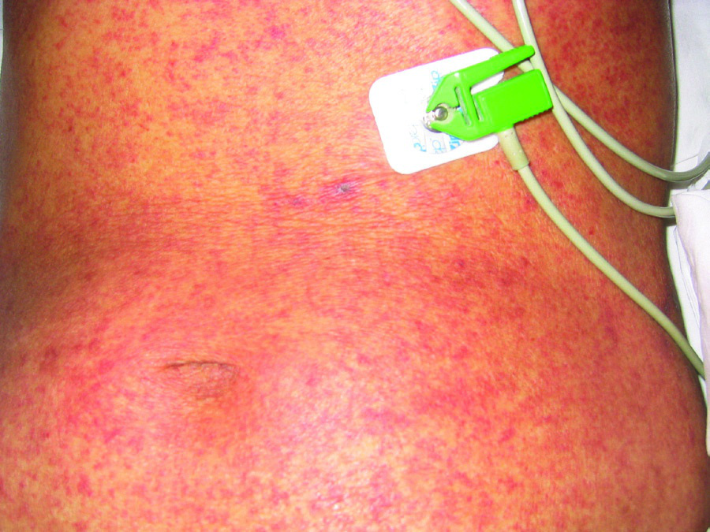
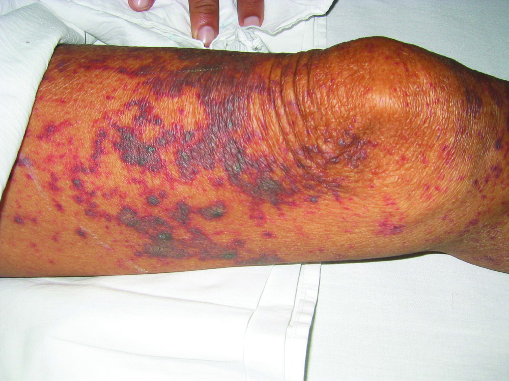

# Page 185 A 55-Year-Old Female Pig Farmer from Vietnam With Fever and Impaired Consciousness THI THUY NGAN NGUYEN AND JEREMY DAY Clinical Presentation History A 55-year-old woman presents to a hospital in rural Vietnam with a 1-day history of fever, headache and vomiting. Her blood film is negative for malaria and she is treated with fluids and paracetamol. On the second day of illness she develops confusion and is referred to a hospital in Ho Chi Minh City for further investigation. The patient has a history of type 2 diabetes and hyperten-sion, she has been on treatment for 4 years. She raises pigs on her smallholding and works as a butcher in a local market selling pork and chicken. Clinical Findings On admission, she is confused with a Glasgow Coma Score of 12/15 (E3 M5 V4), there is fever (38.5°C or 101.3°F), tachycardia (124 bpm), hypotension (85/60 mmHg), tachypnoea (32 breaths per minute), and hypoxia (O2 satu-ration 86% on ambient air). She has neck stiffness and pho-tophobia. There are no focal neurological signs. She has a diffuse petechial rash over her trunk (Fig. 85.1) and marked purpuric non-blanching lesions on her left leg (Fig. 85.2). The rest of her examination is unremarkable. Laboratory Results Her laboratory results on admission are shown in Table 85.1. Further Investigations Non-contrast-enhanced CT scan of the brain is unremark-able. Electrocardiogram shows sinus tachycardia and is oth-erwise normal. Chest x-ray is unremarkable. • Fig. 85.1 Petechial rash on the trunk of the patient. • Fig. 85.2 Purpuric, non-blanching rash on the leg. 237 # Page 2 Questions 1. What is the differential diagnosis and what empirical treatment would you give? 2. What additional investigations are needed? Discussion This middle-aged Vietnamese woman from a rural area pre-sents with a syndrome consistent with meningitis compli-cated by shock. She has a widespread non-blanching purpuric rash. Answer to Question 1 What is the Differential Diagnosis and What Empirical Treatment Would You Give? The patient presented at the rural district hospital with fever and malaise and developed confusion. There is malaria in rural Vietnam and both P. falciparum and P. vivax are endemic; therefore severe malaria must be excluded. Enteric fever, an important disease in low-income tropical countries, can cause confusion and should be considered, but the rate of disease progression in this case is uncharacteristic. Dengue fever is endemic in South-east Asia and should also be con-sidered. Skin changes in dengue usually present with tran-sient flushing erythema of the face followed by a diffuse erythematous, blanching rash on days 3 to 6. A small propor-tion of patients develop severe disease during a second, immune-mediated phase (usually on day 4-6). This phase may be complicated by capillary leak, shock, mucocutaneous bleeding and organ involvement. Dengue may also present as encephalitis. In this case the rapid deterioration with signs of meningi-tis and shock is not typical for dengue. Melioidosis is another differential diagnosis to consider. In some areas of South-east Asia, it is the commonest cause of community-acquired sepsis, and diabetes is known to be a risk factor for the disease. Melioidosis may also cause brain abscess and encephalitis. However, melioidosis is compara-tively rare in Vietnam, where the true burden of disease remains to be elucidated. The most likely diagnosis though seems to be acute bac-terial meningitis complicated by septic shock. Globally, the common causes of acute bacterial meningitis are Streptococcus pneumoniae, Neisseria meningitidis, and Haemophilus influen-zae. Both S. pneumoniae and N. meningitidis infections can be complicated by development of a purpuric rash; this is more common with N. meningitidis septicemia. In Vietnam, however, the commonest identified cause of acute bacterial meningitis in adults is Streptococcus suis. Like its counterparts, S. suis infection can cause both meningitis and septic shock; the syndromes overlap. A florid purpuric rash is common (6%-31% of patient cases). Other forms of meningitis seen in Asia and the tropics include tuberculous and cryptococcal meningitis. Although each of these tends to have a more insidious onset, the dura-tion of symptoms before presentation can be as short as 4 to 5 days; these diagnoses therefore should always be considered. However, they are not associated with shock or purpuric rash. Meningitis is a medical emergency requiring prompt treatment. Lumbar puncture is the investigation of choice but should not delay administration of broad-spectrum intravenous antibiotics. A typical choice is ceftriaxone; where resistance is suspected or common epidemiologically, vanco-mycin is also administered. The value of adjunctive cortico-steroids in acute bacterial meningitis is difficult to generalize. Large studies in Africa found no benefit; this contrasts with Western Europe, where steroids reduced the risk of death, and Vietnam, where in microbiologically confirmed disease they reduced the risk of complications. Answer to Question 2 What Additional Investigations are Needed? The patient requires a lumbar puncture and blood cultures. CSF should be sent for microscopy, Gram stain, cell count, protein, glucose and culture. A simultaneous blood glucose measurement should be performed. If resources are limited, then CSF glucose with simultaneous blood glucose is the most important test informing clinical management, because a normal ratio (i.e. a CSF/serum glucose ratio of 0.6) excludes acute bacterial meningitis and TB. In both bacterial and Tb meningitis, the CSF/serum glucose ratio is expected to be markedly diminished. Rapid diagnostic tests such as pneu-mococcal antigen can be performed on CSF, blood or urine, and meningococcal polymerase chain reaction on blood or CSF if available. Because the patient is from a malaria-endemic area, the blood film should be repeated. The Case Continued… The patient received empirical treatment with intravenous ceftriaxone and vancomycin, and supportive treatment including intravenous fluids. Lumbar puncture revealed TABLE 85.1 Laboratory Results on Admission Parameter Patient Reference WBC ( 109/L) 10.254-10 % Neutrophils 86.545-75 Haemoglobin (g/dL) 11.812-17 Platelets ( 109/L) 56200-400 Creatinine (mg/dL) 0.860.7-1.5 Blood urea nitrogen (mg/dL) 77-20 Na+ (mmol/l) 137135-150 K+ (mmol/l) 3.23.5-5.5 Random blood glucose (mmol/L) 15.43.9-7.8 HbA1c (%) 8.54-7 Lactate (mmol/L) 11.20.5-2.2238 CHAPTER 85 A 55-Year-Old Female Pig Farmer from Vietnam With Fever and Impaired Consciousness # Page 3 turbid cerebrospinal fluid with 2870 cells/μL (<5), 92% neutrophils, protein 541.16 mg/dL (15-45) and CSF glu-cose 2.44 mmol/l (2.5-4.4). Blood glucose was 19 mmol/ L (3.9-6.1), CSF/serum glucose ratio 0.12 (normal 0.6). Gram stain showed a Gram-positive coccus in short chains, and negative India ink, mycobacterial GeneXpert and Herpes simplex virus PCR. Repeat malaria film and malaria rapid diagnostic tests were negative. Five days later, both blood and CSF cultures grew S. suis, sensitive to pen-icillin and ceftriaxone. The patient received 12 days of antibiotic therapy. Dexa-methasone was administered for the first 4 days of treatment. She responded to treatment but had residual bilateral hearing impairment. SUMMARY BOX Streptococcus suis meningitis S. suis is the most frequently confirmed cause of acute bacterial meningitis in adults in Vietnam. Globally, it is an economically important zoonotic pathogen of pigs causing septicaemia, joint and genitourinary tract infections. Human disease is almost exclusively caused by serotype 2. It is reported globally but seems particularly frequent in East and South-east Asia. Outbreaks of severe sepsis have been reported from China. The prevalence of disease in Asia is probably driven by farming and food practices; disease is more common in those in contact with pigs and raw pork. Infection is rare in children because culturally they are protected from contact with pigs. Antibiotic resistance is rarely reported in human isolates. First-line treatment is ceftri-axone; adjunctive treatment with steroids reduces the risk for deafness in adults, which occurs in up to 70%. Further Reading 1. Mai NT, Hoa NT, Nga TV, et al. Streptococcus suis meningitis in adults in Vietnam. Clin Infect Dis 2008;46(5):659-67. 2. Nghia HD, Tu Le TP, Wolbers M, et al. Risk factors of Strepto-coccus suis infection in Vietnam. A case-control study. PLoS One 2011;6(3):e17604. 3. Yu H, Jing H, Chen Z, et al. Human Streptococcus suis outbreak, Sichuan. China Emerg Infect Dis 2006;12(6):914-20. 4. Nguyen TH, Tran TH, Thwaites G, et al. Dexamethasone in Viet-namese adolescents and adults with bacterial meningitis. N Engl J Med 2007;357(24):2431-40. 5. de Gans J, van de Beek D. European Dexamethasone in Adulthood Bacterial Meningitis Study. Dexamethasone in adults with bacterial meningitis. N Engl J Med 2002;347(20):1549-56. 239 CHAPTER 85 A 55-Year-Old Female Pig Farmer from Vietnam With Fever and Impaired Consciousness

## Images

