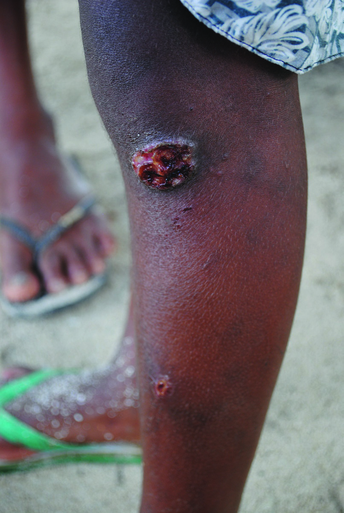

# Page 186 A 14-Year-Old Girl in the Solomon Islands With a Non-Healing Leg Ulcer MICHAEL MARKS AND ORIOL MITIÀ Clinical Presentation History A 14-year-old girl was seen in the Solomon Islands. She reported a painless, non-healing large ulcer of her left leg that began 1 month earlier. Clinical Findings On examination there was a large lesion (approximately 3 cm diameter) on the left lower leg covered by a layer of crust (Fig. 86.1). Lower down the leg a smaller, similar lesion was noted. There was no regional lymphadenopathy or evi-dence of any other skin or bone lesions. Laboratory results A rapid plasma reagin (RPR) test was positive at a titre of 1:64 (Normal-Negative). Questions 1. What is the most likely diagnosis when the patient first presents and how should she be treated? 2. How would you manage her? How should she be followed up? Discussion A 14-year-old girl from the Solomon Islands presenting with a chronic leg ulcer. Answer to Question 1 What is the Most Likely Diagnosis When the Patient First Presents and How Should She Be Treated? The patient has a clinical lesion suspicious for yaws, which is still a common problem in the West Pacific. The satellite lesion on the leg is also very typical of early yaws lesions. The patient has a high-titre positive RPR test which is con-sistent with the diagnosis. A number of other bacteria, in par-ticular Haemophilus ducreyi, can cause skin lesions that clinically appear similar to those of early yaws. Other relevant differential diagnoses are pyoderma, tropical ulcer, cutaneous diphtheria, and Aeromonas hydrophila infection. Answer to Question 2 How Would You Manage Her? How Should She Be Followed Up? A single oral dose of azithromycin (30 mg/kg single dose; maximum dose 2 g) or a single intramuscular (IM) dose of benzathine benzylpenicillin (<10 years of age: 0.6 million • Fig. 86.1 Leg ulcer in a 14-year-old girl from the Solomon Islands. 240 # Page 2 units single dose; 10 years of age: 1.2 million units single dose) is the treatment of choice. A four-fold fall in titre at 6 months indicates cure. The Case Continued… She was treated with a single IM dose of benzathine benzyl-penicillin and the skin lesion resolved over the next 10 days. The patient was seen again at the hospital 12 months later with a similar ulcer on the right leg. The RPR test was repeated and was positive at a titre of 1:8. Given a greater than four-fold fall in the RPR titre this was considered cure after the recent treatment. The other leg ulcer was therefore interpreted to be of a different aetiology. SUMMARY BOX Yaws Yaws is a chronic infectious disease caused by Treponema pallidum subspecies pertenue, which is spread by skin-to-skin contact in warm, humid environments. In the Pacific region, yaws remains highly endemic in the Solomon Islands, Papua New Guinea and Vanuatu, as well as in Indonesia and Timor-Leste. There is also evidence for a re-emergence of yaws in the Philippines were the disease was considered eradicated since the 1970s. The disease is also still endemic in parts of West and Central Africa. Yaws is normally seen in young children; it is associated with overcrowding and poor hygiene. The disease consists of primary, secondary and tertiary phases. The primary lesion usually starts as a localized papule 2 to 10 weeks after inoculation. Common sites are the lower legs and the face. The papule may develop into a large nodule 2 to 5 cm in diameter that ulcerates. Secondary lesions appear from a few weeks to 2 years after the primary lesion and may include a variety of skin lesions. Arthralgias and malaise are the most common additional symptoms and may be accompanied by early osteoperiostitis of the proximal phalanges of the fingers (dactylitis) or long bones (forearm, tibia, or fibula). Late-stage disease is characterized by destructive lesions of soft tissues and bones. Diagnosis is pre-dominantly based on serology and relies on both treponemal tests (such as the Treponema pallidum particle agglutination assay, TPPA) and non-treponemal tests (such as RPR test). Benzathine benzylpenicillin and azithromycin are the treatments of choice, with the latter the preferred drug to use in mass treatment campaigns. A four-fold fall in the RPR titre over 6 months (for example from 1:64 to 1:16) is considered to indicate cure. Similar lesions to those of early yaws may be caused by other bacteria, in particular H. ducreyi, but PCR is required to make this diagnosis. Further Reading 1. Salazar JC, Bennett NJ. Endemic treponematosis including yaws and other spirochaetes. In: farrar j, editor. Manson’s tropical dis-eases. 23rd ed. London: Elsevier; 2013 [chapter 36]. 2. Mitjà O, Asiedu K. Mabey D. Yaws Lancet 2013;381:763-73. 3. Mitjà O, Houinei W, Moses P, et al. Mass treatment with single-dose azithromycin for yaws. N Engl J Med 2015;372:703-10. 4. Marks M, Chi K-H, Vahi V, et al. Haemophilus ducreyi associated with skin ulcers among children, Solomon Islands. Emerg Infect Dis 2014;20:1705-7. 5. Mitjà O, Godornes C, Houinei W, et al. Re-emergence of yaws after single mass azithromycin treatment followed by targeted treat-ment: a longitudinal study. Lancet 2018;391:1599-607. 241 CHAPTER 86 A 14-Year-Old Girl in the Solomon Islands With a Non-Healing Leg Ulcer

## Images

