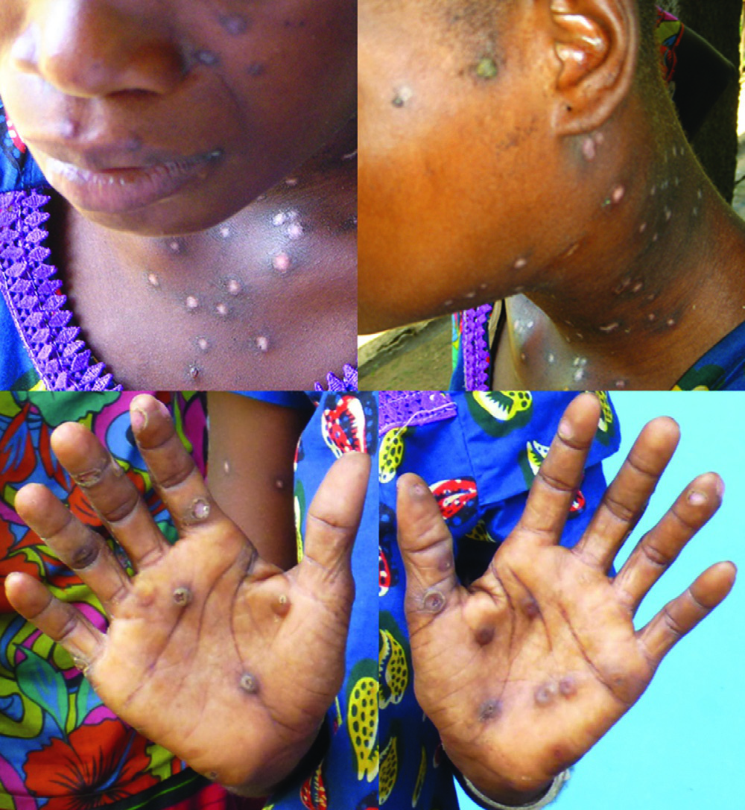

# Page 194 A 20-Year-Old Woman from the Democratic Republic of the Congo With Fever and a Vesiculopustular Skin Rash JOHANNES BLUM AND ANDREAS NEUMAYR Clinical Presentation History A 20-year-old woman presents to her local hospital in a rural area of the Democratic Republic of the Congo with a history of fever, malaise, headache, dry cough, swelling of the neck and a disseminated skin rash, which appeared 2 days after the symptoms began. The skin lesions first appeared on the face and then spread centrifugally over her body, including the palms and soles of her feet as well as the oral mucosa. The lesions have developed from initial macules to papules, then to vesicles and finally to pustules. The oral mucosal lesions are painful and make drinking and eating difficult. The patient resides in a village, where people live from agriculture, she has no relevant past medical history and is the mother of three children. Clinical Findings Vital signs: temperature 38°C (100.4°F), pulse 110 beats per minute, blood pressure 105/82 mmHg. Disseminated uni-form umbilicated vesiculopustular skin lesions, ranging from 0.5 to 1 cm in diameter, all over the body with a predilection for the face, the hands and the feet (Fig. 94.1). Generalized lymphadenopathy with prominent swelling of the cervical lymph nodes. The examination of the lungs, heart, abdomen and the CNS is unremarkable. Laboratory Results See Table 94.1 TABLE 94.1 Laboratory Results at Presentation Parameter Patient Reference WBC ( 109/L) (neutrophils: lymphocytes) 4.4 (73%:21%) 4-10 Haemoglobin (g/dL) 12.312-16 ESR 75 mm/h <20 mm/h • Fig. 94.1 Vesiculopustular skin rash seen at hospital admission 262 # Page 2 Questions 1. What are your differential diagnoses? 2. What are the main criteria to distinguish these differential diagnoses from each other? Discussion A 20-year-old woman from a rural region of the Democratic Republic of the Congo presents with an acute febrile illness which is accompanied by a disseminated uniform vesiculo-pustular skin rash including the palms and soles of the feet as well as the oral mucosa and a prominent cervical lymphadenopathy. Answer to Question 1 What Are Your Differential Diagnoses? The clinical manifestation suggests a viral infection and the morphology and evolution of the skin lesions is characteristic for a poxvirus. Although smallpox was eradicated in 1979 and no cases have occurred since, a zoonotic poxvirus would be the primary suspicion, particularly monkeypox, which is endemic in rural regions of Central Africa. Varicella, caused by the varicella zoster virus, is another febrile illness associ-ated with a vesicular rash that is often confused with monkeypox, but several features help distinguish the two ill-nesses (discussed below). Cowpox usually presents with a single lesion (unless the patient is immunosuppressed); fever and lymphadenopathy are uncommon, therefore this seems to be less likely. Answer to Question 2 What Are the Main Criteria to Distinguish These Differential Diagnoses from Each Other? Important criteria to distinguish the main viral infections presenting with a vesiculopapular rash include the distribu-tion of the skin lesions, the stage of the respective lesion(s), involvement of palms and soles, and the presence of fever and lymphadenopathy (Table 94.2). The Case Continued… Currently, no specific vaccine or treatment for monkeypox is available and clinical management is exclusively supportive. Persons who have been vaccinated against smallpox in the past appear to have some cross-protection against monkey-pox; and if they get infected, develop milder symptoms than unvaccinated persons. Our patient is 20 years old, and was thus born after the worldwide smallpox vaccination TABLE 94.2 Clinical Characteristics of Viral Infections Presenting With a Vesicular Rash (McCollum, 2014)2 Monkeypox Smallpox Cowpox Varicella Incubation period (days) 6-1612-147-1414-17 Fever (°C) 38.5-40.5 >40 Rare <38.8 Rash disseminated, uniform disseminated, uniform localized singular lesion(s) (rarely disseminated) disseminated, non-uniform Lesion distribution centrifugal centrifugal-centripetal Lesion progression homogenous rash (lesions are mostly in one stage of development); slow progression with each stage lasting 1-2 days homogenous rash (lesions are mostly in one stage of development); slow progression with each stage lasting 1-2 days-heterogeneous rash (lesions are often in multiple stages of development on the body; fast progression Frequency of lesions on palms or soles of feet common common-rare Rash period (from the appearance of lesions to desquamation) (days) 14-2114-2121-5610-21 Lymphadenopathy yes yes rare no Case fatality rate 1%-10% 10%-50% 1%-3% 0.13% 263 CHAPTER 94 A 20-Year-Old Woman from the DRC with Fever and a Skin Rash # Page 3 programmes were stopped in the early 1980s. She made an uneventful recovery; however, with scarring from the skin lesions (Fig. 94.2). SUMMARY BOX Human Monkeypox Human monkeypox is a sporadic smallpox-like zoonotic viral exanthematous disease. It occurs in the rain forests of Central and West Africa. The virus was first identified in 1958 in laboratory monkeys. Human monkeypox was not recognized as a distinct infection in humans until 1970. Then, during efforts to eradicate smallpox, the virus was isolated from a patient with suspected smallpox infection in Zaire (now the Democratic Republic of the Congo). Although the natural animal reservoir of monkeypox remains unknown, several lines of evidence point to rodents as a likely reservoir. The sporadically observed human cases and small outbreaks are confined to remote villages and believed to result from close contact between humans and wild animals. However, the precise exposure is often difficult to pinpoint in areas where contact with animals through household rodent infestations and hunting or preparation of bushmeat from a variety of species is common. Outside endemic areas, there was an outbreak of monkeypox in the United States in 2003 associated with infected prairie dogs sold as pets. Although considerably less infective than smallpox, monkey-pox can also spread from human to human through the respi-ratory route or by contact with an infected person’s bodily fluids. Transmission is believed to occur through saliva and respiratory secretions or contact with exudate or crust material from the skin lesions. Risk factors for transmission include sharing a bed or room or using the same utensils as an infected person. The clinical picture of monkeypox is similar to smallpox but shows a considerably milder course with a case fatality rate of 10%. It is believed that the rising number of reported human cases in recent years is largely attributable to the waning herd immunity after the suspension of smallpox vaccination in the early 1980s. In endemic regions, the fairly distinct rash of monkeypox is primarily a clinical diagnosis because neither commercial assays nor the required laboratory infrastructure are usually readily available. The definitive diagnosis is established by PCR, culture, immunohistochemistry or electron microscopy but demands biosafety level 2 laboratory facilities. Optimal diagnostic speci-mens for PCR are lesion exudate on a swab or crust specimens (stored in a dry, sterile tube without any transport media and kept cold). Interpretation of serological tests can be hampered by cross-reactivity with other orthopoxviruses including previous smallpox vaccination. Further Reading 1. Blumberg L, Enria D, Bausch DG. Viral haemorrhagic fevers. In: Farrar J, editor. Manson’s Tropical Diseases. 23rd ed London: Elsevier; 2013 [chapter 16]. 2. McCollum AM, Damon IK. Human monkeypox. Clin Infect Dis 2014;58(2):260-7. 3. Sklenovská N, Van Ranst M. Emergence of Monkeypox as the Most Important Orthopoxvirus Infection in Humans. Front Public Health 2018;6:241. 4. Reed KD, Melski JW, Graham MB, et al. The Detection of Mon-keypox in Humans in the Western Hemisphere. N Engl J Med 2004;350:342-50. • Fig. 94.2 Healing skin lesions at discharge from the hospital 264 CHAPTER 94 A 20-Year-Old Woman from the DRC with Fever and a Skin Rash

## Images

